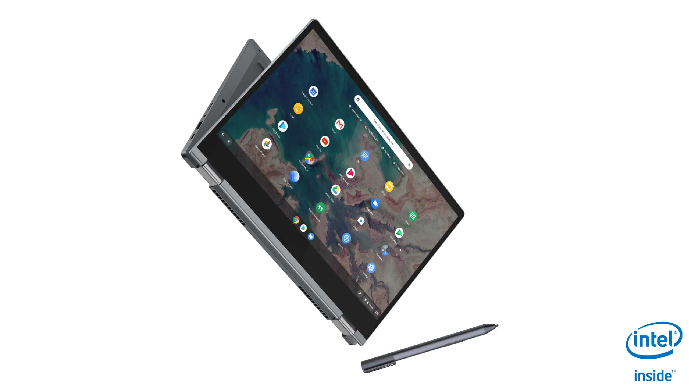
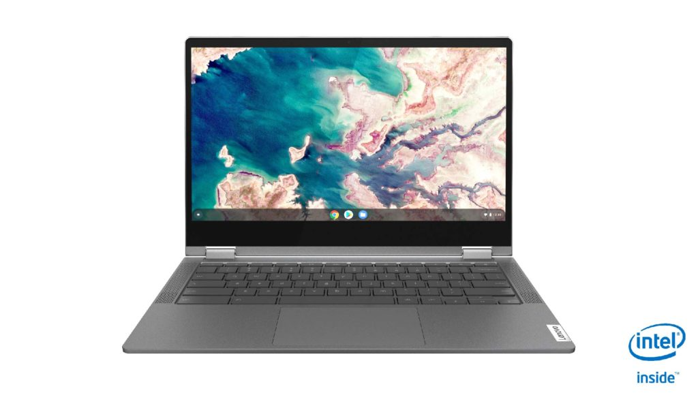
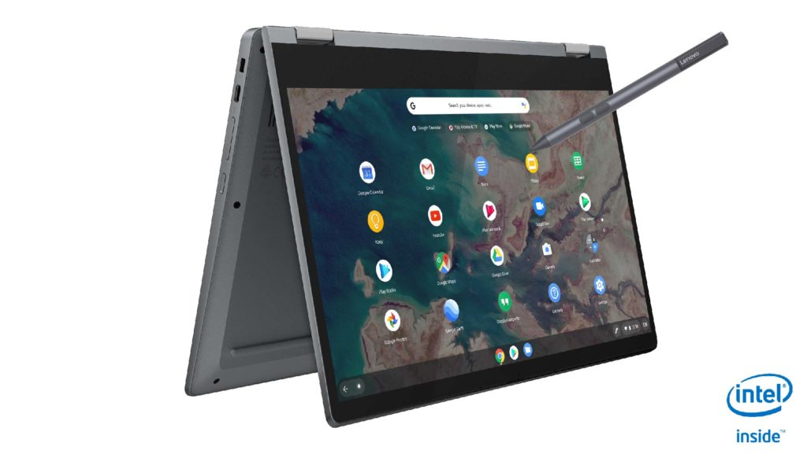

With all of the hype about the [Lenovo IdeaPad Duet Chromebook yesterday](https://www.aboutchromebooks.com/news/lenovo-ideapad-duet-chromebook-specifications-release-date-price-ces-2020/), it was easy to overlook a new 2-in-1 from the same company: the Lenovo Chromebook Flex 5, which starts at $360 when it launches in June.

This is a 13.3-inch 1080p convertible with an included pressure-sensitive stylus that can be configured with up to a 10th-gen Intel Core i5 processor. Given that the base model comes with 32 GB of storage, I suspect the chip powering that configuration is either a Celeron or a Pentium but I'll swing by Lenovo's CES booth to find out.

Aside from the stylus support, a first for Lenovo's Chromebooks, the company says this is also the first 13-inch Chromebook with "intelligent built-in user-facing dual stereo speakers". It will be difficult to test the sound quality on the show floor, but I like the speaker placement alongside the keyboard.

Here's a rundown on the specs as provided by Lenovo:

<table><tbody><tr><td>CPU</td><td>Up to 10th-Gen Intel Core i5</td></tr><tr><td>GPU</td><td>Intel Integrated Graphics</td></tr><tr><td>Display</td><td>13.3-inch 1920 x 1080 IPS touchscreen, 300 nits</td></tr><tr><td>Memory</td><td>4 GB / 8 GB DDR4</td></tr><tr><td>Storage</td><td>32GB / 64GB eMMC or 128GB SSD, microSD slot for expansion</td></tr><tr><td>Connectivity</td><td>WiFi 6 <em>(Note: No mention of Bluetooth but I suspect it's there)</em></td></tr><tr><td>Input</td><td>Water-resistant, backlit keyboard, multitouch trackpad, 720p webcam</td></tr><tr><td>Ports</td><td>Two USB Type-C (3.1), one USB Type-A (3.1), headphone jack</td></tr><tr><td>Battery</td><td>Claimed run-time of up to 10 hours</td></tr><tr><td>Weight</td><td>2.97 pounds</td></tr><tr><td>Software</td><td>Chrome OS automatic software update expiration: TBD</td></tr></tbody></table>

The chassis is plastic while the top lid is aluminum. Considering that and a $360 starting price, this is an entry-level to mid-range device although with options you can certainly make it more powerful. I like the fact that if you want more and faster local storage, a true SSD option will be available.

