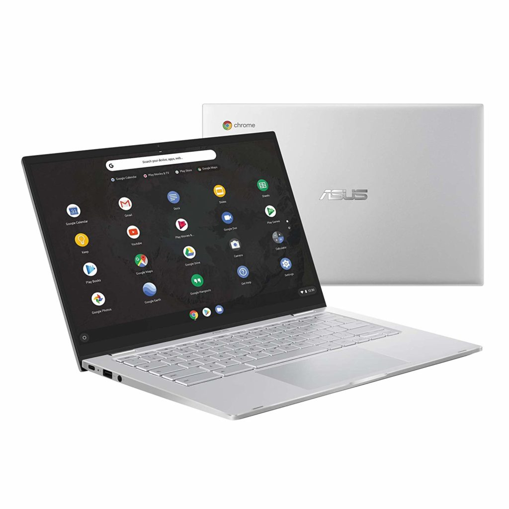

<iframe style="width:120px;height:240px;" marginwidth="0" marginheight="0" scrolling="no" align="right" frameborder="0" src="//ws-na.amazon-adsystem.com/widgets/q?ServiceVersion=20070822&amp;OneJS=1&amp;Operation=GetAdHtml&amp;MarketPlace=US&amp;source=ss&amp;ref=as_ss_li_til&amp;ad_type=product_link&amp;tracking_id=aboutchromebo-20&amp;language=en_US&amp;marketplace=amazon&amp;region=US&amp;placement=B07VT254P6&amp;asins=B07VT254P6&amp;linkId=e5e6539111bc3dedff6978360cbb7e45&amp;show_border=true&amp;link_opens_in_new_window=true"></iframe>

Considering the internal hardware of the Asus Chromebook C425 is nearly the same as the $649 Pixelbook Go, this limited-time sale for the Asus at $329.99 is a ridiculously good buy.

Even at the normal price of $379.99, you're getting a lot of bang for your buck with this Chromebook.

There **_is_** one key feature lacking, however. The 14-inch 1080p display isn't a touchscreen. So if that's a must-have feature, you'll need to look elsewhere. You can fold the display 180-degrees but this isn't what I'd call a 2-in-1, especially without that touchscreen.

Asus Chromebook C425

Here's a rundown of the specs:

<table class=""><tbody><tr><td>CPU</td><td>Intel Core m3-8100Y</td></tr><tr><td>GPU</td><td>Intel HD 615 Graphics</td></tr><tr><td>Display</td><td>14", 1920 x 1080 resolution 3:2 aspect ratio, 45% NTSC color gamut</td></tr><tr><td>Memory</td><td>8 GB</td></tr><tr><td>Storage</td><td>64 GB, eMMC plus a microSD card slot</td></tr><tr><td>Connectivity</td><td>802.11ac and Bluetooth 5.0</td></tr><tr><td>Input</td><td>Backlit keyboard and 6" multitouch trackpad</td></tr><tr><td>Ports</td><td>Two USB Type-C, one USB Type-A audio jack</td></tr><tr><td>Battery</td><td>48 WHr, claimed 12-hour run time</td></tr><tr><td>Chrome OS updates</td><td>Support through June 2026</td></tr></tbody></table>

At 2.8 pounds, this is also a pretty light 14-inch Chromebook.

If you'd prefer a touch display and want to stick with the Asus brand, you'll have to [step up to the Flip C434 for around $475 or so](https://www.amazon.com/Chromebook-Touchscreen-Processor-All-Metal-C434TA-DSM4T/dp/B07QY4RN79/ref=pd_cp_147_3/139-7833636-2399469?_encoding=UTF8&pd_rd_i=B07Q2RB6BY&pd_rd_r=806b29fe-60a6-487d-a2b0-babc6fb914c7&pd_rd_w=TMTL2&pd_rd_wg=p0qPE&pf_rd_p=0e5324e1-c848-4872-bbd5-5be6baedf80e&pf_rd_r=65TRFZDMBTMHGCCSYBVT&refRID=65TRFZDMBTMHGCCSYBVT&th=1), which is a steep premium. And that model halves the memory by comparison: It only comes with 4 GB. To configure it with the same 8 GB as the C425, [you're looking at $500 or more](https://www.amazon.com/Chromebook-Touchscreen-Processor-All-Metal-C434TA-DSM4T/dp/B07QY4RN79/ref=pd_cp_147_3/139-7833636-2399469?_encoding=UTF8&pd_rd_i=B07Q2RB6BY&pd_rd_r=806b29fe-60a6-487d-a2b0-babc6fb914c7&pd_rd_w=TMTL2&pd_rd_wg=p0qPE&pf_rd_p=0e5324e1-c848-4872-bbd5-5be6baedf80e&pf_rd_r=65TRFZDMBTMHGCCSYBVT&refRID=65TRFZDMBTMHGCCSYBVT&th=1).
