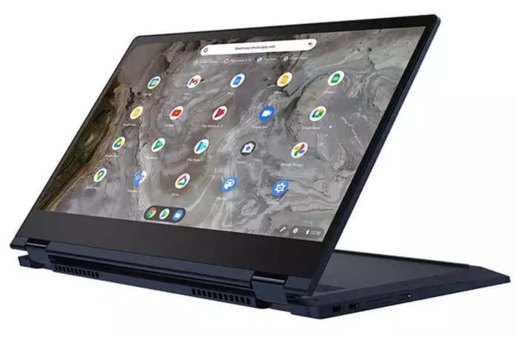
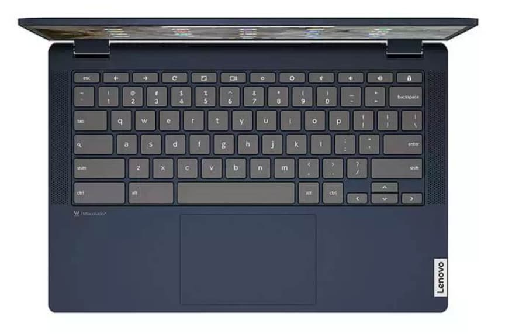

I love Saturdays. It's when I take time off to make a cup of coffee, sit in my recliner, relax with ambient music and... look for Chromebook deals. OK, so it's not much time off. That's OK because it's often worth it. I found a discount on the new [Lenovo Flex 5i Chromebook with 11th-gen Core i3 at NewEgg](https://www.newegg.com/lenovo-82m70010ux/p/2S3-0005-00231?item=9SIAHRCFF14931).

You can buy this, including shipping, for $399.99. That's less expensive than the [Lenovo IdeaPad 5i Chromebook with the same generation Pentium that I recently raved about](https://www.aboutchromebooks.com/news/lenovo-ideapad-5i-chromebook-review-a-potent-pentium-powered-laptop/).

Lenovo's "official" price for this model is $539.99, but Chromies don't let Chromies buy from Lenovo at full price. Currently, [direct sales of the Lenovo Flex 5i Chromebook are discounted to $429.99](https://www.lenovo.com/us/en/p/laptops/lenovo/lenovo-edu-chromebooks/ideapad-flex-5i-chromebook-gen-6/wmd00000497) from retail. So this NewEgg deal saves you an additional $30 over what Lenovo is offering.

Now, aside from the bump up to an Intel Core i3-1115G4 processor from the [Pentium Gold 7505](https://ark.intel.com/content/www/us/en/ark/products/208667/intel-pentium-gold-7505-processor-4m-cache-up-to-3-50-ghz-with-ipu.html), this is the Flex model. So it's a convertible, 2-in-1 Chromebook. The 5i I reviewed with a retail price of $439.99 is not. That may be a win for some folks.

The Flex model does sacrifice a little screen space though: It uses a 13.3-inch 1080p touch panel, whereas the non-Flex model has a 14-inch display. That larger display has 300 nits of brightness while this discounted configuration tops out at an average of 250 nits.

Aside from those key differences, much between this Lenovo Chromebook Flex 5i is the same as the IdeaPad 5i.

It has 4 GB of memory, 64 GB of storage (the slower eMMC type, however, and half of the 128 GB on the IdeaPad), and a microSD card slot for additional storage. There's a pair of USB Type-C ports, one on each side, which is my personal preference. I like having a choice on which side I want to charge my devices from. Connectivity is provided through WiFi 6 and Bluetooth 5.1. And best of all, the Lenovo Chromebook Flex 5i has a backlit keyboard. The IdeaPad 5i does not.

[Here are the official specs](https://www.lenovo.com/us/en/p/laptops/lenovo/lenovo-edu-chromebooks/ideapad-flex-5i-chromebook-gen-6/wmd00000497), if you want to review them.

While I haven't tested the Intel Core i3 inside this model on a Chromebook yet, I'm confident it will offer a performance bump over the Pentium in the non-Flex version I did test. And that chip was a surprisingly good performer.

From my review:

> The newest chip is a Pentium processor but handily beats a Core i5 that’s two generations old. And it fares better against last year’s Core i3 mobile CPU as well. Put another way: This isn’t your grandpa’s Pentium. It’s a peppy little processor that keeps things moving nicely in Chrome OS. Dare I say, this year’s Pentium in an entry-level Chromebook competes well against last year’s mid-range line?

Like I said in that review, try not to pay full retail for Lenovo Chromebooks. They often have higher than average "retail prices" so the company can discount them to make them look like good deals. I'm not being critical of that strategy, by the way. I think it's smart.

So the Lenovo Chromebook Flex 5i discounted at NewEgg for less than Lenovo's discounted price is a good value. If you think it will fit your needs, [grab one right here.](https://www.newegg.com/lenovo-82m70010ux/p/2S3-0005-00231?item=9SIAHRCFF14931)
