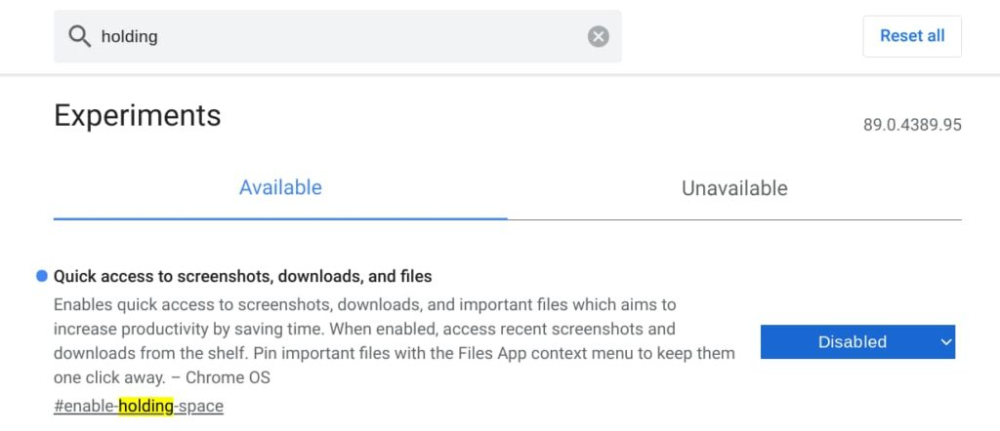
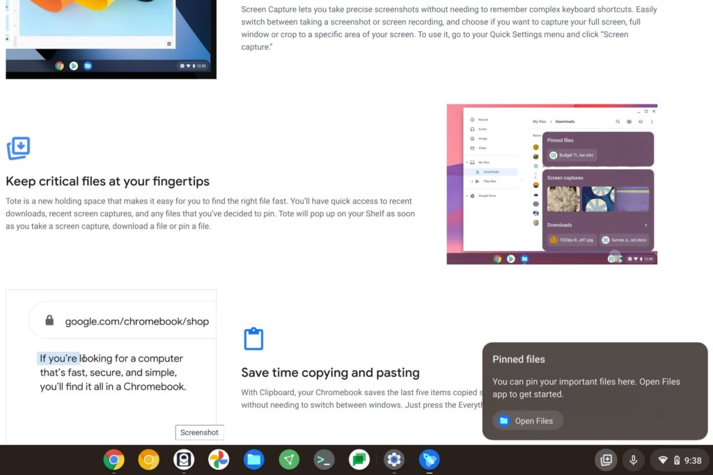

I've heard from a number of readers and on various social media sites from folks who don't like [the new Tote feature in Chrome OS 89](https://www.google.com/chromebook/whatsnew/?utm_source=newfeatures&utm_medium=blog&utm_campaign=chromebook10). Apparently, not everyone is a fan. The good news is that it's currently easy to disable it, which removes the extra icon near the Quick Settings panel on your Chromebook. There's bad news too, but I'll share that after explaining how to remove Tote from Chrome OS 89.

If you're not familiar with the Tote feature, it basically provides quick access to recent or pinned files on your Chromebook.

Here's how Google describes it:

> Enables quick access to screenshots, downloads, and important files which aims to increase productivity by saving time. When enabled, access recent screenshots and downloads from the shelf. Pin important files with the Files App context menu to keep them one click away. 

For those who want that access, this is indeed a time saver. However, I'm in the camp of "no thanks" and I'd rather not have the icon appearing, nor the feature working. So here's how I removed it, which is quite easy.

Type [chrome://flags/#enable-holding-space](//flags/#enable-holding-space) in your Chromebook browser, or click the link I've provided.

Then change the option to the right of the flag information to Disabled.

Click the Restart button at the bottom right of the window and after a few seconds, you'll be all set: The Tote feature will be gone.

**_Now for the bad news._**

While this process works in the Chrome OS 89 Stable Version, I was testing something on another Chromebook with Chrome OS 91 Dev Version software.

This flag for the Tote feature is not there.

And that makes sense because flags are for "experimental" features. With Tote enabled in the Stable Channel by default, it's no longer experimental but "generally available."

So as Chrome OS moves up in versions, the flag will be expired and therefore disappear. Essentially, we'll all be stuck with the Tote icon and functionality.

New Tote feature in Chrome OS 89

Personally, I think this feature should be user-configurable in the Chrome OS Settings app. If you want to use it, enable it. If you don't, disable it.

As of now, however, it won't be.

My suggestion for those who don't want Tote enabled by default, or want a user option to turn it on or off would be to send feedback to Google. It's quite simple: Just press Alt + Shift + I (as in "_Igloo_") to open up a feedback screen. Type your thoughts, capture a screenshot if you'd like, and send it to Google.

Perhaps if enough of the "no Tote, please" users submit this feedback, Google might consider a less universal approach.
