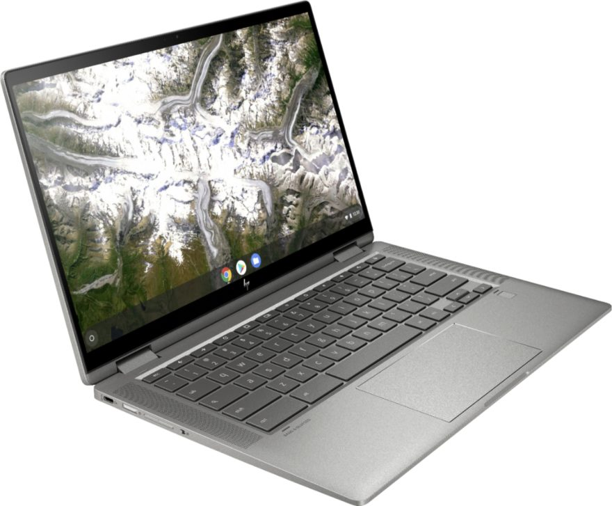

There's no need to fight Black Friday crowds for deals this year as many retailers are using this whole week to share their discounts. And to limit in-store activities due to COVID-19, for that matter. Best Buy's Black Friday week has kicked off and if I had to pick one deal out of the bunch, I'd go with the HP Chromebook 14c. Normally priced at $629, [this convertible Chromebook is discounted to $379](https://www.bestbuy.com/site/hp-2-in-1-14-touch-screen-chromebook-intel-core-i3-8gb-memory-64gb-emmc-flash-memory-mineral-silver/6407695.p?skuId=6407695), making it a steal for what you get.

If you recall when HP announced the starting price of $499 for this 14-inch 2-in-1, I said to pay attention to the device specifications. That base model uses a dual-core [Intel Pentium Gold 6405U](https://ark.intel.com/content/www/us/en/ark/products/197888/intel-pentium-gold-6405u-processor-2m-cache-2-40-ghz.html) processor, 4 GB of memory and 64 GB of local storage. Buy getting the $379 special deal, this HP Chromebook X360 14c gets beefier hardware: a 10th-generation dual-core [Intel Core i3-10110U](https://ark.intel.com/content/www/us/en/ark/products/196451/intel-core-i3-10110u-processor-4m-cache-up-to-4-10-ghz.html) processor, 8 GB of memory and the same 64 GB of eMMC storage.

Along with the updated processor and memory, this model has a 14-inch IPS 1920×1080 touch panel with an average but decent 250 nits of brightness and 45% NTSC support. It also has WiFi 6 and Bluetooth 5 support, plus a trio of USB ports: 2 SuperSpeed Type-C and one SuperSpeed Type-A.

The keyboard is backlit and you can add additional local storage via a memory card slot. The 2-in-1 laptop supports an optional USI stylus and charges over USB-C with an included 45W charger. And it has a handy fingerprint sensor under the right corner of the keyboard as well.

It's hard to find a Chromebook at this price with a Core i3 processor, let alone 8 GB of memory, which I generally recommend as the minimum if possible. Having more than double the relatively standard 4 GB of RAM offers more headroom to open up dozens of browser tabs or run Android apps alongside the browser. It's not a "must-have" for most Chromebook users but definitely nice to have.

[Get this HP Chromebook X360 14c deal](https://www.bestbuy.com/site/hp-2-in-1-14-touch-screen-chromebook-intel-core-i3-8gb-memory-64gb-emmc-flash-memory-mineral-silver/6407695.p?skuId=6407695 "Get this HP Chromebook X360 14c deal")

_**Update: This post was originally published on November 23. As of today, this deal is back.**_
