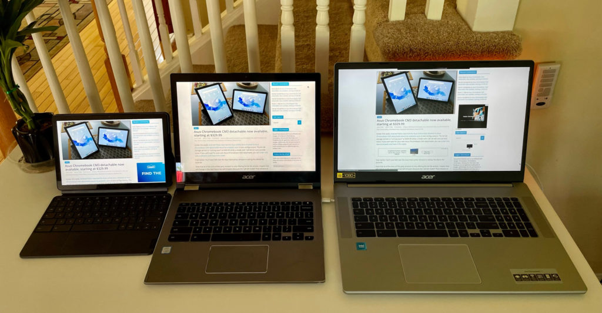
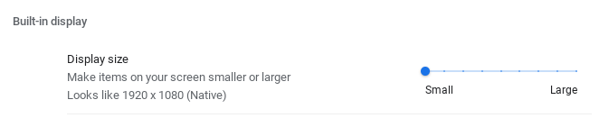
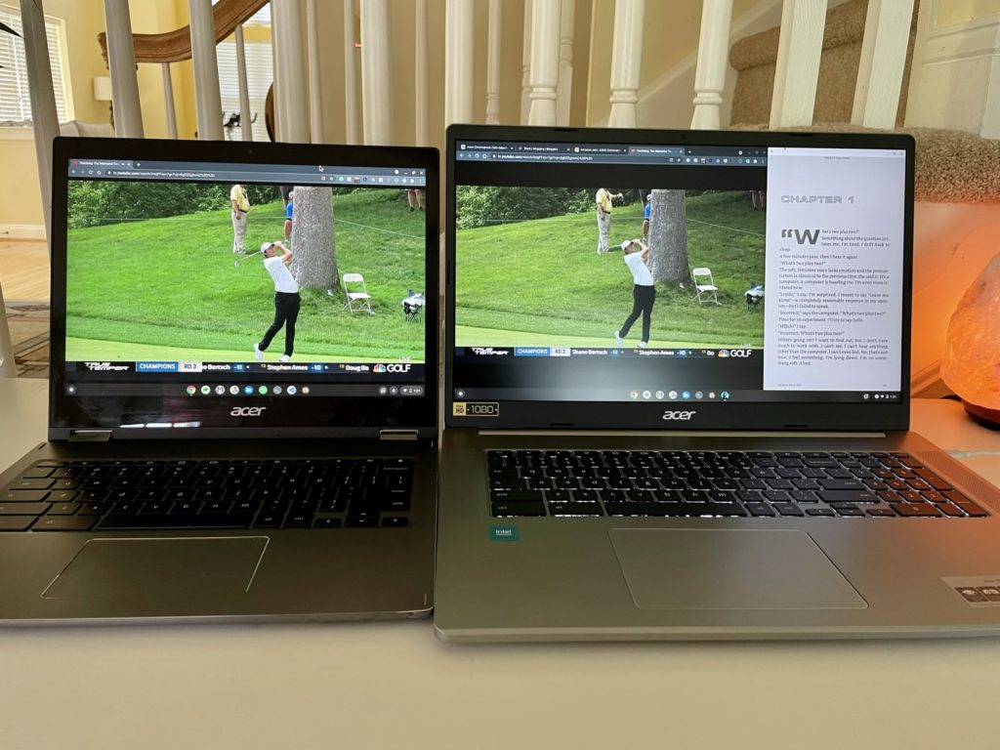
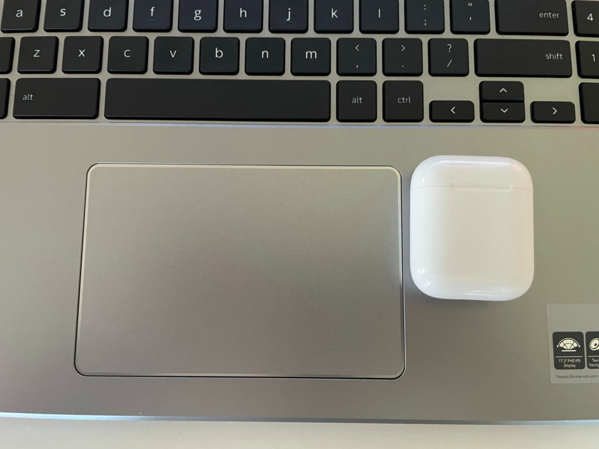
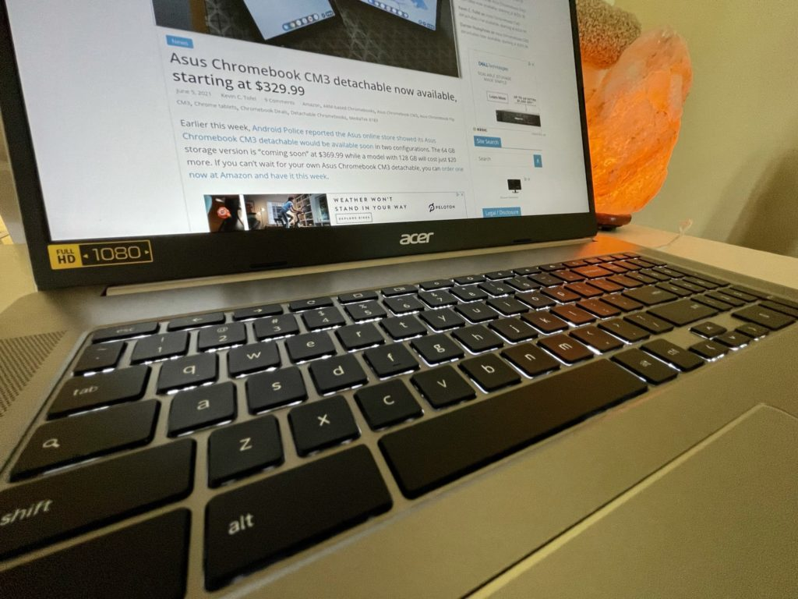

Last week, [Acer introduced four new Chromebooks including the massive Acer Chromebook 317](https://www.aboutchromebooks.com/news/4-new-acer-chromebooks-11th-gen-intel-chips-and-one-with-thunderbolt-4-0/). This is the first Chromebook with a 17.3-inch display, making it ideal for working at a desk or table. It's an entry-level device with an expected starting price of $369.99, with availability later this month in North America.

I have an early, pre-production model that Acer sent the day before it announced the device. Between that tight time frame and 1,300 miles of driving to visit college campuses after that, I decided to wait on my first look.

I've now spent two full days looking over the [Acer Chromebook 317](https://www.acer.com/ac/en/US/content/model/NX.AQ2AA.001) and it's an intriguing device. I say that even though I skew towards higher-end devices.

Given this is a pre-production model, I can only share general impressions. So there won't be any benchmark tests or expectations of performance and battery life. However, I can tell you a bit about the device itself.

For starters, Acer sent me an upgraded model. I don't know the cost of this version but here are the basic specs of this Acer Chromebook 317 configuration:

- 17.3-inch IPS 1920 x 1080 non-touch display, 16:9 aspect ratio
- Quad-core [Intel Celeron N5100 CPU](https://ark.intel.com/content/www/us/en/ark/products/212329/intel-celeron-processor-n5100-4m-cache-up-to-2-80-ghz.html) with Intel UHD Graphics
- 8 GB of LPDDR4x RAM
- 64 GB of eMMC local storage
- WiFi 6 (2x2 MIMO) and Bluetooth 5.0
- Wide-view webcam
- Weight: 5.18 pounds
- Expected battery life of 10 hours

Note the only differences between this upgraded configuration and the base model are the memory (8 GB vs 4 GB) and the four-core Intel N5100 chipset. The base Acer Chromebook 317 will have a [dual-core Intel N4500](https://ark.intel.com/content/www/us/en/ark/products/212326/intel-celeron-processor-n4500-4m-cache-up-to-2-80-ghz.html) under the hood.

Other upgraded models will offer 128 GB of storage, a multi-touch display and/or an Intel Pentium Silver N6000 processor.

So back to what intrigues me here.

As I noted, the Acer Chromebook 317 is targeted at the entry-level market. And that generally means 4 GB of memory. Not this time, since 8 GB of RAM is an available option. Even though I don't know the cost of that bump, it brings tremendous value to this segment from a usability perspective. More memory generally means more apps and browser tabs in use simultaneously.

Also interesting is this massive display. You can see that compared to the 10.1-inch Lenovo Duet Chromebook and my daily driver, the 13.5-inch Acer Chromebook Spin 13.

All displays are set to the default display scaling and around 75% brightness above.

That massive screen makes it much easier to read text right off the bat. And on this particular unit, the IPS display has decent color saturation. One interesting observation though: I can't scale the display to show more information across the display.

I can only make everything larger. That may change between now and when production units arrive.

Regardless of that, I can keep up with golf on YouTube TV while doing something else on the Acer Chromebook Spin 317. And the video player isn't that much smaller than watching the same thing on my Acer Chromebook Spin 13.

While the large display is the what draws my eye to this Chromebook, the overall chassis is nicely appointed.

You have dual speakers on each side of the backlit keyboard and numeric keypad. The trackpad is nearly as large as my hand. Here it is with an Apple AirPods case (similar to a dental floss container) for reference.

And ports are split nicely on both sides. Each has a USB Type-C and a USB-Type A. The left side also houses the microSD card slot and headphone microphone jack.

My limited usage of the keyboard and mouse are in line with what I'd expect for a Chromebook at this price. Very usable but not the best I've used. I think that's partly because of what I believe is an all-plastic build.

Fit and finish will vary between this specific device and production units, but I don't see any issues. I will forewarn you that there could be a bit of chassis flex, particularly above the keyboard. We'll have to see if production units are reinforced there, although it's not common to push down in that spot.

Again, I need more horsepower than a Celeron CPU for what I do on my Chromebook. [I use an Intel Core i5 device with 16 GB of memory](https://www.aboutchromebooks.com/news/acer-chromebook-spin-13-with-16-gb-ram-should-you-buy-one/) for [my computer science classes](https://www.aboutchromebooks.com/news/can-you-learn-to-code-in-a-college-computer-science-program-with-a-chromebook/), which rely heavily on Linux apps.

Even so, I think Acer is on to something with the first 17.3-inch Chromebook, particularly with a sub-$400 starting price. For my basic web work of email, blogging, watching YouTube videos and other content, my brief experience was positive.

I'll try to get a production review unit if folks are interested in a full review. Let me know!
