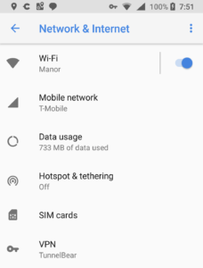

Chromebook owners that are fans of the Always-on VPN feature in Android have something to look forward to: A future version of Chrome OS will be able to use that function, automatically helping to [secure a Chromebook accessing public Wi-Fi hotspots](https://chromium-review.googlesource.com/c/chromium/src/+/1052507); essentially a must for enterprise workers.

What's interesting about this is that the Chromium team will be implementing Always-on VPN through Android running on a Chromebook. And the encrypted connection will be available to the Chromebook immediately after a reboot, **_before_** the Android app container, known as ARC++, even launches. Here's a description of the code change:

> To expand the Always-on VPN feature on Android to apply to chrome, we need to know what VPN package to apply it to. Then we store that information in a pref in chrome, so that it is available after restart, even before ARC++ has started.

It's a clever tweak as I've heard many complaints on setting up and using VPNs on Chrome OS. The process may actually be easier within in Android; I don't know because I use a VPN extension in Chrome when I need to.

\[caption id="attachment\_1277" align="alignright" width="228"\] Android VPN option in Network & Internet settings\[/caption\]

Anyone can benefit from using a VPN, which encrypts your connection so that no data can be accessed while it's in flight. Additionally, websites won't have your actual IP address or location. From a consumer standpoint, VPN connections typically won't work with online streaming subscriptions such as YouTube TV because those services are designed to work in specific locations; with a VPN connection, for example, my YouTube TV doesn't work.

The bigger bang for buck though with an Always-on VPN is likely for Chromebook users in enterprises where VPN connections are often required for remote access in order to protect sensitive business or employee data and security credentials.

From the code additions, it appears that device administrators will have a policy to enable and force the Always-on VPN function, which makes sense from a security standpoint.

And since the feature will work upon a restart immediately, IT should be happy as will Chromebook users while working remotely; they won't have to worry about enabling their VPN after each reboot.
