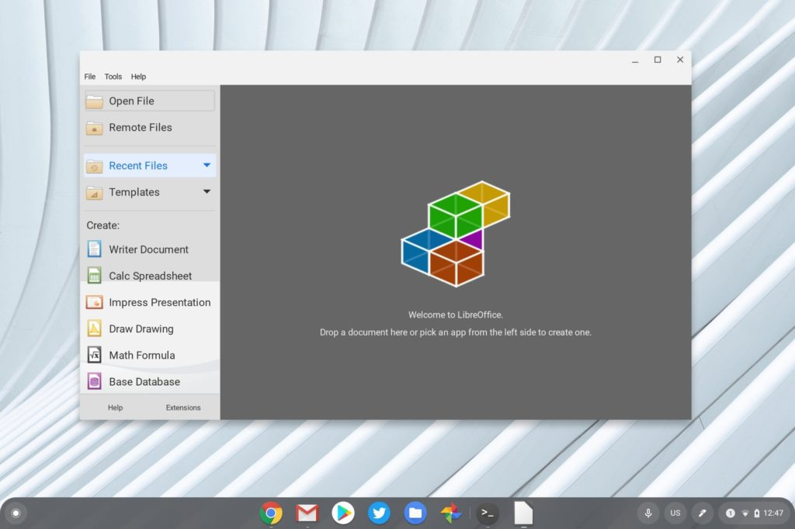

For some time now, Chromebook owners using Linux or Android apps have used emulation to run Windows software. Now, a native solution is coming: This fall, [Chrome Enterprise devices will have Windows support via Parallels on Chrome OS](https://www.parallels.com/chrome/). The news and partnership was announced on Tuesday both [by Google](https://cloud.google.com/blog/products/chrome-enterprise/the-remote-work-revolution) and Parallels.

Why now? According to the Google blog post, the COVID-19 pandemic has accelerated remote work so much that the time is right.

> We’ve long been saying that almost any business role can be a cloud worker, and COVID-19 has dramatically made this point. As a result, the Chrome OS team is working on new ways to make sure every company can benefit from the velocity created by supporting a cloud workforce.
> 
> John Solomon, VP, Chrome OS

And that's not to mention the increase in Chromebook sales Google noted today. The company says there's been a 109% year over year growth in US Chromebook sales, plus a 155% jump in commercial Chromebooks in the first quarter since the year ago period.

Clearly, add Windows support via Parallels to Chrome Enterprise devices will cause some IT departments to consider Chromebooks a bit more than ever before.

Instead of using Microsoft Office for Android, Office365 on the web, Google Docs or [LibreOffice on Linux](https://www.aboutchromebooks.com/news/how-to-install-libreoffice-for-linux-on-a-chromebook-after-downloading-it-as-a-tar-gz-file/), Parallels promises the full-fledged Office suite for Windows on Chromebooks this fall. And although Office is a mainstay in the enterprise, this solution opens up a multitude of other Windows desktop software opportunity on Chromebooks.

LibreOffice on a Chromebook

Will consumer Chromebooks ever see the same? I think so at some point although I do think its smart for this partnership to start in the enterprise. Chromebooks for consumer and education use has been growing for several years, likely faster than Chrome OS in the business world, last quarter notwithstanding.

There's a much larger growth opportunity for Google to tap into enterprises here as a start. Then, assuming consumer devices have enough horsepower, Windows support via Parallels on Chrome can filter its way down to everyday home and school uses.
