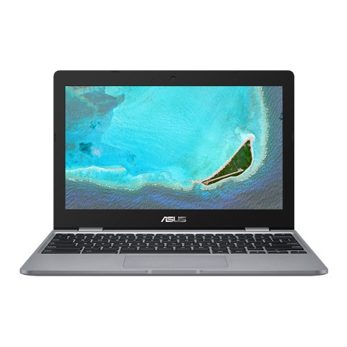
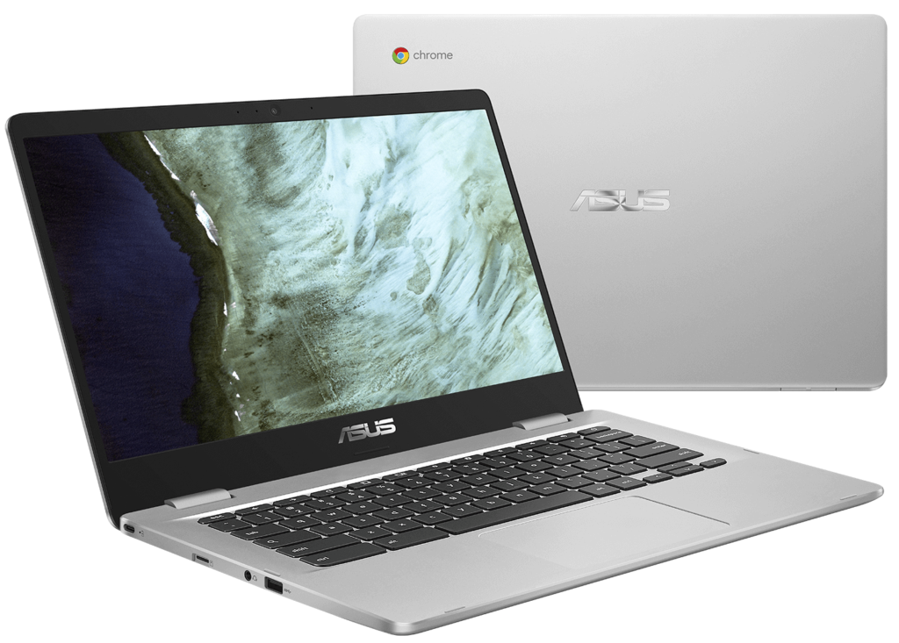
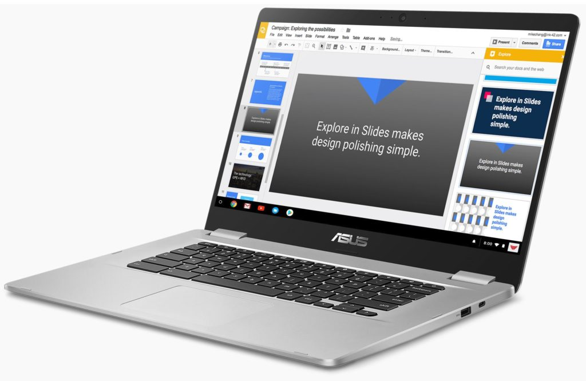

With a slew of new Chromebooks from [Acer](https://www.aboutchromebooks.com/news/acer-chromebook-spin-13-price-specifications/), [Dell](https://www.aboutchromebooks.com/news/dell-inspiron-chromebook-14-early-release-date-best-buy/), Google, and [Lenovo](https://www.aboutchromebooks.com/news/lenovo-yoga-chromebook-c630-price-availability-4k/) now or soon hitting retailers, many are concerned that the market is shifting to more expensive devices. The least expensive from this bunch is $599 and you can easily spend $1,000. But I've been saying not to worry: There's still a large consumer and education audience for entry-level Chromebooks that won't break the bank. Asus validated that theory this week by debuting [a trio of Chromebooks that start in the low-$200 range](https://www.asus.com/us/News/Xr5fZ4M8OZ0tsEW4), with all three expected to run for 10 hours on a charge.

Here's a rundown of the choices, which generally vary by screen size:

<iframe style="width: 120px; height: 240px;" src="//ws-na.amazon-adsystem.com/widgets/q?ServiceVersion=20070822&amp;OneJS=1&amp;Operation=GetAdHtml&amp;MarketPlace=US&amp;source=ac&amp;ref=tf_til&amp;ad_type=product_link&amp;tracking_id=aboutchromebo-20&amp;marketplace=amazon&amp;region=US&amp;placement=B07G2XB2MB&amp;asins=B07G2XB2MB&amp;linkId=59297e6baf3ca334534b1d3f29b3e70b&amp;show_border=true&amp;link_opens_in_new_window=true&amp;price_color=333333&amp;title_color=0066c0&amp;bg_color=ffffff" frameborder="0" marginwidth="0" marginheight="0" scrolling="no" align="right"></iframe>

The [Asus Chromebook C223](https://www.asus.com/us/Laptops/ASUS-Chromebook-C223/specifications/) runs on a 1.1GHz Intel Celeron Dual-Core N3350 processor paired with 4GB of memory and 32GB of eMMC storage, although it also has an integrated card reader for external storage. It's the smallest of the bunch with an 11.6-inch display that provides 1366 x 768 resolution. You won't get touch support on the screen and the colors will likely be muted: Asus says the panel provides a 45% NTSC color gamut, which isn't very high.

Most of the other essentials are there though: 802.11ac Wi-Fi, 2 USB Type C ports -- one with power delivery to charge other devices -- and 1 USB Type-A port, an HD webcam, and stereo speakers. No Bluetooth or backlit keyboard at this level for the 2.2 pound Chromebook, however. Still, we're talking about a $229 entry price, making this a great secondary device for casual browsing or Android apps, or a potential option for the family.

Next up is the [Asus Chromebook C423](https://www.asus.com/us/Laptops/ASUS-Chromebook-C423/) that moves up in size while retaining many of its smaller sibling's internals.

<iframe style="width: 120px; height: 240px;" src="//ws-na.amazon-adsystem.com/widgets/q?ServiceVersion=20070822&amp;OneJS=1&amp;Operation=GetAdHtml&amp;MarketPlace=US&amp;source=ac&amp;ref=tf_til&amp;ad_type=product_link&amp;tracking_id=aboutchromebo-20&amp;marketplace=amazon&amp;region=US&amp;placement=B07HRZM2V4&amp;asins=B07HRZM2V4&amp;linkId=f1bd9d2790afebf1547a934e1efaeb0b&amp;show_border=true&amp;link_opens_in_new_window=true&amp;price_color=333333&amp;title_color=0066c0&amp;bg_color=ffffff" frameborder="0" marginwidth="0" marginheight="0" scrolling="no" align="right"> </iframe>

This 14-inch Chromebook runs on the same 1.1GHz Intel Celeron Dual-Core N3350 processor but can be had with an Intel Pentium Quad-Core N4200 chipset as an option. Memory choices are either 4GB or 8GB, based on the model, as is 32GB or 64GB of eMMC storage.

The base model display is the basically the same as the one on the C223 -- bigger, of course -- with a mediocre color gamut. I do like the thin bezels on the left and right of the display though.

There is a touch display option and you can fold the display back 180-degrees, although I don't see many use cases for that position. You get an extra USB Type-A port over the C223 as well as Bluetooth 4.0 on this 2.7 pound Chromebook, which starts around $270.

Lastly is the big one: [The Asus Chromebook C523](https://www.asus.com/us/Laptops/ASUS-Chromebook-C523/) and its 15.6-inch display. This is essentially the same device with the same options as the C423 with the main difference being the screen size and the weight which is 3.7 pounds. If you expected a price boost along with the size and weight increase over the C423, you expected wrong. I see pricing at a few online retailers [with inventory coming soon at the same $270 price-tag](https://www.bhphotovideo.com/c/product/1437069-REG/asus_c523na_dh02_15_6_32gb_c523_chromebook.html?ap=y&gclid=Cj0KCQjw08XeBRC0ARIsAP_gaQCCiUY-1zOOGvK0wbU7vAZinASdzljtwmBu0_z-90B1H8YQpEllt48aAnScEALw_wcB&smp=y) as the 14-inch model.

Again, none of these devices will have eye-popping colors or wide-viewing angles. Plus the Celeron and Pentium options are the lowest-powered silicon offered by Intel in a Chromebook these days. So it may be worth splurging a bit more if those things will bother you. If not, you can pick one of three sizes and get yourself an entry-level Chromebook for under $300 and call it a day.
