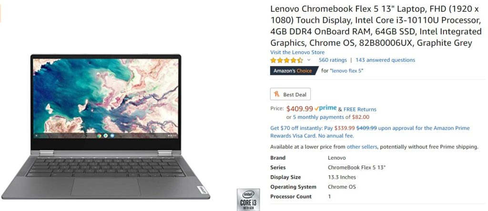

With so many schools having to go virtual due to COVID-19, Chromebooks have been hard to come by for months. Most of what I've found in stock these days are older devices, [sometimes posing as new ones](https://www.aboutchromebooks.com/opinion/opinion-amazon-needs-to-stop-listing-chromebooks-with-misleading-information/), that you really should skip.

This morning, however, I did find that [Amazon has the Lenovo Flex 5 Chromebook in stock for U.S. delivery](https://amzn.to/3lsJyq9).

(**_Note_**: While the above link may take you to a higher priced option from a third-party on Amazon, clicking the option to see all prices and shippers is showing me the original $409.99 deal with free Prime shipping and sold by Amazon.)

Priced at $409.99 I think this is a great value for the the money, especially after using the device; [see my hands on thoughts here](https://www.aboutchromebooks.com/news/lenovo-flex-5-chromebook-hands-on-and-first-impressions/).

You could spend more and get double the RAM on a different 2020 Chromebook, for example, or a higher-performing Core i5 processor, but you're probably looking at another $150 or so. If you're looking for a virtual learning device, an every day, all day browser, and some Android apps, you can _easily_ get away with this device based on the hardware specifications:

<table><tbody><tr><td>CPU</td><td>10th-Gen Intel Core i3</td></tr><tr><td>GPU</td><td>Intel Integrated Graphics</td></tr><tr><td>Display</td><td>13.3-inch 1920 x 1080 IPS touchscreen, 300 nits</td></tr><tr><td>Memory</td><td>4 GB / DDR4</td></tr><tr><td>Storage</td><td>64GB eMMC, microSD slot for expansion</td></tr><tr><td>Connectivity</td><td>WiFi 6, Bluetooth 5.0</td></tr><tr><td>Input</td><td>Water-resistant, backlit keyboard, multitouch trackpad, 720p webcam</td></tr><tr><td>Ports</td><td>Two USB Type-C (3.1), one USB Type-A (3.1), headphone jack</td></tr><tr><td>Battery</td><td>Run-time of up to 10 hours</td></tr><tr><td>Weight</td><td>2.97 pounds</td></tr><tr><td>Software</td><td>Chrome OS automatic software update expiration: June 2028</td></tr></tbody></table>

There are a bunch of solid mid-range components in there along with some future-proofing. You're getting WiFi 6 support, for example, and nearly 8 years of Chrome OS software updates.

That, combined with a very solid 1080p IPS touchscreen display, a 10th-gen Intel Core i3 and up to 10 hours of run time make the Flex 5 an attractive convertible Chromebook.

[Get the Lenovo Flex 5 Chromebook](https://amzn.to/3lsJyq9 "Get the Lenovo Flex 5 Chromebook")

_**Update**: This post was originally published on September 27, 2020 and updated on October 8._
