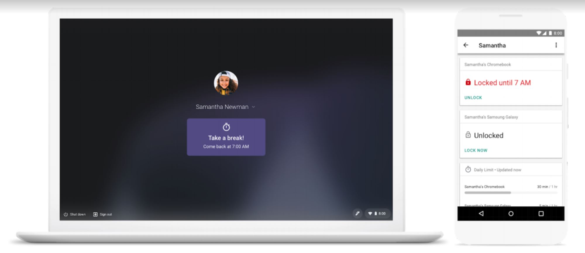

Back in September, [Google expanded its Family Link service from Android devices to Chromebooks](https://www.blog.google/technology/families/helping-more-families-set-digital-ground-rules-family-link/). On Thursday, [Google added new Family Link features on the Chromebook side](https://blog.google/products/chromebooks/helping-families-develop-healthy-digital-habits-chromebooks/) that will allow parents to have more control over how, and how long, their kids use Chrome OS devices.

The new additions include:

- Screen time settings: Parents can limit the amount of time their child's Chromebook is used on a daily basis, set bedtime hours and even view Chromebook usage reports to better understand how much a home Chromebook is used.
- Site and app whitelisting: This adds the ability for parents to allow access to only certain websites or Google Play Store apps on a Chromebook, similar to managed Chrome OS devices in enterprises. Unapproved apps can even be hidden so children don't see them in the Google Play Store.
- Account and device settings: With the updated Family Link service, parents can remotely lock managed Family Link accounts and review or edit their child's Google account settings.

 Since Family Link is based on Google accounts, parents can manage a shared Chromebook differently for individual children. You may want to hide specific apps or limit access to particular websites for a 6-year old, for example, but let that child's 14-year old sibling have a little more freedom on the same device.

We've seen these types of parental controls come to phones over the past year or so and it's fitting that Google bring the same to Chromebooks. Obviously, it's up to each individual family to decide whether or not Family Link fits well in their own home and it's completely optional. For those households that want to actively manage devices, however, Family Link is a _great_ feature to have.

My own kids are now college age, so I don't take advantage of any such controls on their devices save for one: Application purchases on a family credit card.

I do that because we all share apps across phones so that we don't all purchase the same software multiple times. I pay for those upon review and I have yet to say "no" to a request. If my kids want to buy their own apps that I don't need to know about, they do that on their own dime at this point. I'd feel differently if the kids were ten years younger and I'd be taking full advantage of Family Link.
