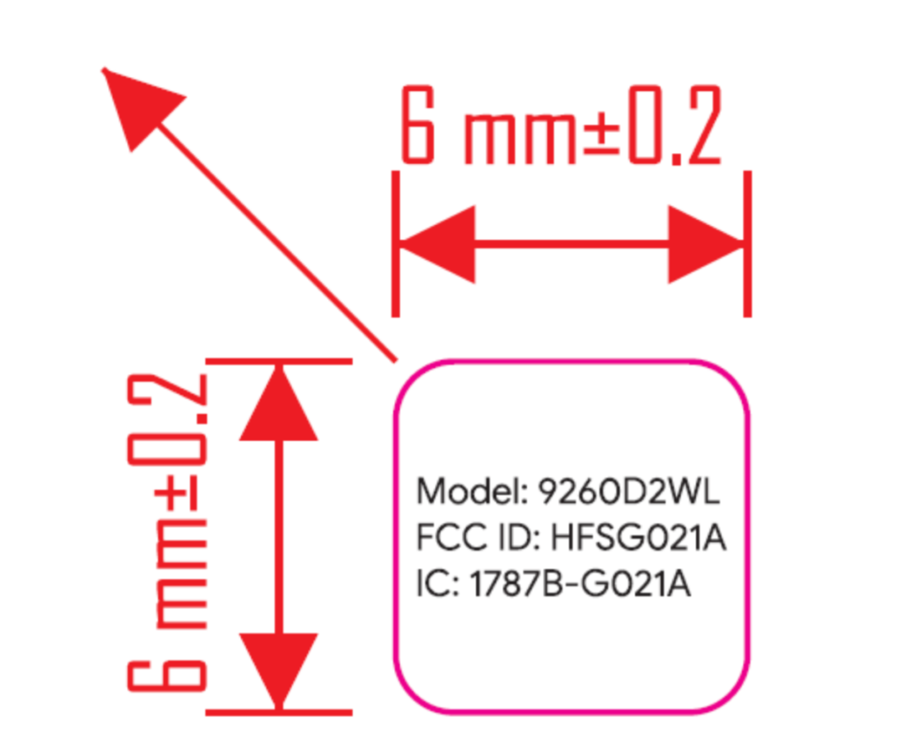

Google's expected hardware event in October to release new Pixel phones and a likely Pixelbook successor called Atlas is fast approaching. That's why now is the time we should start seeing evidence of the next Pixelbook and it appears that the FCC has some.

[Spotted by 9to5 Google](https://9to5google.com/2019/07/24/google-device-fcc-pixelbook-successor-atlas/), there's an [FCC filing from Quanta](https://apps.fcc.gov/oetcf/eas/reports/ViewExhibitReport.cfm?mode=Exhibits&RequestTimeout=500&calledFromFrame=N&application_id=z5nbKh42EUvGx3I9TtP%2Fzw%3D%3D&fcc_id=HFSG021A) that appeared earlier today. Don't get too excited because it's essentially a small change request for the wireless chip inside whatever device Quanta is building. However, Quanta does build Google devices such as the Pixel Slate, leading to some speculation that this filing is specific to the Atlas Chromebook.

In terms of the change, it will allow Quanta to use the [Intel Wireless-AC 9260 chip](https://www.intel.com/content/www/us/en/products/wireless/wireless-products/dual-band-wireless-ac-9260.html), which supports 160 MHz channels of 802.11ac Wi-Fi for up to 1.73 Gbps transfer speeds and Bluetooth 5. Neither the Pixelbook nor the Pixel Slate has those capabilities.

Keep in mind that Quanta also builds hardware for other Chromebook brands such as Acer so there's no guarantee that this filing represents Atlas. However, the timing and performance sound right to me, so I think 9to5 Google's take is correct. Adding to the theory is a device ID of HFSG021A; the IDs of the Pixelbook and Pixel Slate are a similar HFSC0A and HFSC1A, respectively.

What little do know, or at least strongly suspect about Atlas is a [high-resolution touch screen, possibly with 4K resolution](https://www.aboutchromebooks.com/news/chromium-code-suggests-4k-chromebook-code-named-atlas-in-the-works/), a top-notch, 1080p [Sony camera sensor](https://www.aboutchromebooks.com/news/4k-atlas-chromebook-detachable-imx208-1080p-front-camera/), [use of an Intel Sensor Hub](https://www.aboutchromebooks.com/news/atlas-chromebook-battery-boost-co-processor-intel-sensor-hub-ish/) to save battery life, and the possibility of a detachable display.

That last point was discovered early on in development for Atlas and the design may have since changed now that [Google has exited the tablet hardware business](https://www.aboutchromebooks.com/news/made-by-google-exit-tablet-business-pixel-slate-chrome-os-chromebooks/). It all depends on if you consider a Chromebook with detachable display to be both a laptop and a tablet, of course.
