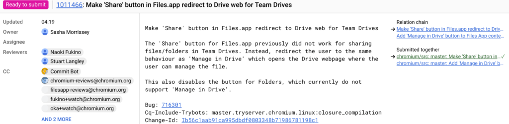

Admittedly, the Files app on Chrome OS is pretty bare-bones. It's simple but lacks many features found on Windows and MacOS computers. It's getting better though, at least based on some new code commits that show what the Chrome OS team is working on in regards to Google Drive integration.

First is a quick method [spotted by XDA-Developers to manage a file stored on your Google Drive](https://www.xda-developers.com/chrome-os-manage-google-drive-files-files-app/). Ideally, I'd like to see the Files app natively support all of the same management features you see in the Drive web app. That's not what the team is working on.... yet.

For now, it looks like a ["Manage in Drive" option will appear when right-clicking a file in the Files app](https://chromium-review.googlesource.com/c/chromium/src/+/1011465). That will open up the Drive web app and take you to the file so you can fully manage it, i.e.: Share, Get Sharable Link, Move, Make a Copy, etc... Note that you'll need to be online for this option. That makes sense since Files will be sending you to the live Google Drive web app. Presumably, if your Chromebook doesn't have connectivity, the "Manage in Drive" option will be hidden or greyed out.

Related to this change -- bundled with it, in fact -- is another Drive redirect option that has to do with file sharing. Apparently, the Share feature as part of ["Manage in Drive" hasn't been working for files (but not yet folders) stored in Team Drives](https://chromium-review.googlesource.com/c/chromium/src/+/1011466/3). That's getting fixed per the code commits, assuming all of the testing works out.

Note that these updates to the Files app aren't even in the Dev Channel yet, so it's possible that there are additional changes or modifications to the current work-in-progress features. Hopefully we see them soon, along with even more functionality for the Files app in Chrome OS.
