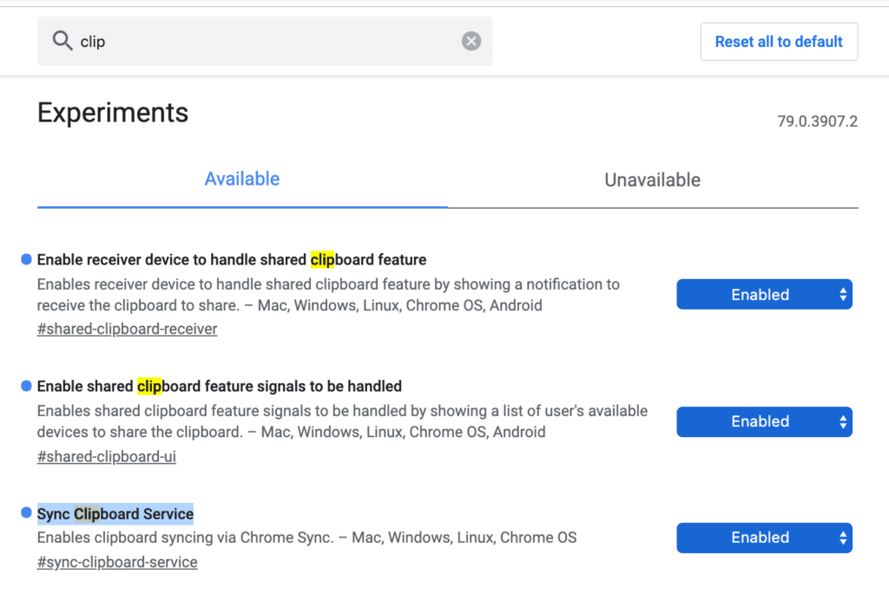

Last month, code commits indicated in no uncertain terms that Google was planning [a Shared Clipboard feature between devices that run the Chrome browser, including Chromebooks](https://chromium-review.googlesource.com/c/chromium/src/+/1741814).

The feature is now available but only in the often unstable Canary Channel, and is expected to be released with Chrome OS 78, currently slated for October 28.

Thankfully, Dinsan Francis at Chrome Story has no problems throwing caution to the wind and using the Canary Channel. With it, [he's already sharing copied text between devices that use Chrome](https://www.chromestory.com/2019/09/how-to-use-chromes-shared-clipboard/) by enabling these flags:

Credit: Chrome Story

I won't steal all of Dinsan's thunder because you should take a look at all of the screenshots he took when using the shared clipboard. In fact, he has a complete walkthrough of how to use this feature when it arrives.

I'd expect to see it on the Developer Channel within the next week or two, which - although is also a bit unstable - is typically good enough to get through a workday save for the occasional bug.

I'm looking forward to this method of sharing text snippets between devices, much as you can do with links using the [Send to your Devices feature](https://www.aboutchromebooks.com/news/chrome-os-76-adds-send-to-self-feature-for-pushing-web-pages-to-your-other-devices/) that arrived in [Chrome OS 76](https://www.aboutchromebooks.com/news/chrome-os-76-stable-version-arrives-heres-what-you-need-to-know/).

Keep in mind that this feature isn't limited to Chromebooks and Android devices. Any device running the Chrome browser, including macOS and Windows computers, as well as iOS phones and tablets, should be able to sent text snippets to other supported devices.
