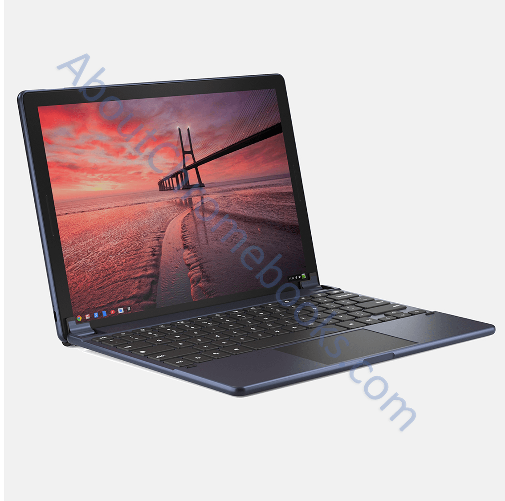

I recently discovered [two Chrome OS tablet keyboards from](https://www.aboutchromebooks.com/news/brydge-wallaby-goanna-keyboards-for-chrome-os-pixelbook-nocturne-tablets/) Brydge and perhaps more interesting than the keyboards themselves is the image of a Chrome tablet attached to one of them. While this could be a simple render, I believe this is the first image of what I'd call the Pixelbook tablet, also known as Nocturne, [which should debut on October 9](https://www.aboutchromebooks.com/news/pixelbook-2-atlas-nocturne-madebygoogle-event-october-9/).

Why do I think that? Take a real close look at the tablet. Aside from the Chrome OS screen rendering, I first thought this was an iPad Pro with rounded corners and a thin design. But the device is shown with Chrome OS, although I'm _sure_ the screen is rendered on the display. Second, you can see what appears to be a USB Type-C port on the bottom left of the tablet. Nocturne will have two USB Type-C ports, likely one on each side.

Dive into the sides of the tablet in the image and you'll see elongated speakers; it's easier to see the one the left but if your boost the brightness of your device, you'll see a duplicate speaker on the right. I don't know of another tablet that has speakers with such long speaker grilles.

Lastly, let's take a look at the tablet in the keyboard from above:

Do you see the same flat power button that I see? Does it remind you of anything? It should. That looks just like the rendering of the [fingerprint sensor enrollment image for Chrome OS found by Chrome Unboxed](https://chromeunboxed.com/news/chromebook-tablet-fingerprint-render-side-scanner-thin-bezels/) earlier this month:

Again, this _could_ be a render. But I don't think so. I think it's at least a dummy shell for Nocturne and it debuts in a few weeks as the flagship Google tablet for Chrome OS. The fact that there's no company logo on the bottom bezel is another indicator that this is a Google device.

Just a reminder, we already know that from early on [Nocturne would support a fingerprint sensor](https://www.aboutchromebooks.com/news/nocturne-to-be-a-chrome-os-detachable-with-high-res-display-and-fingerprint-reader/). And that it won't likely have an SD card slot, which I don't see, although we can only view four of the tablet's two sides. [Nocturne will also have](https://www.aboutchromebooks.com/news/atlas-and-nocturne-chromebooks-may-natively-support-acoustic-echo-cancellation/) AEC, or acoustic echo cancellation and I do see multiple microphone holes on the above tablet, which would be needed for that feature. I'd expect this device to have fanless 8th-generation Intel processors as well. And [Nocturne was first revealed to have pogo pin support](https://www.aboutchromebooks.com/news/nocturne-chromebook-to-power-its-detachable-keyboard-like-apples-smart-keyboard-for-ipad/). Even though we can't see them here with this Bluetooth keyboard, I suspect there are pins on the "bottom" of it. That would mean it should work with other keyboards as well.

Of course, if this is Nocturne, I was completely off with the [HP Chromebook X2-like device I found earlier this week](https://www.aboutchromebooks.com/news/nocturne-chromebook-hp-x2-lte/). Perhaps that's just a redesigned X2 with LTE, which is also appealing. But I have to say: If the above images are a Pixelbook tablet or PixelTab (who knows?), I'm already leaning towards buying it over any upgraded Chromebook X2.

_**Update**: Chrome OS code shows that [Nocturne will have a 3000x2000 resolution display](https://www.aboutchromebooks.com/news/nocturne-chrome-tablet-screen-resolution-specs-pixelbook-3000x2000/), up from the original plan of 2400x1600._
