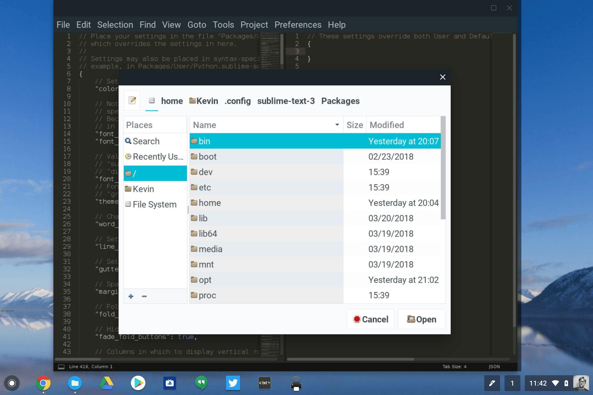

If you haven't heard about Project Crostini yet, you're missing out on what may be the most exciting new advance coming to Chromebooks. To make a long story short, Crostini allows a full Linux virtual machine environment to run in safe, sandboxed containers within Chrome OS. There's no need to use the less secure Developer Mode -- with Crouton -- for this, which makes it an ideal solution to run traditional desktop apps.

Since this solution is in its early stages, I had been holding off on kicking the tires. But after reading [this Google+ post from John Bowdre showing how Crosini looks on a Pixelbook](https://plus.google.com/+JohnBowdre/posts/SLSRh1XdCz2), I decided to take the plunge.

Note that to run the Linux VM in a Chrome OS container you have to currently:

1. Have a Pixelbook
2. Be on the Dev Channel
3. Enable the experimental _#enable-cros-container_ flag

The second reason is why I was holding off: Since my Pixelbook is my daily driver, I like to stay on the Stable Channel. Heck, let's throw caution to the wind!

This site lists the steps on how to [get Crostini running on a Pixelbook](https://github.com/lstoll/cros-crostini/blob/master/README.md) but basically you just open up a crosh terminal by pressing _ctrl+alt+t_ on your Pixelbook keyboard and run these two lines. Note that for _<username>_, I entered my first name as the account.

- _Create crostini VM vmc start dev_
- _run\_container.sh --container\_name=stretch --user=<username> --shell_

That's it. You'll see a standard terminal where you can now download, install and run Linux packages.

I haven't yet played around with getting a graphical user interface up, but I have installed a few apps I'd consider using for my coding hobby: Eclipse and Sublime Text, in particular.

I can use these apps just as I would on any traditional operating system. And anything I store is persistently stored in the VM file system. After shutting down my Pixelbook and powering it back up the next day, I opened the Linux container, ran Sublime Text and was able to retrieve a saved Python script.

I'll continue to tinker with this but have a few observations based on my limited use:

1. This opens up Chromebooks to a whole new world of offline desktop application use, of course, and nicely supplements Android app usage. I anticipate that folks will install Steam for gaming as well as programming tools and possibly productivity suites in cases where GSuite doesn't fully meet needs.
2. There's still _plenty_ of work to be done from what I can see. Crostini uses a ton of memory so I don't know how well optimized it is yet. And my guess is that a Chromebook with 4GB of memory isn't going to cut it.
3. It's not likely going to be for mainstream Chromebook users as it's a bit complicated for now. There aren't even any icons in the Chrome OS shelf to indicate you're running a Linux app in a virtual machine, [although it looks like that's in the works](https://chromium-review.googlesource.com/c/chromium/src/+/1013842). And we should be able to [pin and launch Crostini apps from the shelf](https://chromium-review.googlesource.com/c/chromium/src/+/1011485) at some point too. However, you can use the _alt-tab_ key combo to switch between Chrome OS and the Linux apps. And from what I can see, window resizing is working well.

I strongly suspect that we'll hear more details of Google's strategy involving Linux containers at Google I/O next month. That's really a developer event and right now, this looks to be the missing piece for developers who need to code directly on a Chromebook and [not use workarounds like I do](https://aboutchromebooks.com/how-to/how-to-code-on-a-chromebook-using-python-and-a-raspberry-pi/).
