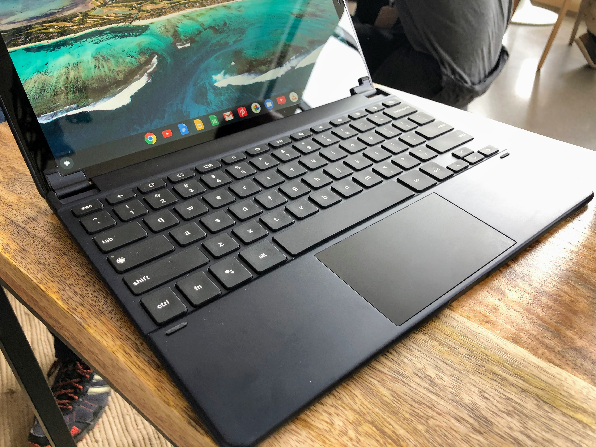

After spending the day traveling to and from New York and the #MadeByGoogle event, I'm finally home. I'm still gathering thoughts on the Pixel Slate but wanted to at least share a video look at the $199 Google Pixel Slate Keyboard. This is really the _only_ hardware that didn't completely leak before the event and I had some questions about how it would attach to the slate. Now I know.

I apologize in advance for the poor sound quality of this video. As you'll hear, it was pretty loud in the demo area. And shooting video with one hand using a phone while manipulating a tablet keyboard wasn't one of my finest moments either.

\[embed\]https://youtu.be/MqRuNDGV9lA\[/embed\]

Regardless, at least you'll get to see how the keyboard props the Pixel Slate up. You can adjust it to nearly any angle thanks to the clever use of internal magnets. And it folds completely over the back of the tablet for protection. I found the engineering and design impressive.

So too was the typing experience; I didn't do that on video but the round keys didn't bother me as much as I thought. Keyboards are very personal things, however, so some may not get used to the circles. The trackpad size is generous and the overall build quality of the units I used was excellent.

Yes, $199 is a bit steep when compared to the very similar Apple Smart Keyboard for the iPad Pro. I asked about that and was told that the Pixel Slate Keyboard some premium advantages: Namely: Completely adjustable stand angles and the trackpad, which is used for the Chrome OS mouse; something iOS doesn't have.

Those are fair points. We'll have to see how third-party keyboards for the Pixel Slate, [such as the one from](https://www.aboutchromebooks.com/news/brydge-wallaby-goanna-keyboards-for-chrome-os-pixelbook-nocturne-tablets/) Brydge, are priced to see if there are less expensive options.

Speaking of the Brydge keyboard, [it's called the G-Type](https://www.brydge.com/pages/gtype-keyboard-for-google-pixel-slate). No pricing yet, but I did get to use one. It's more of a traditional typing experience and laptop feel for those that want it. Here's a peek or at it.

