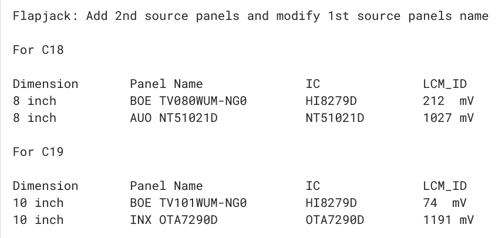
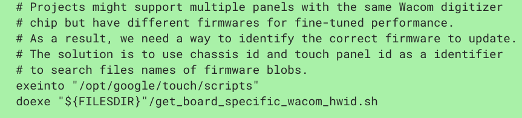
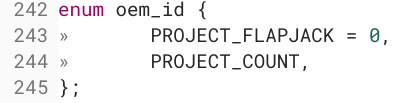
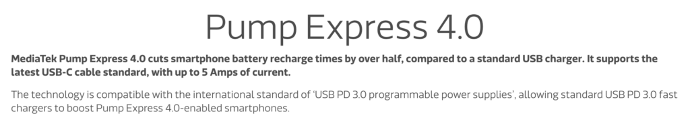
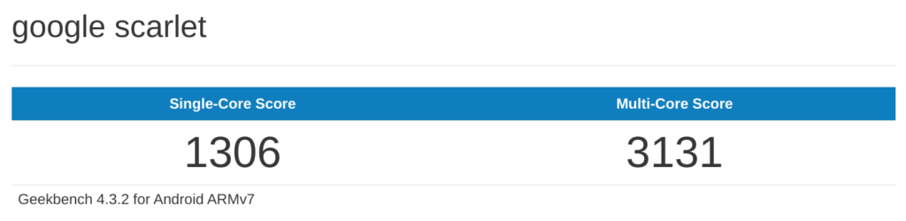
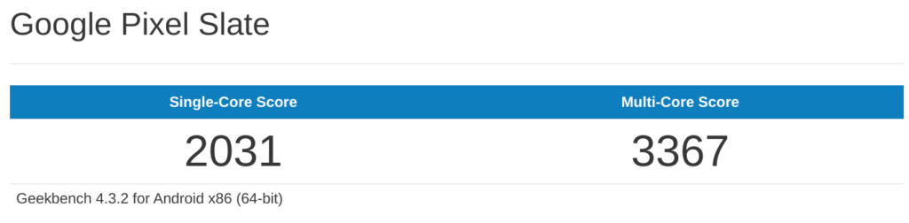
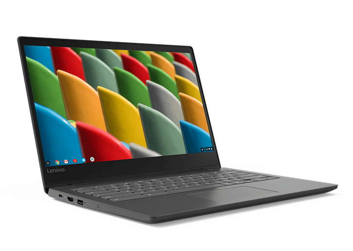

I've seen several other sites discussing new Chrome OS tablets in the works under the name of "Flapjack" over the past few months. So I spent some time reviewing both their reports as well as the Chromium code commit log recently, which both verifies some of the reporting and adds some new information as well. I'm trying to get a feel for what we should really expect as well as level-set those expectations.

Here's what I found, along with some thoughts:

For sure, Flapjack is indeed the name of a project with two very similar Chrome OS tablets with two different display sizes. Eight and ten inches are the mostly correct reports, but technically, these have 8 and 10.1-inch displays. The screens will be coming from at least three different display panel manufacturers: [BOE, INX, and AUO based on this code commit](https://chromium-review.googlesource.com/c/chromiumos/platform/ec/+/1580620):

It was previously reported that both tablets would have FHD or 1920 x 1080 resolution, but they'll actually both be 1920 x 1200 per the product data sheets for these screens. Here's information on the [AUO 8-inch TFT panel](https://www.fortecag.de/fileadmin/user_data/Dokumente/Datenblaetter/Displays/TFT/8/G080UAN01.0_Datasheet.pdf), for example, and here is a rundown of the [BOE 10.1-inch panel, also a TFT display](https://ph.lcds-display.com/products/TV101WUM-AD0_BOE_LCM_10.1-inch_1920x1200_parameter.html). I'm sure these will be good, but not outstanding displays; I'd prefer to see IPS panels for sure.

Yes, there will be Wacom digitizer support for these tablets, indicating an included stylus. Interestingly, there could be different firmware between the two sizes, presumably because of different pixel density: If both tablets have the same screen resolution at 8 and 10.1-inches, the pixel density will be different:

Stylus support on small tablets should be table stakes, so this is good. Ideally, some more optimized pen apps from Google or big-name Android developers would be ideal.

Speculation that Huaqin is the ODM, or original design manufacturer, appear confirmed to me. Mainly that's because people with email addresses from [Huaqin](http://www.huaqin.com/) are active in nearly all of the Flapjack code commits. However, it's still not clear which Chrome OS hardware partner's branding will be on the device.

I'm actually considering that these _could_ debut as "Made By Google" devices though because of how Flapjack is referenced a few times: **_Project_** Flapjack. It seems odd to me that the Chromium team would use the word "project" in the code for a non-Google device. However, that's simply speculation on my part. It just seems odd to include "project" here.

As previously reported, [these Chrome OS tablets will support Qi wireless charging up to 15W](https://www.androidheadlines.com/2019/03/flapjack-tablet-finally-wireless-charging-chrome-os.html). If these tablets can support the full 15 Watts, this will help with quicker wireless charging. Then again, these will have larger batteries than found in phones so we'll see. I'd like to see fast charging over USB so I'm hoping we see [MediaTek's Pump Express 4.0 charging solution](https://www.mediatek.com/features/pump-express), which provides 5A wired charging.

Credit: MediaTek

Now about the chip. I have no doubt these will both run on the MediaTek MT8183. And that is a bit of a step up from the Rockchip RK3999 found in last year's [Acer Chromebook Tab 10](https://www.aboutchromebooks.com/news/acer-chromebook-tab-10-review-unit-is-here-got-questions/) and followed by similar slates from [Asus](https://www.aboutchromebooks.com/news/asus-chromebook-tablet-ct100-specifications/) and CTL. But I'm not expecting huge performance gains from the Flapjack tablets compared to a traditional Chromebook, even a relatively low-end model.

To understand my thinking, let's outline the two chips:

<table class="wp-block-table"><tbody><tr><td></td><td>RK3999</td><td>MT8183</td></tr><tr><td>CPU</td><td>Hexa-core (2x Cortex-A72 &amp; 4x Cortex-A53)</td><td>Octo-core (4x Cortex-A73 &amp; 4x Cortex-A53)</td></tr><tr><td>Clock speed</td><td>Up to 1.51 GHz</td><td>Up to 1.99 GHz</td></tr><tr><td>GPU</td><td>Mali T860 MP4</td><td>Mali Bifrost (TBD)</td></tr></tbody></table>

A few things worth noting. Compared to the aging Rockchip SOC, MediaTek is adding two more "big" cores and a generation newer of those cores with the Cortex-A73 architecture. It also has a higher clock speed for the CPU. No one has yet determined the exact GPU for the MT8183, although there are [Chromium code references to Mali Bifrost drivers](https://chromium.googlesource.com/chromiumos/overlays/board-overlays/+/master/chipset-mt8183/media-libs/mali-drivers-bifrost-bin).

Clearly, there should be a performance boost in the Flapjack tablets compared to the old Acer Chromebook Tab 10. And there is, at least for the multi-core numbers, based on [Geekbench scores found recently by Chrome Unboxed](https://chromeunboxed.com/new-chromebook-tablets-8-10-inch-close-to-launch/):

Flapjack benchmarks

Acer Chromebook Tab 10 benchmarks

Strangely, the higher clock speed and newer A73 core don't help Flapjack on the single core score. That's concerning to me. And when you put them in perspective of the poor performing dual-core Celeron-powered Pixel Slate, the numbers all that impressive either. (There's a reason I'm adding this device, so keep reading!)

Pixel Slate Celeron benchmarks

My takeaway is this: Yes, these two new Chrome OS tablets should definitely see a performance improvement over the few current 10.1-inch options available today. That's great news.

But I often see people suggesting they want a small Chrome OS tablet to be their one-and-only device as they'll use it with an external monitor, keyboard, and mouse for their non-portable Chrome OS needs. I'd say that's not likely going to happen with these slates unless you're a very basic Chrome OS user. Clearly, that couldn't be done well with the base model Pixel Slate.

Put another way: If you could be happy with the [$249 Lenovo Chromebook S330, which uses a MediaTek MTK8173C processor](https://www.lenovo.com/us/en/laptops/lenovo/lenovo-n-series/Lenovo-Chromebook-S330/p/88LGCS31095), then I'm sure Flapjack will suit your needs, depending on the price. If you're looking for the performance of a $300/$350 and up Chromebook with these tablets, I think you're setting your expectations too high.

Lenovo Chromebook S330

One last thought and it has to do with small-ish Chrome OS tablets in general. I thought I'd love the Acer Chromebook Tab 10 -- performance issues aside -- because I'm partial to the small tablet form factor. But I learned something that's worth a mention: Using a desktop browser on a device with a smaller screen isn't always a great experience.

It's actually more enjoyable to use the [recently added tablet view mode of Chrome OS](https://www.aboutchromebooks.com/news/chrome-os-72-dev-channel-mobile-tablet-view-web-page-setting/) on a smaller screen. But at that point, you're sort of defeating the purpose of having the full functionality of a desktop browser. Well, unless you can dock or connect to an external monitor for the full desktop experience, but again, I don't think that's going to happen with Flapjack, at least not for performance-minded buyers.
