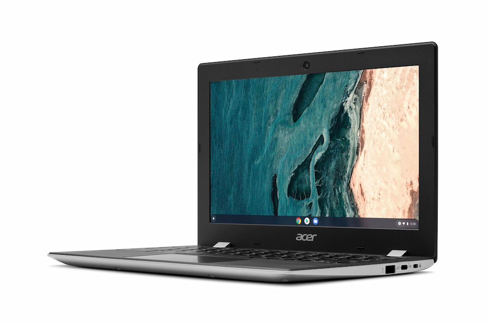
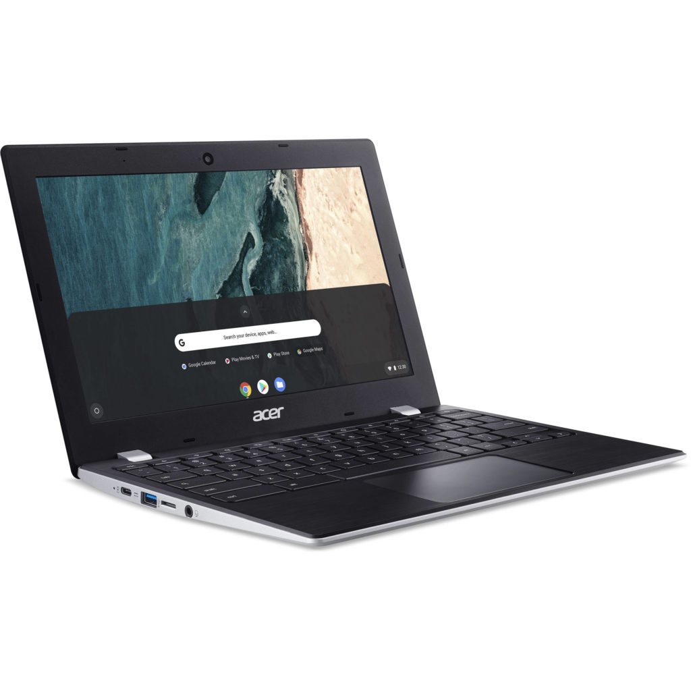

Ok, this deal is for all of the people that think Chromebooks have to be cheap. They don't, and [Google never said they would be, but that's another story](https://www.aboutchromebooks.com/news/the-case-for-expensive-chromebooks/). Walmart is discounting the Acer Chromebook 311 by $100, bringing the cost [down to $129 on its site](https://www.walmart.com/ip/Acer-Chromebook-311-11-6-HD-Intel-Celeron-N4020-4GB-LPDDR4-32GB-eMMC-Pure-Silver-Gigabit-WiFi-Bluetooth-5-0-CB311-9H-C4XC/588464990).

That's less than the cost of netbooks when I was buying them back in the day. And this isn't some very old model that's being advertised as "new"; something [I detest when certain retailers do this](https://www.aboutchromebooks.com/opinion/opinion-amazon-needs-to-stop-listing-chromebooks-with-misleading-information/). This is a prior generation model as the [latest Acer Chromebook 311 uses an ARM-based MediaTek MT8183C processor](https://www.aboutchromebooks.com/news/acer-education-chromebooks-311-511-512-spin-price-specifications/). You'll get an Intel Celeron N4020 inside this low-cost Chromebook.

[Get this Acer Chromebook 311 deal](https://www.walmart.com/ip/Acer-Chromebook-311-11-6-HD-Intel-Celeron-N4020-4GB-LPDDR4-32GB-eMMC-Pure-Silver-Gigabit-WiFi-Bluetooth-5-0-CB311-9H-C4XC/588464990 "Get this Acer Chromebook 311 deal")

[Acer still sells this model but it will cost you $229.99](https://www.acer.com/ac/en/US/content/model/NX.HKFAA.007). And I verified the Chrome OS automatic update expiration date for this Acer Chromebook 311 configuration. You're currently looking at five years of support ending in June of 2026.

At $129, or even $229, you have to understand what you're getting and what this Chromebook is capable of. I'd say it's fine for basic, everyday web usage at home. Younger students would be a good fit as well but once you move up to high school and beyond, that might be pushing the envelope a smidge.

The [dual-core Intel Celeron CPU should perform similarly to the MediaTek MT8183](https://www.cpubenchmark.net/compare/MediaTek-MT8183-vs-Intel-Celeron-N4020/3928vs3683) in the newer model. And that chip has made plenty of Lenovo Duet Chromebook users happy; it's snappy enough as long as you don't expect the performance of a mid-range device costing $400 or more.

Keep in mind the 11.6-inch display isn't a touchscreen. And the resolution is 1366 x 768. So don't expect a super-sharp viewing experience. Oh, and those bezels around the screen remind me of a TV from the 1970's.

But if you can get past that and the limited 4 GB of memory and 32 GB of eMMC storage, you've got a basic Chromebook on the cheap with this deal. Note that this model does support a microSD card for additional storage.

Acer says to expect around 10 hours of battery life; I'd say 7 to 8 is a better estimate in the real world. The Acer Chromebook 311 is also ruggedized to handle drops and spills.

And there's no lack of inputs: a pair of USB Type-C ports and a matching pair of USB Type-A as well. An external display with better resolution can be powered by DisplayPort over USB Type-C. Connectivity options include WiFi 5 and Bluetooth 5.0.

Again, you can get better performance, battery life, viewing experience, etc... from **_any_** number of other Chromebooks. But you'll pay more. A lot more.

This is better suited as that "around the house" Chromebook for many people or even a secondary device. If you understand that and have basic expectations, this is a great deal at $129.

[Get this Acer Chromebook 311 deal](https://www.walmart.com/ip/Acer-Chromebook-311-11-6-HD-Intel-Celeron-N4020-4GB-LPDDR4-32GB-eMMC-Pure-Silver-Gigabit-WiFi-Bluetooth-5-0-CB311-9H-C4XC/588464990 "Get this Acer Chromebook 311 deal")
