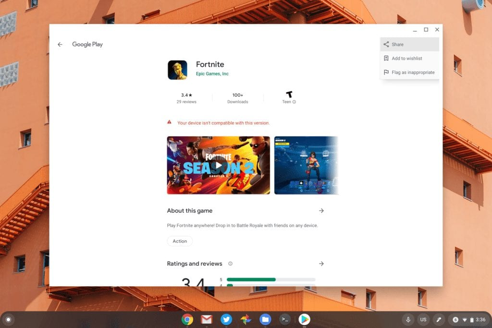

I'm not a big Fortnite player as I prefer different types of games on Stadia or my Switch these days: Think puzzlers and action-adventure type games like Witcher 3, Tomb Raider or Assassin's Creed. But I know many people will be happy to hear that today [Epic Games has published Fortnite for Android in the Google Play Store](https://www.polygon.com/2020/4/21/21229930/fortnite-available-on-google-play-android-mobile-devices).

This means that instead of sideloading Fortnite, and thus making your phone less secure that Google would like it to be, Android device users can stay within the safer confines of the Google Play Store to get the game.

Of course, the Google Play Store is also available for Chromebook owners, so we can all start shooting it up on Chrome OS, right?

Nope.

I found the [Fortnite listing in the Google Play Store](https://play.google.com/store/apps/details?id=com.epicgames.fortnite) using my Acer Chromebook Spin 13 with no issue. Unfortunately, it's blocked from installation with the dreaded "Your device isn't compatible with this version" message.

I was thinking that maybe a pure Chrome OS tablet might be compatible, so I tried to install it on my Pixel Slate. Again, no dice.

The only way I could get Fortnite on my devices is to [sideload it using instructions that I've previously written up](https://www.aboutchromebooks.com/news/chrome-os-80-how-to-sideload-android-apps-to-a-chromebook/). But since I don't play the game, it's not worth it to me.

Hopefully, Epic Games adds Chrome OS compatibility to the Android app because this is clearly still a popular game. No a Chromebook in tablet mode might not be the ideal way to play Fortnite but it's better than no way at all.
