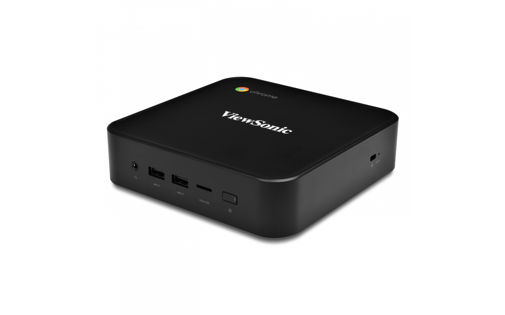

Slowly but surely, the [Chromium team is bringing GPU acceleration to Project Crostini](https://www.aboutchromebooks.com/news/project-crostini-progressing-towards-gpu-acceleration-for-chromebooks-running-linux-apps/) so that Linux containers can take advantage of improved graphical frame rates and performance. The [Pixelbook and Acer Chromebook Spin 13 were among the first Chromebooks](https://www.aboutchromebooks.com/news/pixelbook-and-nami-chromebooks-the-first-to-get-linux-gpu-acceleration-in-project-crostini/) to get this feature and now the team is eyeing four Chromeboxes for the next round of implementation. (_Update: Make it five!_)

A Chromium code commit was made on Thursday to [enable GPU acceleration for devices built on the "Fizz" boards.](https://chromium-review.googlesource.com/c/chromiumos/overlays/board-overlays/+/1541827) Looking up Fizz on the Chromium Developer Information page shows that it represents the following devices:

- [HP Chromebox G2](https://www.aboutchromebooks.com/news/hp-chromebox-g2-available-release-date-cost/)
- [Acer Chromebox CXI3](https://www.aboutchromebooks.com/news/new-acer-chromebox-cxi3-models-available-for-pre-order-start-at-298/)
- [ViewSonic NMP660 Chromebox](https://www.aboutchromebooks.com/news/viewsonic-new-nmp660-chromebox-for-business-and-education-expected-in-june/)
- [Asus Chromebox 3](https://www.aboutchromebooks.com/news/asus-chromebox-3-available-for-pre-orders-starting-at-239-and-shipping-in-mid-may/)
- [CTL Chromebox CBX1](https://ctl.net/collections/chromebox-1?page=1&rb_vendor=CTL&rb_product_type=Chrome+Devices)

Note that all of these Chromeboxes debuted in June of last year, so they're the most recent Chromebox hardware from these vendors. Many start around $200 to $300 but can be configured with more powerful hardware for close to $700.

<iframe style="width:120px;height:240px;" align="right" marginwidth="0" marginheight="0" scrolling="no" frameborder="0" src="//ws-na.amazon-adsystem.com/widgets/q?ServiceVersion=20070822&amp;OneJS=1&amp;Operation=GetAdHtml&amp;MarketPlace=US&amp;source=ac&amp;ref=qf_sp_asin_til&amp;ad_type=product_link&amp;tracking_id=aboutchromebo-20&amp;marketplace=amazon&amp;region=US&amp;placement=B07BGBMLVY&amp;asins=B07BGBMLVY&amp;linkId=08d36430705da5fbc29f75e2beb89441&amp;show_border=true&amp;link_opens_in_new_window=true&amp;price_color=333333&amp;title_color=0066c0&amp;bg_color=ffffff"></iframe>

I still haven't been able to test how well GPU acceleration works on Chrome OS but it surely has to be better than none. For example, I tried to play Portal through Steam for Linux on my Pixel Slate and without GPU acceleration, it was unplayable. I roughly saw one frame per second so the experience was jumpy.

Keep in mind that even after GPU acceleration is available for even the most capable Chrome OS devices, you shouldn't expect 1080p 4K at 60 fps when gaming: For that you'd need a discrete graphics card that can cost you upwards of $1,500 or more. The only way that type of gaming is going to happen on a Chromebook in the coming months - or maybe even years - is through [Stadia: Google's game streaming service due out this year](https://www.aboutchromebooks.com/news/google-stadia-turns-every-chromebook-into-a-pc-gaming-rig/).

Regardless, Linux apps that can use hardware acceleration for graphics will be welcome for basic gaming and graphical development.

There's no timeline associated with the new code commit, but I'll keep an eye on the Chrome OS 74 Dev Channel to see if these four Chromeboxes will gain GPU acceleration with that release since there's time for the function to make the cut.

_Updated on 4/7/2019 to add the CTL Chromebox and correct gaming resolution._
