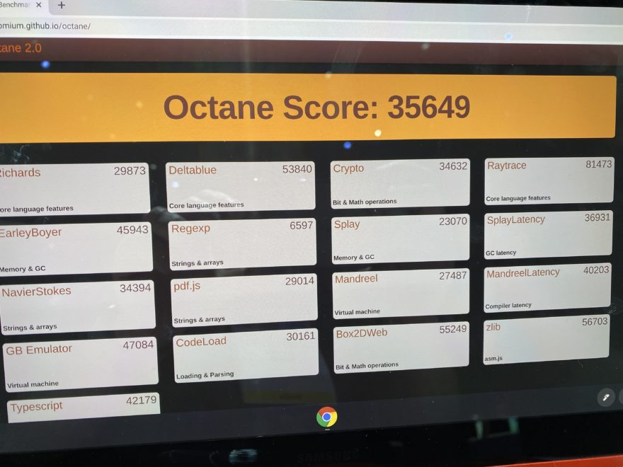

If you're often near outlets, last year's Galaxy Chromebook limited battery life isn't a huge issue. At $849, you can now [get the Core i5, 256 GB Samsung Galaxy Chromebook for $150 off](https://www.samsung.com/us/computing/chromebooks/buy/?skipModel=galaxy-chromebook). In fact, if it wasn't for the battery lasting only 5-ish hours on a charge, I might have bought this convertible Chromebook last year for its then-full price of $999.

Indeed, when I got [my first hands-on with the 2020 Samsung Galaxy Chromebook](https://www.aboutchromebooks.com/news/samsung-galaxy-chromebook-hands-on-yes-its-as-nice-as-it-looks/), I was impressed by just about everything.

[Get this Samsung Galaxy Chromebook deal](https://www.samsung.com/us/computing/chromebooks/buy/?skipModel=galaxy-chromebook "Get this Samsung Galaxy Chromebook deal")

Sure, the 4K AMOLED display was overkill but boy, did it look great from every angle. The typing experience was perfectly fine as was using the glass multitouch trackpad. And you got what was at the time, a fairly powerful processor in the 10th-generation Intel Core i5 U-series chipset.

Of course, we're now seeing 11th-generation Core processors coming to new Chromebooks. I've seen two that use the latest Core i3 chips and these models cost less than even the discounted Samsung Galaxy Chromebook. So you'll want to keep that in mind.

If it's performance you're primarily after, this $150 discount _may_ not make the most sense. If you want super-light and thin along with solid performance from a last-generation Core i5, 8 GB of memory, and 256 GB of speedy, NVMe for local storage, then maybe this deal is worth the look.

Early 2020 Octane score of the Samsung Galaxy Chromebook

Just make sure you're near an outlet if this is your full-time Chromebook. Either that or invest a little bit of cash into a high-capacity, fast USB battery for charging on the go.

In fact, that might not be a bad purchase even if you pass on this Chromebook. Given that most new devices are going with USB-C for charging, it wouldn't be a waste of money since it's very likely you'll be able to keep using that power pack. Even with future Chromebook purchases.

[Get this Samsung Galaxy Chromebook deal](https://www.samsung.com/us/computing/chromebooks/buy/?skipModel=galaxy-chromebook "Get this Samsung Galaxy Chromebook deal")
