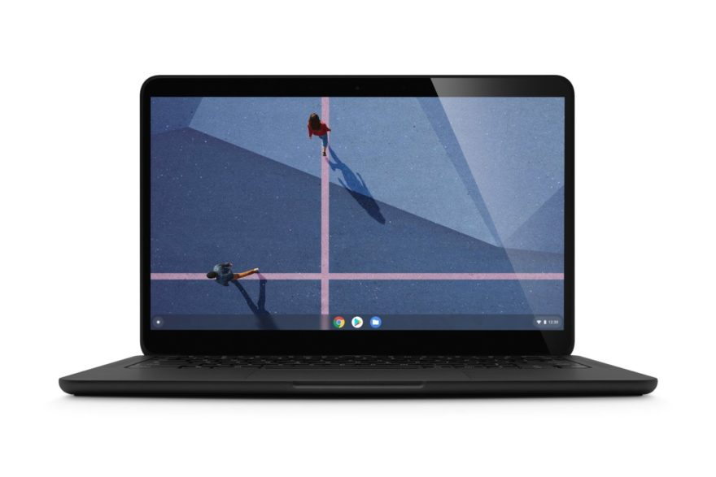

If you're getting your first Chromebook, it can be a little overwhelming on what to buy. Depending on what you plan to do on your Chromebook, the choices and prices can vary wildly.

And unlike the Apple approach where there are just a few Macbook models and some customization options, Chromebooks are more akin to Microsoft-powered Windows laptops: There are a bunch of brands that make them such as Acer, Asus, Dell, HP, Lenovo, Samsung, and others.

For starters, I highly recommend reading an article I wrote in 2020 about [Chromebook options from Amazon](https://www.aboutchromebooks.com/opinion/opinion-amazon-needs-to-stop-listing-chromebooks-with-misleading-information/). I'm surfacing that article for a very good reason: Amazon lists many old Chromebooks as "new", "newest" or "2020" models, when in fact, they aren't.

Some of them are four years old and although based on the prices, they may look like good deals, they generally aren't. For just a little more money you actually can get the newest or 2020 model of a Chromebook, depending on your budget.

And in case you don't read that article, the key here is that Google provides automatic Chrome OS software updates for these devices, but only for a specified time frame. And **you don't want to spend money on a laptop that's going to stop getting those software and security updates in the next year or so**, given that [new Chromebooks get up to 8 years of such updates](https://www.aboutchromebooks.com/news/google-announces-8-years-of-chrome-os-software-updates-aue-for-new-chromebooks/).

All new Chromebooks run the Chrome browser, Android apps, and Linux software out of the box these days, although the latter two are options you can choose to enable or ignore.

Multiple Chrome tabs, a PWA, Google Play Music Android app, and Linux humming along.

Your budget will highly determine the power, performance, and features of your Chromebook, so I'll break this guide down into three budget brackets, highlighting what you should look for and expect from a device in each price range.

## Entry level devices for around $300 or less

The lowest budget devices are still very capable for web browsing and web apps, although it will depend on how many browser tabs you plan to have open simultaneously. They will also handle Android apps; just don't expect to run several at the same time. As far as using Linux apps? I'd have very low expectations here due to limited memory and processing power, although it can be done in a pinch.

Essentially, here's what I'd look for and expect in this price range:

- Intel Celeron processor, preferably the newer N5000 although an N4020 or N4010 should suffice
- OR an ARM processor such as the MediaTek Helio P60T, MediaTek MT8173C
- At least 4 GB of RAM, which is pretty typical in this price range. Occasionally you might see a rare sale price for an 8 GB Chromebook around or just over $300
- Expect a mediocre screen in the 11.6- or 14-inch size. By mediocre, I mean the resolution will likely be 1366 x 768 and not full HD, or 1920 x 1080. Check to see if the screen is touch-capable as some aren't in the entry-level segment. Not having a touchscreen may be OK but some people do prefer touch navigation for Android apps. If you can find a screen with 200 to 250 nits of brightness, that's about the brightest you'll find for this price range.
- If possible, ensure you have 64 GB of local storage. Many low-cost Chromebooks come with 32 GB, so pay attention to this spec. Most also come with a memory card slot to add storage, so that can help, but having at least 64 GB will come in handy.
- Expect a non-backlit keyboard. Finding a Chromebook for under $300 with backlit keys is often the exception, not the rule.
- The Chromebook will probably be made of, or mostly of, plastic in this range. Some may have aluminum behind the display; even so, you're not going to find an all-metal chassis in a new entry-level Chromebook.
- You definitely want at least three USB ports, more if possible. A pair of USB Type-C ports can be handy, particularly if the Chromebook has one on each side. Having at least one USB Type-A port is useful for connecting older devices to your Chromebook.

Here are some of the devices that meet most of the above recommendations for basic browsing and occasional Android use in this price range; click the image to read either my reviews/coverage or to see the current online price. These are some suggestions to get you started:

Lenovo Chromebook Duet tablet, which is often on sale for $249

[Get the Lenovo Chromebook Duet tablet](https://www.bestbuy.com/site/lenovo-chromebook-duet-10-1-tablet-128gb-with-keyboard-ice-blue-iron-gray/6401727.p?skuId=6401727 "Get the Lenovo Chromebook Duet tablet")

HP Chromebook x360 EDU edition with 8 GB of memory  

[Get the HP Chromebook X360 EDU Edition](https://store.hp.com/us/en/pdp/hp-chromebook-x360-11mk-g3-education-edition "Get the HP Chromebook X360 EDU Edition")

Acer Chromebook 315 Touch with Full HD display

[Get the Acer Chromebook 315 Touch](https://store.acer.com/en-us/acer-chromebook-315-cb315-3ht-c296 "Get the Acer Chromebook 315 Touch")

## Mid-range devices from $300-ish to $600

Once you step up to this price range, you'll notice big differences, and not just with performance. You'll see some metal chassis parts, better build quality, higher resolution displays and more. These are ideally suited to handle a good 12 to 20 Chome browser tabs at the same times, can run more intensive Android apps or games and could be used as a solid part-time Linux laptop as well.

Here's what you can expect to find and should look for in this price range:

- Intel Pentium, Core i3 and a some Core i5 processors. Look for Pentium Gold 4417U or 4425U chips, or 10th-generation Core i3 / i5 processors. You can save a little money if you find a nice device with an 8-generation of these Core chips as well, but I wouldn't go older than that.
- There are some Chromebooks with 4 GB of RAM in this segment, but many have 8 GB. Given a choice between more memory and some other feature, I'd almost always opt for the extra RAM.
- Most screens in this price range are in the 13-, 14- or 15.6-inch sizes. And for the money you should definitely be getting at least 1920 x 1080 resolution and a touchscreen. There are a few 4K Chromebooks but those are typically above $600 unless there's a great sale. If you want to hold out for that, watch for the Lenovo Chromebook Yoga C630 4K model to be discounted.
- 64 GB of local storage is the minimum capacity you should find here; don't spend more money only to get 32 GB of memory. It's not uncommon to find 128 GB of storage as well for the higher end of this price range.
- You should have a backlit keyboard included with most mid-range Chromebooks, save for a few in the lower end of the price bracket.
- Look for four USB ports, preferably split up to be on each side, i.e.: one Type-A and one Type-C on both left and right. A few models here may have an HDMI out port for an external monitor as well.
- Expect better speakers at this cost. They won't likely blow you away but they should sound better than most entry-level Chromebooks.

Some suggested devices to consider, although there are many options in the $300 to $600 range:

Lenovo IdeaPad 5i Chromebook, [recently reviewed](https://www.aboutchromebooks.com/news/lenovo-ideapad-5i-chromebook-review-a-potent-pentium-powered-laptop/)

[Get the Lenovo IdeaPad 5i Chromebook](https://www.bestbuy.com/site/lenovo-flex-5-13-2-in-1-chromebook-pentium-7505-4gb-memory-32gb-emmc-abyss-blue/6454254.p?skuId=6454254&ref=212&loc=1" "Get the Lenovo IdeaPad 5i Chromebook")

Samsung Galaxy Chromebook 2

[Get the Samsung Galaxy Chromebook 2](https://www.samsung.com/us/computing/chromebook2/buy/?modelCode=XE530QDA-KA2US "Get the Samsung Galaxy Chromebook 2")

Acer Chromebook Spin 514

[Get the Acer Chromebook Spin 514](https://store.acer.com/en-us/acer-chromebook-spin-514-cp514-1h-r4hq "Get the Acer Chromebook Spin 514")

## High-end Chromebooks over $600

It used to be that there were very few choices in this price bracket; over the past two years, however, that's changed in a huge way. You can spend $600 or more on a Chromebook from just about all of Google's hardware partners or from Google itself. These are premium devices with the highest possible performance in a Chromebook that can deal with just about any task you throw at them.

Some expectations and things to look for with premium models include:

- Intel Core i5 or Core i7 processors. Again, look for 10th-generation processors if possible.
- In terms of memory 8 GB is essentially the standard, although a few Chromebooks can be had with 16 GB of memory for an additional cost
- Again, Most screens in this price range are in the 13-, 14- or 15.6-inch sizes with 1920 x 1080 resolution and a touchscreen. [The $999 Samsung Galaxy Chromebook is an exception as it comes with a fantastic 4K OLED display that looks amazing](https://www.aboutchromebooks.com/news/samsung-galaxy-chromebook-hands-on-yes-its-as-nice-as-it-looks/), even though it cuts down quite a bit on battery life.
- Again 64 GB of local storage is the minimum capacity you should find here but there are just as many models with 128 GB and a few with 256 GB. If possible, get a Chromebook that uses faster NVMe storage instead of the slower eMMC type.
- Again, look for four USB ports, preferably split up to be on each side, i.e.: one Type-A and one Type-C on both left and right. A few models here may have an HDMI out port for an external monitor as well.
- Speaker sound and overall build quality should be noticeably better on these Chromebooks. They're also likely to be thinner and lighter, so if that's your thing, expect to bust out the wallet. Some include a fingerprint sensor for easier logins.

A few options to consider in the premium segment:

Google Pixelbook Go (available in 3 different models)

[Get the Google Pixelbook Go](https://www.amazon.com/Google-Pixelbook-Chromebook-64GB-Black/dp/B07YMM4YC1/ref=sr_1_1_sspa?dchild=1&keywords=pixelbook%2Bgo&qid=1594680644&s=electronics&sr=1-1-spons&spLa=ZW5jcnlwdGVkUXVhbGlmaWVyPUEzT0RTTDlDM1hRNDJPJmVuY3J5cHRlZElkPUEwNjE0MzI1MkJOT1pBM01PSkcyMCZlbmNyeXB0ZWRBZElkPUEwMzQ4NDA0U0VDMzRCMDRFMTQmd2lkZ2V0TmFtZT1zcF9hdGYmYWN0aW9uPWNsaWNrUmVkaXJlY3QmZG9Ob3RMb2dDbGljaz10cnVl&th=1 "Get the Google Pixelbook Go")

Acer Chromebook Spin 713

[Get the Acer Chromebook Spin 713](https://www.bestbuy.com/site/acer-chromebook-spin-713-laptop-13-5-2k-gorilla-glass-intel-evo-core-i5-8gb-ram-256gb-ssd-thunderbolt-4/6458849.p?skuId=6458849 "Get the Acer Chromebook Spin 713")

HP Elite c1030 Chromebook

[Get the HP Elite c1030 Chromebook](https://store.hp.com/us/en/pdp/hp-elite-c1030-chromebook "Get the HP Elite c1030 Chromebook")

## One more thing...

There are thousands of people who have commented on this site since I started it and many are Chromebook owners as you'd suspect. So take advantage of the community here if you're buying your first Chromebook: Leave a comment with your budget and how you expect to use the device, or what features you'd like to have. I'm sure seasoned Chromebook owners will offer helpful suggestions and feedback!

_Note: Originally posted on July 13, 2020 and has been updated with newer device recommendations_
