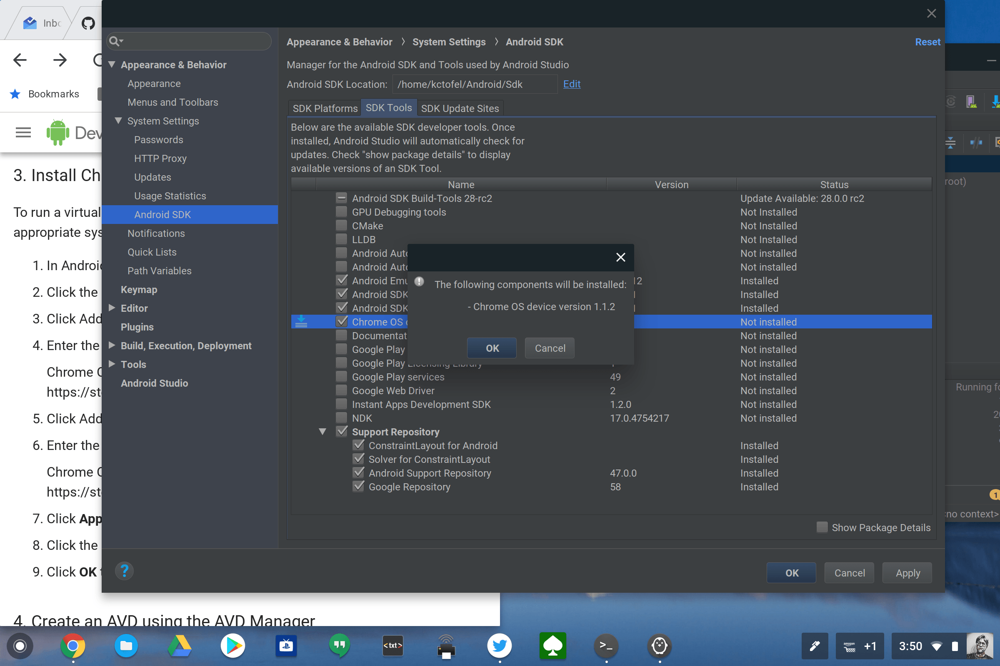

While developers have been thrilled with the news that some of their [Chromebooks can run Linux apps such as Android Studio](https://www.aboutchromebooks.com/news/google-officially-unveils-project-crostini-linux-apps-on-chrome-os/), Google quietly introduced something else today for devs that use Mac, Windows or Linux machines: [A Chrome OS emulator preview in Android Studio](https://developer.android.com/topic/arc/emulator).

On an Android Studio support page, Google explains how to install the Chrome OS emulation mode in its development IDE for Android.

The steps are pretty simple: Add two repositories in the Android Studio SDK add-ons and let Android Studio manage the download and installation. For the current preview, only the Pixelbook and its 12.3-inch 2400 x 1600 display can be emulated; you'll find it in the Tablets section of devices.

Why would Google want to add a Chrome OS emulator to Android Studio? Here's what Google says:

> If you'd like to develop and test your app on a Chrome OS device, such as a Pixelbook, but you don't have the hardware, you can use a virtual Chrome OS device on the Android Emulator.

Since Android apps are supported on many Chromebooks, this allows Android developers to create and test their apps for use on a Chrome OS device, even if they don't have a Chromebook or Chromebox. In a sense, this is almost the _reverse_ of Chrome OS getting Android Studio -- although obviously very related -- which allows developers to create Android apps for any supported device on a Chromebook.

What this all means though is that Google is finally treating Chrome OS devices like first-class citizens when it comes to developing apps for Android, which are now effectively Chrome OS apps as well. Without compromising security, the "app gap" for Chromebooks is withering away.
