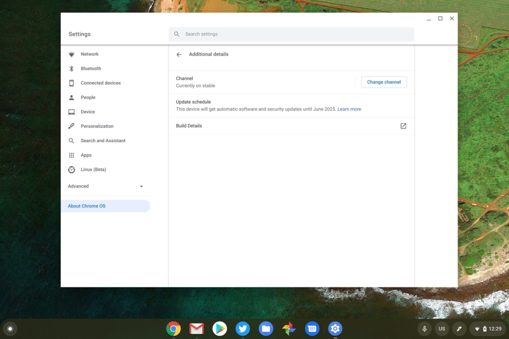

Today in conjunction with the BETT education event in London, Google announced major news with [all new Chromebooks to receive 8 years of Chrome OS automatic software updates](https://blog.google/outreach-initiatives/education/2020-chromebooks/). Late last year, [Google extended Chrome OS update expiration dates for more than 130 devic](https://www.aboutchromebooks.com/news/chrome-os-software-support-dates-extended-for-more-than-130-chromebooks/)[e](https://www.aboutchromebooks.com/news/chrome-os-software-support-dates-extended-for-more-than-130-chromebooks/) [models](https://www.aboutchromebooks.com/news/chrome-os-software-support-dates-extended-for-more-than-130-chromebooks/), but this new policy applies to new Chromebooks launching in 2020 and beyond.

Chromebooks now show their software end of support date

This news is a big plus for the Chromebook market. For one thing, it addresses much the oft-quoted "built-in obsolesce" argument against the devices. Windows PCs and macOS computers are typically able to get updated software for at least the same 8 years. So this announcement brings Chromebooks more on par with those devices.

Secondly, the limited amount of update support for Chrome OS has skewed some buyers away from Chromebooks who look at their total hardware investment over time. This could sway some potential buyers back to a Chromebook.

This also provides a better ROI for schools and businesses who don't want to replace hardware every few years. That's especially true since purchasing a Chromebook in the middle of its software update lifecycle cuts into that return. That's still something to be aware of, but now these organizations have a longer timeframe to work with.

While I applaud this news from Google, I'd still like to see the company [require its hardware partners to clearly indicate the software update expiration date on product boxes and in specification sheets](https://www.aboutchromebooks.com/news/chromebook-settings-show-chrome-os-end-of-support-date-but-its-not-enough/). I've started to include this date whenever I report on new hardware but this should be a universal piece of information. At least you can see the software expiration date on your Chromebook -- after you purchase it, that is -- in the Settings.

By the way, I didn't have this information when sharing news of the [new Acer Chromebook 712 earlier today](https://www.aboutchromebooks.com/news/acer-chromebook-712-with-32-display-and-ruggedized-features-announced-for-education-market/), but I've now added it to the list of specifications.

**_Update at 2:30 pm ET, January 21:_** _After reaching out to a Google representative for clarification, I was told that this policy applies to all Chromebooks, not just those in the EDU sector._

_Effectively, the AUE date is being changed from 6.5 years to 8 years. I have no additional information on the policy as it pertains to Chromeboxes and Chromebases at this time._

_Keep in mind what has not changed: the AUE date is 8 years from the device platform release. That means the clock begins when the first Chromebook with a certain platform is released, future Chromebooks using that same platform will have less than 8 years of full AUE support; that's the current policy._
