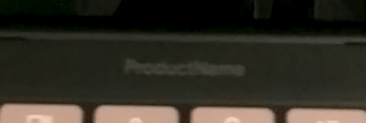
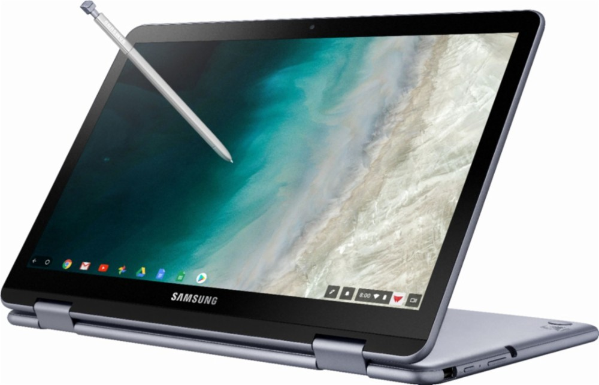

We've known for a long time that the [Google Atlas Chromebook has been in the works](https://www.aboutchromebooks.com/news/chromium-code-suggests-4k-chromebook-code-named-atlas-in-the-works/) and it appears that the laptop has progressed enough for actual device testing. In the two videos below, you can see Atlas being put through the paces for some display tests, both of which have [generated](https://crbug.com/945460) [bugs](https://crbug.com/945456) for the Chromium team to work on. [Brandon Lall](https://twitter.com/brandonlall36) was kind enough to tip me off to these bugs.

In the two videos below, you can see Atlas being put through the paces for some display tests, both of which have generated bugs for the Chromium team to work on. [Brandon Lall](https://twitter.com/brandonlall36) was kind enough to tip me off to these bugs.

Here's your first look at Atlas in a video captured via portrait mode:

This doesn't show us too much other than the display with rounded corners, the top two rows of keyboard keys, which are standard, and an interesting bit just below the display: There's a placeholder that says "Product Name".

The second video provides a much better overall view, although we can't tell much more from it other than the speaker grilles on the left and right of the keyboard. Look carefully and you'll see them.

Google Atlas Chromebook full display

It's impossible to tell from these videos what the native display resolution is although there have been past [code references to a 4K panel for Atlas](https://www.aboutchromebooks.com/news/chromium-code-suggests-4k-chromebook-code-named-atlas-in-the-works/). If I had to guess on the screen size, I'd say it's in the 12- to 13-inch range based on the keyboard keys in comparison to the screen. The display does look to be more of a widescreen than the current Pixelbook and Pixel Slate 3:2 aspect ratio.

And that brings up a curious thought: Perhaps Atlas won't be a Made By Google device, aka: A sequel to the Pixelbook. The aspect ratio isn't the only reason I'm wondering about this; the "Product Name" placeholder isn't typical Google either.

I have no evidence to back this up but I'm leaning towards Atlas being a Samsung device for a few reasons.

First, it has no high-end Chromebook on the market when compared to the Dell Inspiron Chromebook 14, the Acer Chromebook 13 and Spin 13, or the Lenovo Yoga Chromebook C630.

Samsung Chromebook Plus V2

And second, Samsung hasn't debuted a new Chromebook in quite a while. The Samsung Chromebook Plus V2 from last year was a refresh of the prior year's model, while the Samsung Chromebook Pro also launched in 2017. The rounded corner design of the display also reminds me of Samsung's current devices. Again, I have no evidence to back these thoughts up at this time; I'm just thinking out loud.

It's also worth noting that although original code suggested [Atlas would be a detachable 2-in-1](https://www.aboutchromebooks.com/news/more-evidence-suggests-atlas-is-a-4k-detachable-chromebook-tablet/) like the HP Chromebook X2, the second video above suggests otherwise to me based on the hinge. It's hard to say for sure, but this looks like a standard 2-in-1 device. I fully expect eight-generation Intel processors inside of Atlas, regardless of its form factor or manufacturer.

All will become clear in time as Atlas is definitely progressing to the finish line. It's possible we'll see Atlas debut in May at Google I/O -- particularly if it is a Made By Google device -- but it's more likely we see a fall event if this is a Google built Chromebook. And if it's Samsung or some other hardware partner that will sell it? A launch event could happen at any time as soon as Atlas is ready.
