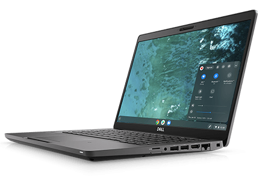
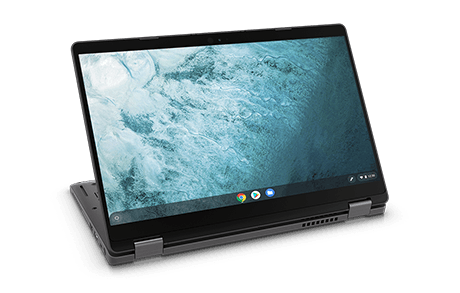

Google is continuing its Chrome OS push into the workplace, announcing on Monday its [Chromebook Enterprise Devices effort](https://cloud.google.com/blog/products/chrome-enterprise/making-the-modern-os-accessible-for-every-enterprise) with Dell bringing the first two Chromebooks to the program. The [Dell Latitude 5400 Chromebook Enterprise and Dell Latitude 5300 2-in-1 Chromebook Enterprise](https://www.dellemc.com/en-us/chromebookenterprise/index.htm) will combine Chrome OS and VMware’s Workspace ONE for device management.

According to Google, these Chromebooks will be available in "two form factors, the 14-inch Latitude 5400 and the 13-inch Latitude 5300 2-in-1, can be configured with up to 8th Generation Intel Core processors. These Chromebooks are the [first to offer up to 32GB of DDR4 memory, enterprise-class PCI-E NVMe SSD drives up to 1TB](https://corporate.delltechnologies.com/en-us/newsroom/announcements/detailpage.press-releases~usa~2019~08~20190826-dt-unified-workspace-gives-users-even-more-choice--the-worlds-first-latitude.htm#/filter-on/Country:en-us)."

The Chromebooks will be made available in more than 50 countries and have an LTE option. If that last part, combined with Dell as the brand sounds familiar, it's because [I've been told these Chromebooks are built from the Sarien baseboard](https://www.aboutchromebooks.com/news/dell-sarien-chromebook-lte-support-arcada-whiskey-lake/), which I've [previously reported](https://www.aboutchromebooks.com/news/sarien-arcada-chromebooks-integrated-4g-lte/).

In addition to offering the new Latitude Chromebook Enterprise devices, Dell will also become a reseller of Dell Technologies will also be a reseller of Drive Enterprise, including Docs, Sheets, Slides.

Hardware aside, there's more on [the Chrome OS side of things](https://cloud.google.com/chrome-enterprise/) for business:

- The improved Google Admin console for Chrome OS provides 10x faster load times.
- Admins can now enable managed Linux environments on Chromebooks (beta), with tools to determine who has access, VPN support for internal files, and containers for maximum protection.
- For customers currently using Chromebooks, they can optimize for business usage by adding the new Chrome Enterprise Upgrade to any Chromebook device. 

The new devices go on sale tomorrow starting at $699.00 for the Latitude 5400 and $819 for the Latitude 5300 2-in-1.

Dell has been a Chrome OS partner with Google for some time and these announcements are a big win for the platform when it comes to business. Dell has large inroads to companies small and large with its hardware and services. Adding the first new Chrome Enterprise Devices to its portfolio could go a long way towards bringing a secure, speedy modern take on getting work done.
