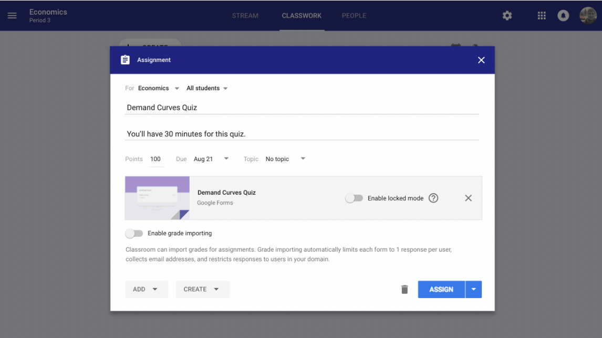

[Google introduced some updates to Classroom today,](https://blog.google/outreach-initiatives/education/optimizing-google-classroom-way-you-work/) making it easier for teachers to create online quizzes while reducing student distractions. The new quizzes feature arrives in the fall to coincide with the upcoming school year.

[Quizzes will use Google Forms](https://support.google.com/docs/answer/7032287?hl=en) and will also include a "locked mode". When locked down, students will only be able to access the quiz, meaning they can't surf online or use other apps when taking the quiz. Note that the locked-down mode is only available on managed Chromebooks, although I can't imagine that a high percentage of school districts deploy unmanaged Chromebooks.

Google Classroom currently includes a Stream showing resources for every class but feedback suggests it can be overwhelming over time. So Classroom will break assignments out of the Stream into a dedicated Classwork view for improved organization.

Classwork will support organization by date -- which is the current method -- but also let teachers group topics and units. Teachers will also gain more granular controls for managing Classroom People, including co-teachers, students and guardians.

Google has quickly earned the majority of education devices, mainly due to school usage of Chromebooks. Without supporting services that educators need, however, that advantage could be short lived, so it's good to see Google accepting feedback and improving upon its existing Classroom services. Kids who have their Chromebooks locked down to take a pop quiz may disagree, of course. ;)
