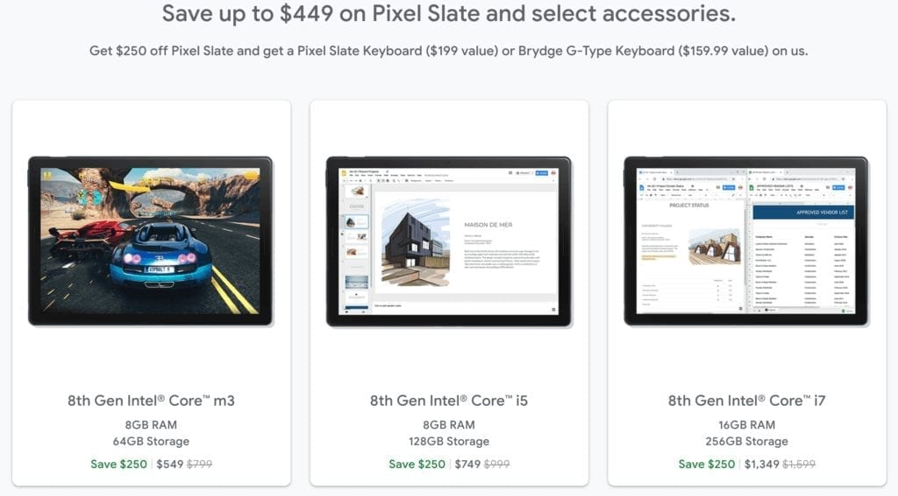

Yes, I know [Google won't be making a successor to the Pixel Slate](https://www.aboutchromebooks.com/news/made-by-google-exit-tablet-business-pixel-slate-chrome-os-chromebooks/). And I remember the early reviews at launch that killed any momentum Google may have hoped for with its first Chrome OS tablet. But if you can live with the shortcomings of the Pixel Slate -- many of which have been addressed -- [Google has a deal worth up to $450 off a Pixel Slate and either a Google-made or Brydge G-Type Keyboard](https://store.google.com/config/pixel_slate).

Keep in mind, it's best to think of the Pixel Slate as you would any other Chromebook, just in a different form factor. It does _everything_ a traditional Chromebook can do while offering the advantage of a keyboard-less, lean back mode for content consumption and Android app usage. If you don't need or want the latter experience, even this discounted deal is probably a pass.

In terms of performance, I can only speak to the Core i5 model, which is what I bought at launch and have used as my daily driver since then; at least until recently. This configuration has handled everything I've thrown at it from daily blogging, email, and web browsing to watching YouTube TV for hours each day [and learning Java via a Linux container](https://www.aboutchromebooks.com/news/how-to-code-on-a-chromebook-crostini-pixel-slate/). Put another way: The Core i5 Pixel Slate will easily meet the needs of _most_ Chromebook owners.

[I recently bought an Acer Chromebook Spin 13 with 16 GB of memory and a higher-performing processor](https://www.aboutchromebooks.com/news/acer-chromebook-spin-13-with-16-gb-ram-should-you-buy-one/), but that decision was driven by planned use of Android Studio, which works better with a more powerful chip and the extra RAM. If not for [Google recommending such hardware for developers that use Chrome OS](https://www.aboutchromebooks.com/news/android-studio-chrome-os-chromebook-recommendation-google-io-2019/), I'd still happily be on the Pixel Slate full time.

As far as those launch shortcomings I mentioned, a slew of software updates have resolved most of them. [Animations on the Pixel Slate in tablet mode are vastly improved](https://www.aboutchromebooks.com/news/chrome-os-75-pixel-slate-tablet-mode-animations-buttery-smooth-overview-lag/), for example. GPU hardware acceleration for Linux is available. The new Virtual Desks feature works well too, as shown below.

https://youtu.be/6EoXhfruZL4

If you're concerned that Google won't be making any more Chrome OS tablets, I get it, but I think that fear is a little unfounded. From a software perspective, the Pixel Slate is no different than any other 2-in-1 Chromebook. As a result, tablet features will continue to be developed in Chrome OS; and the Pixel Slate will get all of them, at least until its automatic update expiration date, [which is June 2024](https://support.google.com/chrome/a/answer/6220366?hl=en).

You'll have to purchase [directly from the Google Store](https://store.google.com/config/pixel_slate) for this deal and it expires either September 5th or while supplies last.
