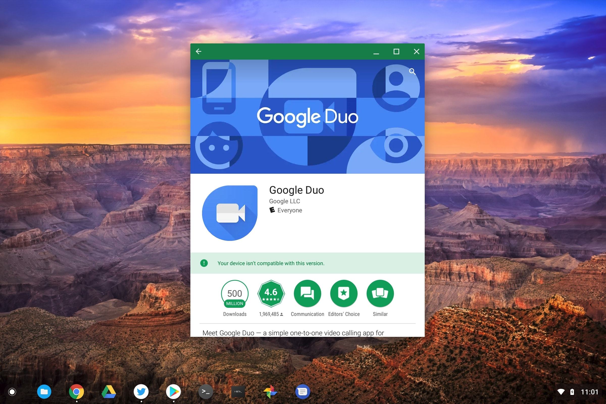

I can't say that I use Google Duo for video and voice calls, mainly because none of my other contacts do. If that changes, however, there are new devices that support Google Duo for Android: The Acer Chromebook Tab 10 and HP Chromebook X2.

Support for the latter was [discovered by XDA Developers](https://www.xda-developers.com/google-duo-chromebooks-hp-chromebook-x2/) through a recent app update that brought support for multiple devices and for Android tablets. When XDA saw the tablet support, they tried it on an HP Chromebook X2 and it worked. I did the same on the Acer Chromebook Tab 10 to install and set it up without a hitch. Sorry, I didn't do any test calls or video chats, again because I can't convince my family or friends to use it. Shame.

Sadly, I wasn't able to install Duo on my Pixelbook. I get the dreaded "_Your device isn't compatible with this version_" message when I attempt it. That surprises me a little, but I'd anticipate Duo will arrive on the Pixelbook as well as other tablet-like Chromebooks soon.

I'd be remiss if I didn't highlight the other change to Duo because it's important.

When Duo first launched in 2016 it required a phone, either Android or iOS. That's because unlike Hangouts, Duo accounts were tied to phone numbers, not to Google accounts. With the support for tablets, that's no longer the case because there is a Google account association. I still had to enter a phone number to set up the app, but I just used my main phone number. Presumably then, Duo calls would be accepted on multiple devices going forward -- which is great -- and either by phone number or Gmail account.
