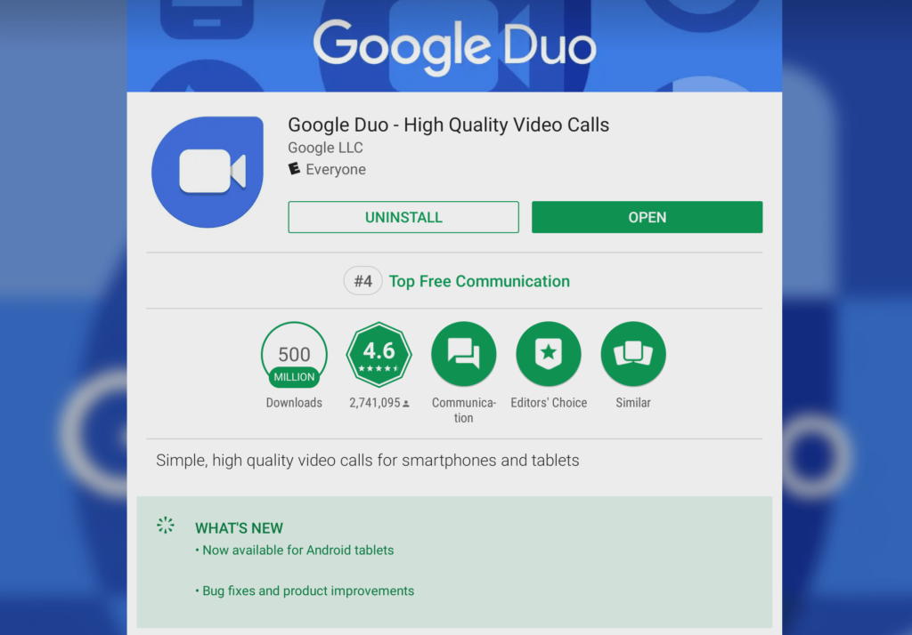
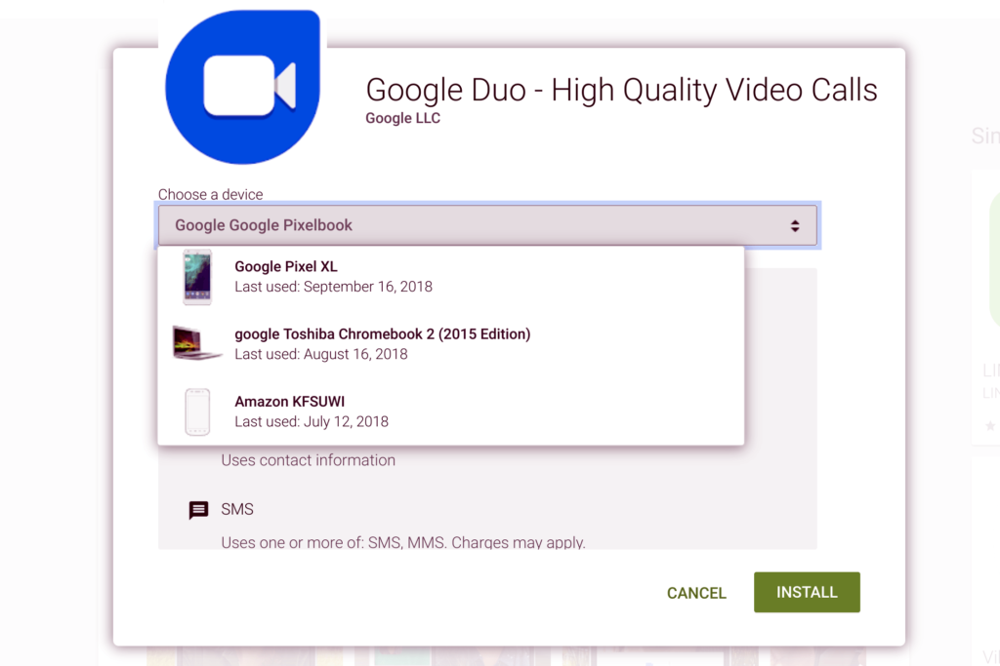

This isn't _too_ surprising, given that the soon to be released [Google Pixel Slate](https://www.aboutchromebooks.com/tag/pixel-slate) will support Google Duo calls and [Duo appeared on a few Chrome tablets back in July](https://chromeunboxed.com/news/google-duo-video-chat-app-working-on-select-chromebooks/),  but if you have a Chromebook -- even a clamshell model -- Google Duo may be available for your device.

According to the Google Play Store, the latest release adds Duo support for Android tablets. By extension then, at least _some_ Chromebooks - true tablets and 2-in-1s -- can install Google's video calling app.

[Redditor gabriele\_tng noticed the updated Duo app](https://www.reddit.com/r/chromeos/comments/9yw343/google_duo_is_finally_available_on_chrome_os/) and confirmed that it was installable on an Acer Chromebook R 13, [which is $100 off at Costco for Black Friday](https://www.aboutchromebooks.com/news/black-friday-chromebook-deals-for-every-budget/) if you need a low-cost 2-in-1 Chromebook.

I was able to install Google Duo on my Pixelbook where it worked like charm, just like it does on my iPhone, Pixel 3XL and Lenovo Smart Display. I initially thought that only Chromebooks which can be used in tablet mode would support the Duo installation, but I don't have any clamshell Chromebooks to test that theory.

However, I noticed that some of my old clamshell Chromebooks, such as the Toshiba Chromebook 2, appear as valid devices, so even if you don't have a Chrome tablet or a 2-in-1 Chromebook, your device may be supported.

With Google Hangouts essentially being phased out for consumers -- Google is keeping it around for enterprises and G Suite accounts -- Duo is basically the default platform choice for Android and Chrome OS video chats.

You can still use any other video chat service on a Chromebook that has a supported Android or web app, but Google would of course prefer you to use Duo. I'm fine with that because there are so many platforms to contact people that I can't keep track of who is on what these days. I use Duo solely with my family and a few business partners. And now I can do that even when I'm on my Pixelbook.
