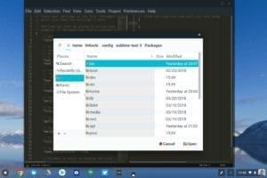

It's nearly here: Tomorrow, Google kicks off I/O, its annual developer conference that often includes an exciting product announcement or two. With so much recent activity in the Chrome OS space, Android won't be the sole star of the show, which is typically the case.

Sure, Android will still take center stage -- it is the most used mobile platform on the planet, after all -- but Chrome OS and Chromebooks will likely have their moment too. Here's what I expect to hear out of Google I/O 2018.

## A Progressive Web Apps push

PWAs are the answer for web developers to avoid creating Android apps and Google is sure to explain the benefits of this approach. Instead of using XML and Java for an Android app, a web developer can use PWAs with JavaScript to create rich, full featured web apps that run across platforms ranging from Windows to Mac to Chrome OS.

Here's [what PWAs look like on a Chromebook,](https://www.aboutchromebooks.com/news/heres-what-progressive-web-apps-or-pwas-look-like-on-a-chromebook/) for example. These can access hardware components such as sensors and behave like a traditional application. [Google has a few PWA sessions for developers](https://events.google.com/io/schedule/?section=may-8&sid=798f812f-2568-427c-807a-14c321d67c3f) to learn more and I anticipate we hear about PWAs in the keynote, possibly seeing some demos.

## Linux apps on Chromebooks and Chromeboxes

Google I/O should be the coming out party for [Project Crostini, which enables Linux containers on Chrome OS devices](https://www.aboutchromebooks.com/tag/crostini/). This would be the perfect event for Google to show off Android Studio on a Pixelbook, for example, and share details of [how the Linux file system will integrate with the Chrome OS Files app](https://www.aboutchromebooks.com/news/how-the-chrome-os-files-app-will-support-linux-files-for-project-crostini/).

While the official roll-out of Crostini won't happen at I/O -- we're still weeks away from the feature in Chrome 67 -- Google will likely make developers happy by showing off the functionality so that they can create whatever apps they like on a Chromebook.

## New Chrome OS form factors and devices

Since Android (and Linux apps) will have to work on screens of different sizes thanks to Chrome OS tablets, Google should be talking about how to optimize software for them. That [game changing Acer Chromebook Tab 10](https://www.aboutchromebooks.com/opinion/why-chrome-tablets-will-be-a-game-changer/) has a 9.7 inch screen, for example, so if not in the keynote, I expect Google to discuss this development aspect in a session or two.

Will we see new Chrome OS devices? There's likely to be a Chromebook Tab 10 or [HP Chromebook X2](https://www.aboutchromebooks.com/news/hp-chromebook-x2-arrives-as-the-first-detachable-chromebook-tablet/) floating around, maybe even shown on stage briefly, but that's all. The [Atlas](https://www.aboutchromebooks.com/news/more-evidence-suggests-atlas-is-a-4k-detachable-chromebook-tablet/) and [Nocturne](https://www.aboutchromebooks.com/news/nocturne-to-be-a-chrome-os-detachable-with-high-res-display-and-fingerprint-reader/) devices, for example, are still in the early stages and Google won't introduce any Chromebooks or Chrome tablets this week; that's up to the device manufacturers to do.

## No other big surprises

Keep in mind if you watch the keynote that Google I/O is a developer event. Yes, it sets the tone for Google's platform strategy over the coming 12-18 months but it's not an end-user conference. And while some end-user devices or features are always in the works, much of what Google announces is to set up its future. So no, don't expect to hear about a refreshed Pixelbook or the "Chrome phone" that some folks seem to be interested in. Instead, look for platform clues this week that will appear in devices in the coming months. Hint: Details on Chrome OS support for AR & VR.

The only possible "surprise" I could think of -- and it's a long shot -- is Android Chat support on Chrome OS either through a cloud back-end or (more mundane but no less useful) a tethered phone. I'd love to see the Android container on Chrome OS support phone numbers for a chat experience across both phones and Chrome OS devices.
