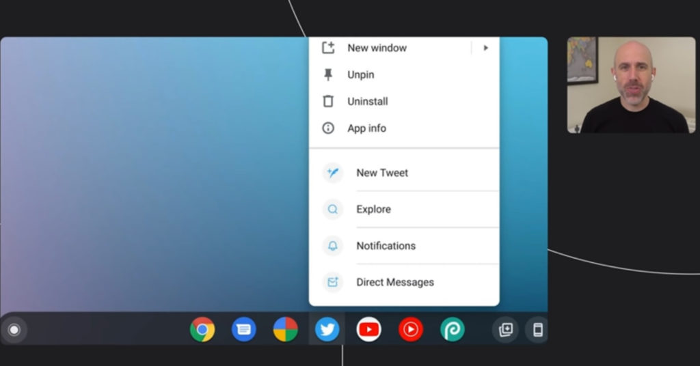

While there wasn't much mention of Chromebooks on the day one keynote of Google I/O 2021, some of the [early online video sessions do focus on Chrome OS and the web](https://youtu.be/0UiaD059eqM). In one of them, several future Chromebook updates were highlighted, [some we knew about](https://www.aboutchromebooks.com/news/sparkplug-a-new-mid-tier-v8-compiler-will-speed-up-javascript-sites-on-chromebooks-using-less-cpu-power/) and some we didn't. I'm sure there will be more Chromebook news at I/O as the event continues, but here's an early look at 9 new Chromebook features on the way.

## Material You

Android 12 is getting an overhaul, as expected, and some of the user interface bits will make their way to Chromebooks. Material You is the big one here, which is an update of Google's Material Design language. It can intelligently adjust fonts and colors based on your lock screen and wallpaper colors.

## Phone Hub brings phone photos to your Chromebook

It will be faster and easier to get photos from your Android phone to your Chromebook with a new photo beaming service in Phone Hub. Using WiFi-Direct, you can wirelessly grab one of your recent phone photos and have it on your Chromebook. No more waiting for photos to sync up to Google Photos so you can download them on your Chromebook.

## Integrated web app menu options

Progressive Web Apps will behave more like native apps, adding extra functionality in context menus. Certain "in app" features can be used right from the web app icon menu to provide new features without having to first open the web app.

## Web app notification badges

We knew this was coming thanks to previous announcements, but it's confirmed: Notification badges for web apps will arrive on Chromebooks. I personally prefer this to the pop-up notifications on some of my apps and can't wait to see it arrive in Chrome OS.

## Web app link handling

Another way to make web apps more like "first class citizens" is to have them open from a browser link. Think of this like a file association feature. If you click a Spotify link, for example, instead of being taken to the Spotify web page, the Spotify PWA opens up to handle the request. Love it!

## Improved access to the File system in the Chrome browser

To further integrate the Chrome browser with Chrome OS, look for improved access to the file system directly from web apps. App developers will need to implement this API but if/when they do, you can expect a more seamless interaction between web apps and local files. I suspect many devs will use the API because it isn't just for Chromebooks; it's for all users of the Chrome browser, regardless of platform.

## Improved multi-monitor support for web apps

This is a feature I really could have used on Zoom calls for last semester's classes. Google is improving the use of multiple monitors for web apps. In the case of Zoom, as an example, this could mean the video call is on one screen while chat or other Zoom functions are on another display. Using this new API, web apps can detect multiple displays and will add finer controls over window placement across them.

## Improved USB serial device support for computing boards

The new Web Serial API won't be used by most Chromebook users, but folks that tinker with small computing boards like me will be happy to see this. In the video presentation, Google showed a Raspberry Pi Pico board connected to a Chromebook and used a web programming tool to code on it. I'm waiting to hear more details on what other compute boards will have more of a plug-and-play experience because it's currently tricky to [use a Pi or Arduino board with a Chromebook](https://www.aboutchromebooks.com/news/how-to-code-an-arduino-with-a-chromebook/).

## Faster JavaScript compiling with SparkPlug = A faster experience

Aside from improving overall JavaScript rendering performance, the new [Sparkplug engine that I recently covered](https://www.aboutchromebooks.com/news/sparkplug-a-new-mid-tier-v8-compiler-will-speed-up-javascript-sites-on-chromebooks-using-less-cpu-power/) will speed up JavaScript compiling. Your Chromebook has to compile the JavaScript code from a website before it can run and render in your browser. You don't see that happen but anything to speed up the process will result in a faster browsing experience.

That's it for day one of Google I/O 2021. I expect many more new Chromebook features to be announced today and possibly tomorrow, so tune back in to hear about them!
