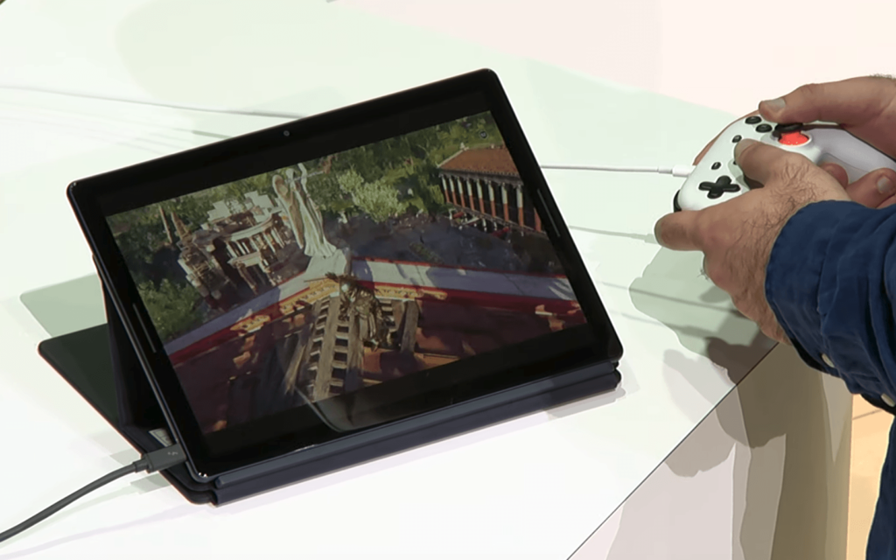

Today's the day! Google I/O kicks off shortly with the main keynote at 1 pm ET where I am.

Normally, I watch on my own and take notes, but this year, I'll be on the TWiT network with a special edition of This Week in Google, which you can catch right here:

https://youtu.be/AkE0pB2zRDM

Along with other guests, we'll be watching the keynote and providing commentary on the various developments. Although I focus mainly on Chrome OS and Chromebooks, I also write and podcast about smart homes, and I'm sure we'll see new products in that area. Namely, a new [Google Wi-Fi mesh product that will likely double as a smart speaker and digital assistant](https://staceyoniot.com/is-mistral-a-next-gen-mesh-network-google-home-hub-with-zigbee-or-maybe-even-thread/), and possibly as a local smart home hub.

Of course, I'm expecting some Chrome OS news as well. [Not the Atlas Chromebook](https://www.aboutchromebooks.com/news/atlas-chromebook-launch-google-i-o-2019/) that's likely going to be the next Pixelbook, but the removal of the "beta" tag for Linux on Chrome OS, possibly a preview of an Android emulator for Android Studio and maybe, just maybe, a hint about Windows booting on Chromebooks.

Oh, and I really hope we hear [more details of Stadia](https://www.aboutchromebooks.com/news/google-stadia-turns-every-chromebook-into-a-pc-gaming-rig/), Google's cloud streaming game service that will turn most every Chromebook into a decent gaming platform.

Tune and in join me!
