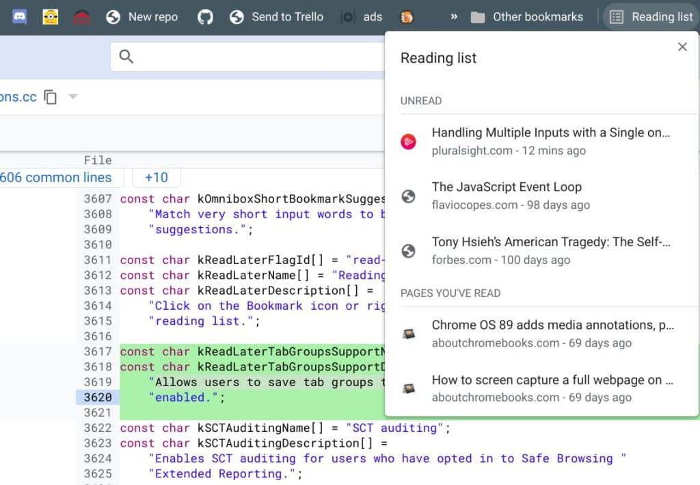

Since it [arrived in Chrome OS 87,](https://www.aboutchromebooks.com/news/chrome-os-87-stable-channel-arrives-on-chromebooks-what-you-need-to-know/) I've been making good use of the experimental Reading List function. It allows me to save links to any web page so I can easily find and read them later. When I'm researching something though, I often have several _related_ tabs that I'd like to save. I can do that, page by page. But it would be easier to add them all in one fell swoop to the Reading List. Perhaps that's why [Google is adding Tab Group support to Reading List on Chromebooks](https://chromium-review.googlesource.com/c/chromium/src/+/2756236 "https://chromium-review.googlesource.com/c/chromium/src/+/2756236").

The feature is pretty self-explanatory by the flag description of "Reading List Tab Groups Support", but here's the full description. When this flag is enabled, alongside the Reading List flag, it will allow users to save tab groups to the reading list.

Current Reading List implementation in Chrome OS 89

When this code change is merged into Chrome OS, you'll find the flag at `chrome://flags#read-later-tab-groups-support`

I'm not yet sure of how this will look in the Reading List but I suspect each tab in the group won't appear individually.

Instead, I'd expect one Reading List item that indicates it has multiple child items. Perhaps, and hopefully, you can expand that list to see or hide the individual tabs in the group. I haven't yet found any code or screen mocks that illustrate the user interface.

Even though Google has tried to call attention to Tab Groups in Chrome OS, I'm not convinced many Chromebook users actually know about this useful feature. And of those who do, I wonder how many actually use it.

I think it's a powerful tool and the ability to save grouped tabs to the Reading List is something I'd use daily. I'm tired of saving my articles individually when they're already grouped. Am I in the minority on this one?
