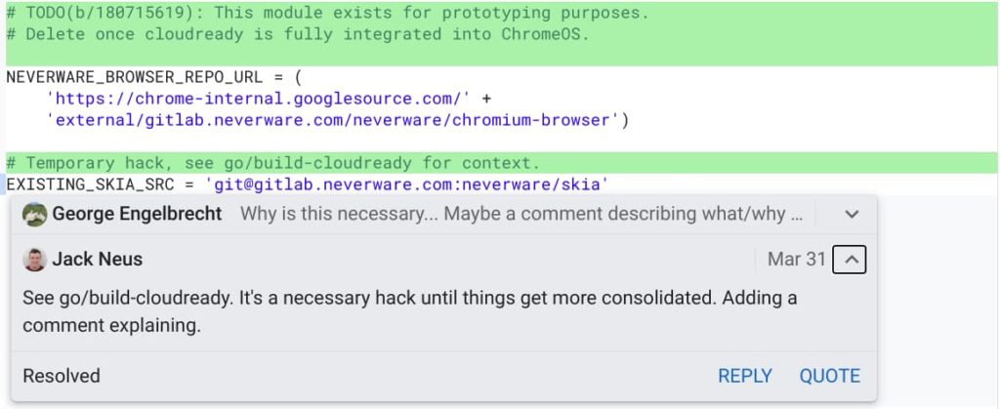
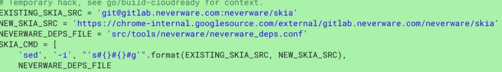
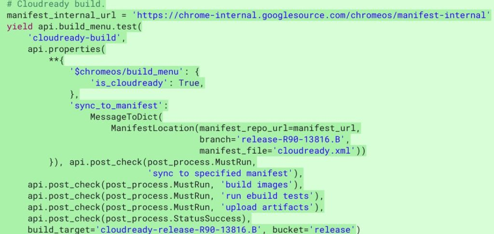
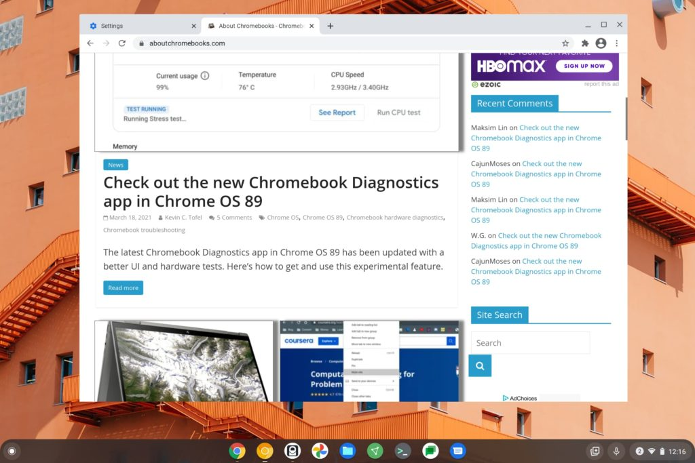

Well, that didn't take long. Back in December, news hit that [Google acquired Neverware](https://www.aboutchromebooks.com/news/google-acquires-neverware-cloudready-chrome-os-chromebooks/ "Google acquires Neverware, the company that brings Chrome OS to older laptops with CloudReady"), creator of the Chromium OS-based CloudReady software that can give new life to old laptops and Chromebooks. Now, [Google is quickly working to integrate Neverware CloudReady into Chrome OS 90 for prototyping](https://chromium-review.googlesource.com/c/chromiumos/infra/recipes/+/2797537 "https://chromium-review.googlesource.com/c/chromiumos/infra/recipes/+/2797537").

To be clear, this is the first of what will likely be many integration steps. Indeed, the initial code and comments specifically note that some parts of the integration are "hacks" for now:

This particular comment had me researching the two code bases a little more and part of the integration is moving all CloudReady code into Google's own code repositories. That makes sense as a first step as [Neverware has managed all of its code on GitLab since 2015](https://www.neverware.com/blogcontent/2015/11/11/chromiumos-the-whirlwind-tour "https://www.neverware.com/blogcontent/2015/11/11/chromiumos-the-whirlwind-tour").

But you can see by this code change that the code will be subsumed by Google's internal Chrome OS code management tools for device builds. In the coming weeks, I'd expect the code to be an "internal" repository inside of Google as opposed to an "external" one.

It's also worth noting that one of the reviewers for these code changes is Nicholas Bishop, who appears on the [Neverware team page as a Senior Software Engineer](https://www.neverware.com/about#meet-the-team "https://www.neverware.com/about#meet-the-team"). In the Chromium code repository, he has a shiny new @google.com email address.

As far as which Chrome OS release these integration efforts are using, version 90 appears to be it.

There's not much point in using Chrome OS 89 (the current Stable version) or less since there are new features in 90 and 91 that could require more integration work if ignored now. The Beta Channel of Chrome OS 90 is pretty stable in my experience and is expected to release into the Stable Channel [on or around April 20](https://chromiumdash.appspot.com/schedule), which is just a few weeks away.

If it's not yet clear, the integration process to merge CloudReady with Chrome OS is in the very early stages. So this effort doesn't provide any insight into how CloudReady will be used by Google, nor what device support will be like.

To that end, at least we know that current CloudReady users won't be impacted based on this statement provided on the day Google acquired Neverware:

> CloudReady will continue to be available as-is, and we’re committed to supporting and maintaining existing customers.  Over the long term, CloudReady will become an official Chrome OS offering, and existing customers will be upgraded seamlessly as that happens

What might change after CloudReady becomes "an official Chrome OS offering" then is still anyone's guess; at least anyone outside of Google.

I still think that this integration can be the second prong of keeping older Chromebooks up to date with security patches and other Chrome OS updates. The first part of that solution is separating out the Chrome browser from Chrome OS and that's [currently in-flight with the Lacros browser; see my explainer here](https://www.aboutchromebooks.com/news/lacros-vs-chrome-and-chrome-os-on-chromebooks/ "Lacros vs Chrome and Chrome OS on Chromebooks").

Lacros browser on Chrome OS 89

With Neverware's CloudReady becoming a part of Chrome OS, my hope is that older Chromebooks and even repurposed laptops, could get updated Chrome OS software and features.

The idea would be that Chrome OS as it is today would still have an [automatic software expiration date](https://www.aboutchromebooks.com/news/how-to-get-chrome-os-updates-on-chromebook-after-aue-automatic-update-expiration-date-cloudready/ "How to get Chrome OS updates on a Chromebook after its AUE, or auto-update expiration date"). After that date, Google would update the new Lacros browser while Neverware developers could update the operating system for CloudReady, which Chromebook owners can transition to.

I'm sure we'll see more details come to light over the rest of the year and I'll be checking the code repository for any additional clues on how this will all work.
