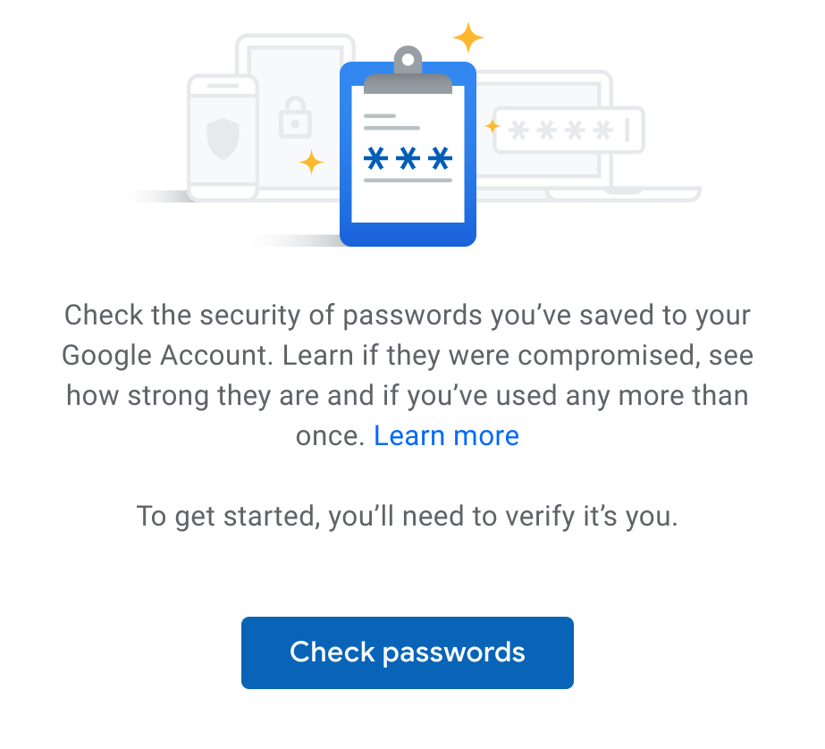
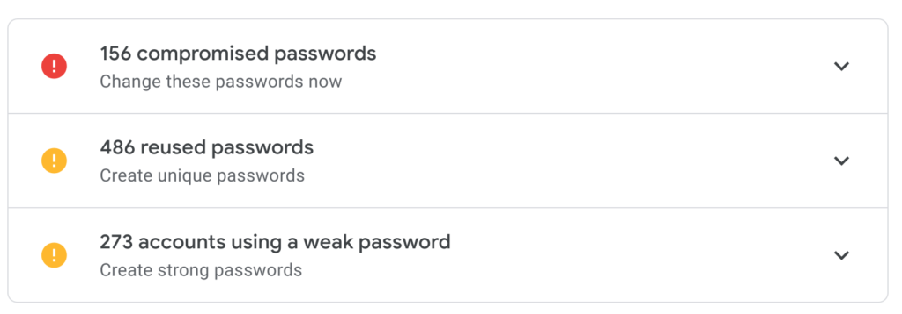

Last month, I reported that [Google plans to add a Password Checkup function directly into Chrome OS](https://www.aboutchromebooks.com/news/chrome-os-78-bringing-password-leak-detection-similar-to-have-i-been-pwned/), warning you about any compromised passwords. This password leak detection, which surfaces any credentials you use among the [4 billion that are known to have been breached by a third-party](https://security.googleblog.com/2019/02/protect-your-accounts-from-data.html), is [now available online](https://www.blog.google/technology/safety-security/password-checkup/) but isn't yet built into Chrome OS.

However, you can still manually use it on your Chromebook. Here's how.

Simply navigate to [https://passwords.google.com](https://passwords.google.com) and log in with your Google account. You'll see the new Password Checkup option with a link to check your passwords:

Clicking the link will take you to this explainer dialog and a link to continue. Click the link and all of the login IDs and passwords stored with the Google Password Manager will be compared to the database of known compromised accounts.

I clicked the link and was shocked to see the results. I've already taken some action to modify the most serious offenders in my accounts, but here's just sampling of my results:

I've been storing my online creditials with Google ever since Chrome supported this feature, and clearly, I've been lax in some areas. In particular, the reuse of credentials across 486 accounts shows my laziness when it comes to online security.

In my (mostly lame) defense, [I do use a Google Titan Security key](https://www.aboutchromebooks.com/news/got-a-chromebook-consider-securing-it-with-a-google-titan-key/) and authentication apps for 2FA, or two-factor authentication, for any accounts that support it. Even so, it's terrible practice to use the same credentials for multiple accounts: A single account compromised will allow a third-party to penetrate multiple accounts due to the reuse.

Google plans to integrate its Password Checkup feature directly in Chrome OS with version 78, so I have some time to clean up my credentials. Until then though, I recommend using the new web version of Password Checkup on your Chromebook. Hopefully, you won't be as surprised as I was by the results.
