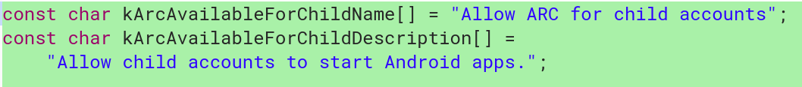

One the great aspects of Chromebooks and Chromeboxes is that they support multiple user accounts as well as those for guests. That's handy for sharing a single device in a household, although it can lead to a wild, wild west show when it comes to kids. Do you want them to have access to the entire Google Play Store for Android apps?

Similar to how [enterprise users can manage access to the Play Store](https://support.google.com/chrome/a/answer/6177447?hl=en&ref_topic=9028500), Google is working on a method for [controlling children's use of Android apps on Chrome OS](https://chromium-review.googlesource.com/c/chromium/src/+/1088930) based on this code commit I found that will apply to child accounts:

For now, the implementation will be behind a flag found when you type _chrome://flags_ on your device. Don't bother checking right now because this code hasn't migrated into production, at least not on Dev Channel version 68. And as it stands now, there's nothing here that will stop kids from downloading Play Store apps; it will only enable or disable the ability to run Android software.

This is probably the first step of a more comprehensive Play Store management function for consumer Chrome OS users. Eventually, I think we'll see application whitelisting by title, category or rating: You might want your younger kids to have Android app access but not to Mature-17 titles, for example.

_**Update**_: Shortly after this post was published, Google pushed a newer version of the Dev Channel for Chrome OS devices which includes a function to "[hide 'Manage users' settings subpage for Child users](https://chromium.googlesource.com/chromium/src/+/d818e926b5c0bae0246b8870da770334d264fb80)", which further restricts what a child account can (or should be able to) do.
