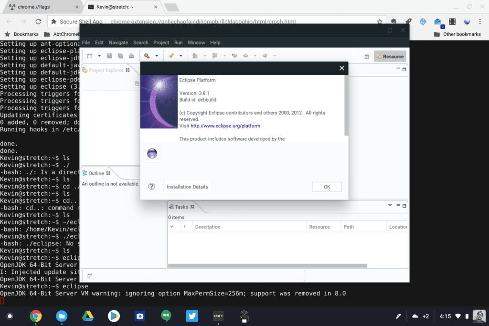

Up until today, Project Crostini was our little secret: I've been running [Linux apps in a container on my Pixelbook](https://www.aboutchromebooks.com/news/first-look-running-full-linux-apps-on-a-chromebook-with-project-crostini/) for the past several weeks. But now [Linux container support is officially official](https://blog.google/products/chromebooks/linux-on-chromebooks/), as announced at Google I/O 2018.

Unfortunately, I missed the actual announcement because I was sharing insights from the main keynote on This Week in Google. It doesn't appear that I missed any new details though: You'll still need a Pixelbook for Linux apps (for now) and the feature isn't yet available on the Stable Channel.

One thing I am curious about is a demo image I saw showing the Android emulator running in Android Studio on a Pixelbook. Currently I can't get that running so I'm not sure if Google had a special Chrome OS build for their demo or not. [Google also announced adb support](https://venturebeat.com/2018/05/08/chrome-os-is-getting-linux-app-support/) is coming, so you'll be able to connect an Android device to a Chromebook with a USB cable and push your app in development to an actual phone or tablet for testing.

In terms of hardware and software requirements -- outside of the Pixelbook -- Google's Kan Liu told ZDNet that about [half of the currently available Chromebooks today have the horsepower to support Linux apps](https://www.zdnet.com/article/linux-comes-to-chromebooks/). And your Chromebook [will have to run on the Linux kernel version 4.4 or higher](https://venturebeat.com/2018/05/08/chrome-os-is-getting-linux-app-support/).

Many Chromebook users won't likely ever use Linux apps, of course. Between Android apps and a browser, they're going to be covered. For developers, tinkerers, and even gamers -- once GPU acceleration is added, likely later this year -- Project Crostini will add tremendous value to the already secure, simple and speedy Chromebook.
