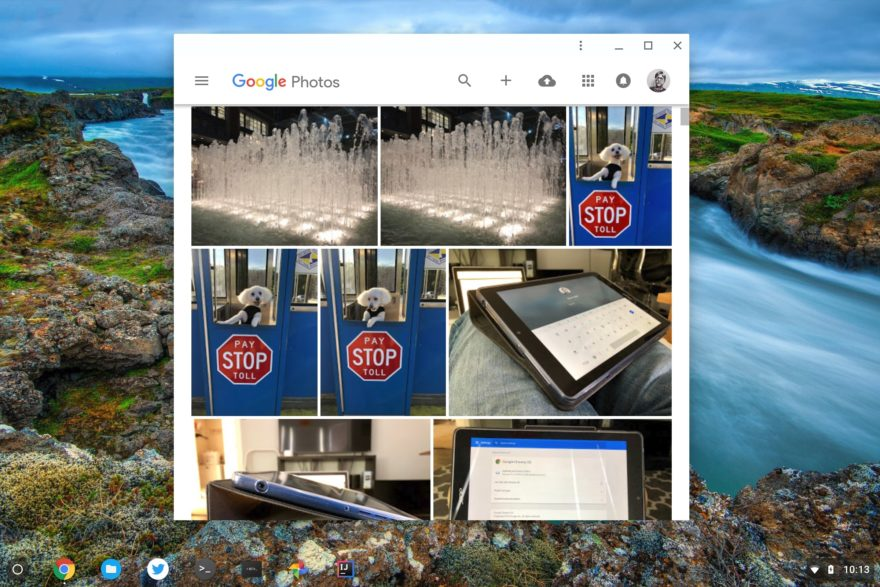
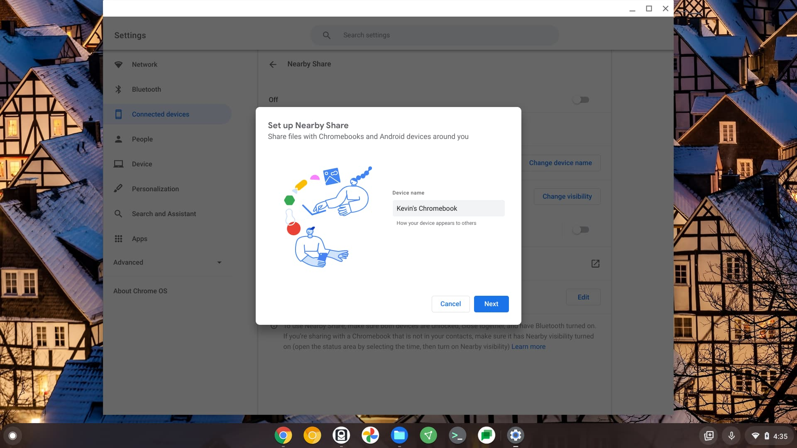

Android Police got tipped on some news that will make Chromebook owners very happy: [Google is working to put dedicated access to Google Photos in the Chrome OS Files app](https://www.androidpolice.com/2021/02/12/google-photos-may-finally-be-integrated-into-the-chromeos-file-manager/).

This would work just like the current Google Drive volume, making your Google Photos library one tap away. But as the effort stands now, there is one big difference: It will use (and therefore require) installation of the Photos app for Android installed on your Chromebook.

There have been earlier attempts to bridge Google Photos with Chromebooks.

Years ago, you could log in to Google Drive on a Chromebook and use the option to synch Photos with Drive. This allowed your Google Photos to appear in the Google Drive volume in the Files app. But Google eventually split Photos off from Drive, leaving Chromebook users in the lurch.

You were also able to install the Google Photos for Android app on Chromebooks a few years back and after using Photos in the share sheet of other Android apps, get Google Photos to appear in the Files app. That too is gone.

The underlying approach of that method will live on, however.

Based on the [code commits for this feature](https://chromium-review.googlesource.com/c/chromium/src/+/2690121), the Chrome OS Files app will use the Android version of Google Photos to show your images on your Chromebook. I find that a bit of a kludge but I assume there's a good technical reason for the approach.

One nice aspect of the current plan is that when using Files in Chrome OS you'll see your Google Photos available. And when you're using the actual Google Photos app on a Chromebook, the Files app won't show Google Photos. That could help lead to a little less confusion when using the feature.

If you can't wait for Google Photos to appear in the Files app of your Chromebook, I can offer a bit of a quick workaround. You could use the [Nearby Share function of Android and Chrome OS](https://www.aboutchromebooks.com/news/nearby-share-file-feature-on-android-now-chromebooks-in-the-coming-months/).

Simply open Google Photos on your Android phone and choose Nearby Share in the share sheet for an image or album.

Assuming your Chromebook is within Bluetooth range, it should appear as a sharing option and file the exact image you want from your phone to your Chromebook.
