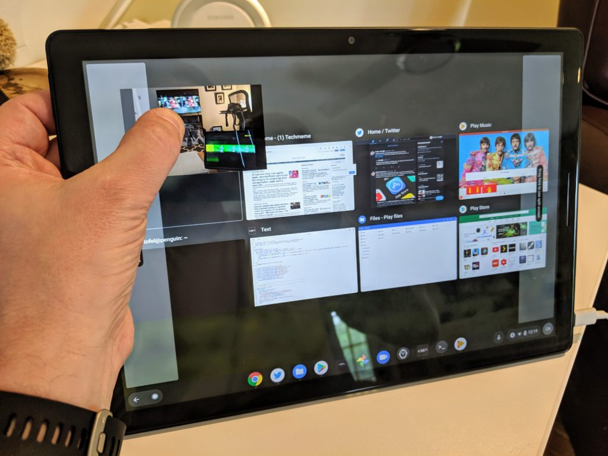
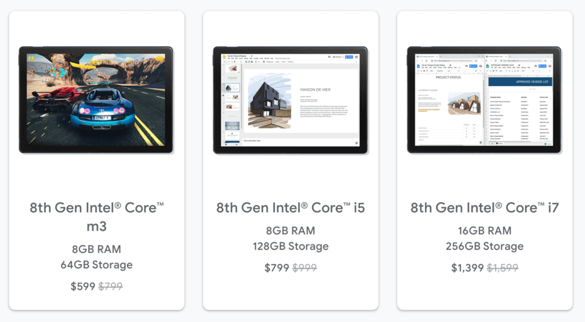

In a move that isn't terribly surprising, Google has pulled the Celeron-powered Pixel Slate models from the Google Store. [9to5 Google noticed that the Slate's lineup dropped from five to three models](https://9to5google.com/2019/06/06/entry-level-pixel-slate-dead/) and received the following statement from Google:

> _We have stopped production on the G Store exclusive $599 and $699 Pixel Slate models. We remain committed to supporting these variants and will continue to stock Pixel Slate online and in stores – including our recent expansion to even more Best Buy locations._

<iframe style="width:120px;height:240px;" align="right" marginwidth="0" marginheight="0" scrolling="no" frameborder="0" src="//ws-na.amazon-adsystem.com/widgets/q?ServiceVersion=20070822&amp;OneJS=1&amp;Operation=GetAdHtml&amp;MarketPlace=US&amp;source=ac&amp;ref=qf_sp_asin_til&amp;ad_type=product_link&amp;tracking_id=aboutchromebo-20&amp;marketplace=amazon&amp;region=US&amp;placement=B07JWB7QB2&amp;asins=B07JWB7QB2&amp;linkId=e10679e36106d73570b91d7fffea698c&amp;show_border=true&amp;link_opens_in_new_window=true&amp;price_color=333333&amp;title_color=0066c0&amp;bg_color=ffffff"></iframe>

Clearly, even with 8 GB of memory, the Celeron inside the Pixel Slate didn't have the horsepower to deliver the type of experience that Google had envisioned.

And frankly, that should have been known before the product went on sale. Internal product testing should have revealed the poor performance on the Celeron model.

Instead, [early reviews of the $599 base model](https://www.aboutchromebooks.com/news/pixel-slate-celeron-review-video/) showed a terrible, laggy experience in many aspects, likely due in part to the 3,000 x 2000 resolution display; after all, there are plenty of Celeron-powered Chromebooks that work perfectly well for a minimum viable experience.

I suspect that since Google had previously said the Pixel Slate starting price would be $599, it really had to offer the Celeron model alongside the others, else it would risk delaying the entire line up if there were going to be efforts to improve performance on the base configuration.

To help offset the price of entry for a Pixel Slate, [Google has recently reduced the prices of the remaining three models by $200](https://www.aboutchromebooks.com/news/with-chrome-os-improvements-and-a-200-discount-the-pixel-slate-is-worth-a-second-look/), which keeps the entry-level price of $599, but gets you an Intel Core m3 processor and double the memory of the old base model.

And while I had no problem spending $999 for my Core i5 Pixels Slate, the current $799 price is more in line with what people likely expect to pay for this device. I'm sure some still think the devices are overpriced, and I respect their opinions, of course. Ideally, I'd love to see the current price cuts become permanent.

If the $200 price reduction does appeal, you _may_ want to pull the trigger soon. As in today. Last I heard, these reduced prices were through June 6, which is today. That could change, of course, but it's worth the mention.

It's an unfortunate situation that the market was turned off in large part to reviews of the Celeron model. When that happened, I noted that [the base configuration didn't represent the entire product line](https://www.aboutchromebooks.com/news/celeron-pixel-slate-review-video/) as I was -- and still do -- use the Core i5 Pixel Slate as my full-time device for writing, content consumption, [and coding for my Computer Science classes](https://www.aboutchromebooks.com/news/how-to-code-on-a-chromebook-crostini-pixel-slate/).

https://youtu.be/4f6j0l9V5\_o

And the Pixel Slate of today isn't the same Pixel Slate from seven or eight months ago: [A slew of targeted improvements](https://www.aboutchromebooks.com/news/https://www.aboutchromebooks.com/news/with-chrome-os-improvements-and-a-200-discount-the-pixel-slate-is-worth-a-second-look/video-pixel-slate-portal-steam-with-gpu-acceleration-chrome-os-76-chromebook/) ranging from [fixes for laggy animations in tablet mode](https://www.aboutchromebooks.com/news/chrome-os-75-pixel-slate-tablet-mode-animations-buttery-smooth-overview-lag/) to [GPU hardware acceleration support in Linux has](https://www.aboutchromebooks.com/news/video-pixel-slate-portal-steam-with-gpu-acceleration-chrome-os-76-chromebook/) made this Chrome OS tablet a far better device.
