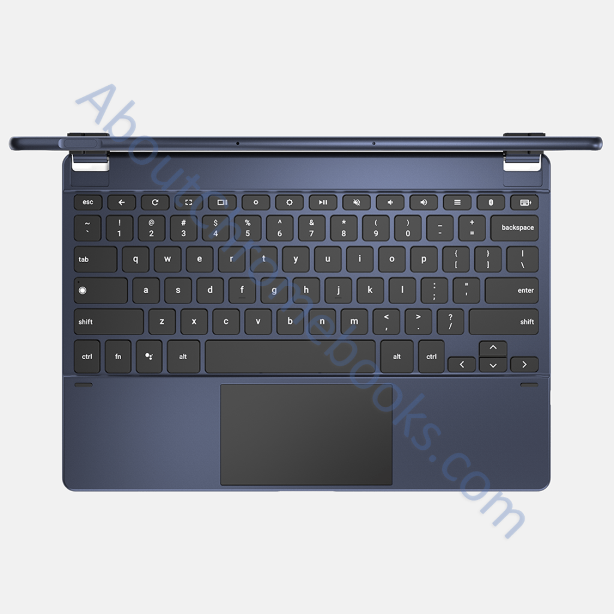

I noted in May that [Nocturne, now known as the Pixel Slate, would have a keyboard similar to the iPad Pro](https://www.aboutchromebooks.com/news/nocturne-chromebook-to-power-its-detachable-keyboard-like-apples-smart-keyboard-for-ipad/). Today we have what appears to be a confirmation: MySmartPrice posted images [showing both the Pixel Slate and a keyboard with pogo pins](https://www.mysmartprice.com/gear/google-pixel-slate/). Also shown is a new digital pen, which was also [found earlier today by Chrome Unboxed](https://chromeunboxed.com/news/pixelbook-pen-black-and-blue-pixel-slate-google-store).

The tablet looks very similar, if not exactly like, [the image I found last month with a hardware keyboard made by](https://www.aboutchromebooks.com/news/first-look-chrome-os-pixelbook-tablet-nocturne-madebygoogle/) Brydge: That keyboard won't use the pins for connectivity though; it will likely use Bluetooth instead.

When you compare last month's images with the recent ones, you can see the similarities in terms of the blue / slate color as well as the fingerprint sensor / power button on the top edge of the tablet. Also visible in both sets of images are the dual speakers on the left and right bezels of the Pixel Slate. In the latest pics, there's also a camera sensor on the back corner.

In terms of the detachable keyboard with pogo pins, the buttons are circular like the Android and Chrome app icons in Chrome OS. And the trackpad looks quite large.

I can't quite figure out how the keyboard holds the Pixel Slate though. Sure, it attaches to the pogo pins and the bottom part is the keyboard. The top part though? Maybe there are magnets that link it to the back of the Pixel Slate when not in use. Surely it's foldable to act as a stand.

There's still an open question if this keyboard will be included _with_ the Pixel Slate. I'm not sure it will but I'm still pondering that, and what it might cost if available separately.

What I do know, or at least strongly suspect based on Chrome OS code is that the [Pixel Slate will have a 3000 x 2000 display resolution](https://www.aboutchromebooks.com/news/nocturne-chrome-tablet-screen-resolution-specs-pixelbook-3000x2000/). And with extra microphones, the tablet should also have [acoustic echo cancellation functionality during voice and video chats](https://www.aboutchromebooks.com/news/atlas-and-nocturne-chromebooks-may-natively-support-acoustic-echo-cancellation/). Lastly, I'm expecting [at least four different configuration options ranging from an Intel Celeron processor all the way up to an 8th-generation Core i7](https://www.aboutchromebooks.com/news/pixel-slate-nocturne-intel-configurations-celeron-m3-i5-i7/), with systems including either 8 or 16 GB of memory.
