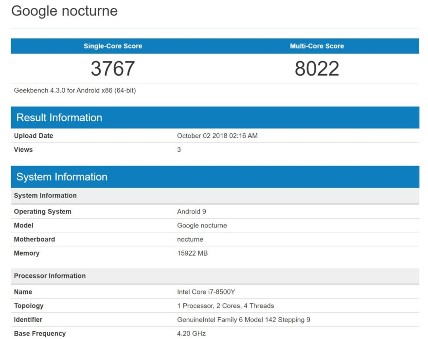
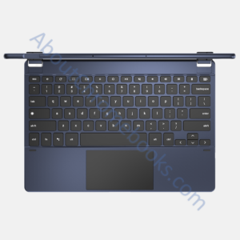

Just seven days away from the #MadeByGoogle event, there's a little more news available for the [Pixel Slate](https://www.aboutchromebooks.com/news/pixel-slate-nocturne-tablet-dual-boot-windows-10-linux/), also known as [Nocturne](https://www.aboutchromebooks.com/news/first-look-chrome-os-pixelbook-tablet-nocturne-madebygoogle/). Similar to the current Pixelbook, at least one configuration option for the Chrome OS tablet is likely to be [an 8th-generation Intel Core i7 paired with 16 GB of memory](https://browser.geekbench.com/v4/cpu/10165890). That information comes from Geekbench testing results [spotted by Phone Arena on Tuesday](https://www.phonearena.com/news/google-pixel-slate-benchmark-specs-16gb-ram-intel-core-i7_id109467).

A few things stand out here. First, the obvious and/or expected: [The Core i7-8500Y processo](https://ark.intel.com/products/185281/Intel-Core-i7-8500Y-Processor-4M-Cache-up-to-4-20-GHz-)r isn't really a surprise and it indicates that Google's first Chrome OS tablet should have comparable performance to the Pixelbook 2, if indeed that gets a refresh. It's also in line with the top configuration of the current Pixelbook, although that device uses a similar 7th-gen processor.

The 16 GB of memory is also what Google offers in its top-of-the-line Pixelbook, so it appears that the tablet will have a high-end configuration akin to last year's Pixelbook. That model also included a 512 NVMe SSD, so perhaps Google will complete the match and offer that same option for the most expensive Pixel Slate.

Also interesting is that Geekbench reports Android 9 as the operating system. That suggests the Android environment on the Pixel Slate -- and likely any new Pixelbook -- is running Android Pie, not Android Oreo. The upgrade is to be expected of course; it appears that the newest devices will come with Android 9 support out of the box. Older devices are likely to see the Pie upgrade at some future point although I think that will happen in Chrome OS 71 by the end of the year.

So does this mean we'll be shelling out around $1,500 for the Pixel Slate [starting next week](https://www.aboutchromebooks.com/news/pixelbook-2-nocturne-release-date-october-9-madebygoogle/)? Perhaps for this configuration, but don't panic just yet: There are surely lower-priced configuration options with 8th-gen processors. Surely there will be a few [Core i5-8200Y](https://ark.intel.com/products/185280/Intel-Core-i5-8200Y-Processor-4M-Cache-up-to-3-90-GHz-) options and I wouldn't rule out an [m3-8100Y](https://ark.intel.com/products/185282/Intel-Core-m3-8100Y-Processor-4M-Cache-up-to-3-40-GHz-) or even a Pentium or Celeron choice to be had, along with [a few different detachable keyboard options](https://www.aboutchromebooks.com/news/interchangeable-chrome-tablet-keyboard-bases-google-assistant-key/).

One last note: I wouldn't read into the Geekbench scores _too_ much. Remember that the test uses Android, which is essentially run in a container within Chrome OS. As a result, there could be some overhead that negatively impacts performance.
