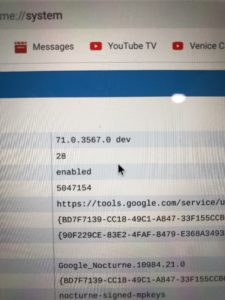

The Google Pixel Slate will officially be available before the end of 2018, according to the company. _Unofficially_, Best Buy said you can expect it on November 22. [The retailer has now changed the listing to a "not announced yet" release date](https://www.bestbuy.com/site/google-pixel-slate-12-3-tablet-128gb-midnight-blue/6306462.p?skuId=6306462), which is technically accurate. However, I was able to capture a screenshot showing the original information.

While this date is clearly unofficial and subject to change, I think the plan actually is to get the Pixel Slate available for sale around late November or early December.

I noticed that the Pixel Slate demo units were running on the Chrome OS version 71 Dev Channel. I also noticed some occasional stutters and glitches; I'm not worried about those since these are pre-sale units and there are _surely_ some hardware and software optimizations still in progress. [Take a look at the number of open code commits for Nocturne](https://chromium-review.googlesource.com/q/nocturne), even as of today, and you'll see that the final software isn't yet ready.

Some of the code for Nocturne could still be backed into Chrome OS 70, which according to the [Chromium Dev Calendar](http://www.chromium.org/developers/calendar) has an estimated Stable release date of October 23 for Chrome OS. That would provide the Chromium team about a month to get any additional fixes into the platform by November 22.

If the final, shipping software does get pushed into Chrome OS 71, that Stable version isn't expected until December 11, so that's roughly a possible release date as well. I suspect it all hinges on how quickly any final optimizations are completed by the developers more than any hardware or production/supply chain challenges.

While we all wait for Pixel Slate availability, if you're curious how the Pixel Slate Keyboard works, [I captured a short video of it at the #MadeByGoogle event](https://www.aboutchromebooks.com/news/first-look-video-google-pixel-slate-keyboard/).
