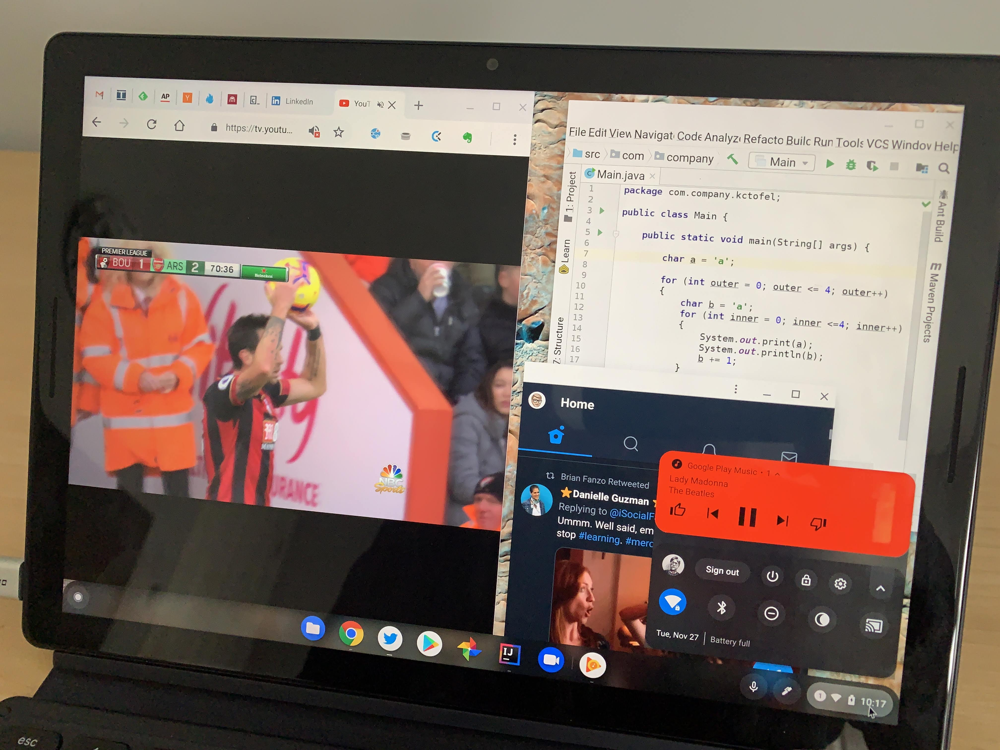

I've publicly stated many times in the past five years that a Chrome OS tablet was something I wanted and it's finally here.

The [Googe Pixel Slate](https://store.google.com/product/pixel_slate) is the peak expression of that desire: A powerful, thin tablet for portability and content consumption in a relaxed environment but all of the productivity of a full desktop Chromebook with a detachable keyboard.

Does the Pixel Slate and Pixel Slate Keyboard meet my long-time desires? Mostly, yes, but there's a price to pay for such premium design and performance. Let's dive into my impressions after using the device full time for the past week.

## What do you get for $999 (or $1,199 with the Keyboard)?

The review unit Google loaned me is the exact same configuration I pre-ordered; [my personal Pixel Slate and keyboard should arrive later this week](https://www.aboutchromebooks.com/news/pixel-slate-shipments-have-begun-best-buy-availability-to-follow-soon/). Orders for the device at the Google Store show shipments in 2-3 weeks, while Best Buy will likely have units available sooner than that.

Here are the specs for the $999 configuration:

- [Intel Core i5-8200Y](https://ark.intel.com/products/185280/Intel-Core-i5-8200Y-Processor-4M-Cache-up-to-3-90-GHz-) dual-core CPU with 1.30GHz clock speed, 3.9GHz turbo speed
- 8 GB of LPDDR3 memory
- 128 GB of eMMC storage
- A 12.3 inch IPS touchscreen display with 3000 x 2000 resolution and 3:2 aspect ratio
- Intel UHD Graphics 615 with that shares memory with the system
- 802.11ac Wi-Fi (2×2 MIMO) and Bluetooth 4.2
- A pair of USB Type-C ports for data, charging and 4K video output, dual microphone and stereo speakers
- Integrated fingerprint sensor in the power button
- 8MP 1080p front wide-angle camera, 8MP, 1080p rear camera
- 48 WHr battery with run time up to 12 hours, fast charge for a 2 hour run time in 15 minutes

Adding the $199 Pixel Slate Keyboard brings the circular, backlit hush keys, a 4.09 x 2.9 - inch etched glass trackpad, "infinitely adjustable" Slate stand and Chrome OS shortcut keys including one dedicated to the Google Assistant.

At 7 millimeters thick, the Pixel Slate is thinner than both my iPhone XR and the Pixel 3XL. Seriously, it's amazingly thin for a full, fanless Chrome OS experience with all of the hardware internals and battery inside the display. It's not the lightest tablet in this size range: You'll tote 1.6-pounds around with the Slate when away from a desk; the Pixel Slate Keyboard adds 1.1 pounds to the package, bringing the total to 2.7 pounds. It's heavier than I expected but I didn't find the weight to be a problem.

## You don't sacrifice on performance with the Pixel Slate

Obviously, I can only speak to the performance of the Core i5 model of the tablet. There are configurations with an Intel Celeron (two options, actually), a Core m3 and Core i7, depending on your budget and needs. I've already put together [thoughts on which configuration makes sense for different use cases](https://www.aboutchromebooks.com/opinion/which-google-pixel-slate-to-buy-guide/) here if that helps.

Like I did in [my review of Acer Chromebook Spin 13](https://www.aboutchromebooks.com/reviews/acer-chromebook-spin-13-review-vs-pixelbook/), I'll get benchmarks out of the way first for those who care. As I said in that review, benchmarks are only a general indication of performance comparisons but everyday use is more important to me. I ran industry standard tests on the Pixel Slate and here's how they compared to last year's Pixelbook as well as the Acer Chromebook Spin 13.

I'm including the latter because that device also uses the newest Intel chips, but a different series that can run longer under higher load. Note that devices using those chips -- the U-Series -- require a fan; the Pixel Slate and its Y-Series CPU does not.

For reference, the Pixel Slate ships with Chrome OS 71. All tests were run in Guest Mode after a fresh reboot.

| Test | Google Pixel Slate | Google Pixelbook | Acer Chromebook Spin 13 |
| --- | --- | --- | --- |
| Speedometer 1.0 | 137 | 117 | 164.1 |
| Speedometer 2.0 | 84.2 | 69.4 | 96.73 |
| JetStream | 146.52 | 118.74 | 174.52 |
| Basemark | 476.86 | 414.2 | 426.18 |
| Octane 2.0 | 32,022 | 22,309\* | 36,448 |

_\***Note**: I have seen many Pixelbooks score into the low-to-mid-30,000 range on Octane tests. I don’t know why my results are much lower, although it may be due to running Chrome OS 71 Dev Channel. This appears to be an outlier._

These numbers are generally what you'd expect and they offer a glimpse of what I experienced when using the Pixel Slate. The device feels a "half step" quicker for just about everything compared to the Core i5 Pixelbook and another "half step" slower in some cases compared to the bulkier Spin 13 with its beefier chip and fan.

In my use, every activity seems super quick; tap something and it just happens. I didn't experience any major lags or system slowdowns even when running a score of Chrome tabs, an Android app or two and the Linux version of IntelliJ Idea for a Java class I'm currently enrolled in.

\[caption id="attachment\_2302" align="aligncenter" width="4032"\] Multiple Chrome tabs, a PWA, Google Play Music Android app and Linux humming along.\[/caption\]

I also ran some intense Android apps, such as Asphault 9, and the Slate handled it like a champ. The best way to summarize performance is this: If the Pixelbook was Google's own Chromebook performance king last year, this year it's the Pixel Slate. Again, this is when comparing like-for-like processors and memory configurations; there are more Pixel Slate options depending on your budget.

I know that some folks were disappointed to find out that the [Pixelbook uses eMMC storage](https://www.aboutchromebooks.com/news/pixelbook-emmc-or-ssd-storage/) unless you purchased the Core i7 model with a faster NVMe SSD so I have to point out that the Pixel Slate does too. All of the models do according to Google, when I asked them. Some will hem and haw, saying "At that price it should have faster storage." That's one opinion. Mine is: It doesn't really matter in terms of typical usage.

The amount of time most people spend transferring or saving large files on a Chromebook is likely minuscule. I wouldn't think it's a daily occurrence, and even if it is, it's likely not more than once. More important, to me anyway, is the speed of the wireless connection because that's used far more often for most every Chrome OS activity.

Still, I ran benchmarks on the internal storage using an Android app and found read speeds averaging 245 MBps and write speeds of 170 MBps. While that's not the same speed you'd find with an NVMe flash drive, it certainly isn't slow, nor did it impact anything I did with the Pixel Slate. It's your call if this really matters to you or not.

## The display is gorgeous and the speakers lead the pack

With a slate, I've always felt that one of the most important features is the display. That's because it's not just the most used part of the tablet -- you look at it every second of use, right? -- but it's also your input device on a pure slate. In both of these aspects, the Pixel Slate shines.

With a 3000 x 2000 resolution panel, you're getting 293 pixels per inch. That's a higher density than the 235 pixels per inch on last year's Pixelbook. And it's noticeable to see more pixels packed into the same 12.3-inch screen size on the Pixel Slate. I wouldn't say it's a major upgrade but you can see it in certain scenarios, such as watching a high-resolution video. Until some 4K Chromebooks actually arrive for sale -- [a few have been announced](https://www.aboutchromebooks.com/news/4k-lenovo-yoga-chromebook-c630-specs-price-release-date-599/) but you can't buy them yet -- this screen is the top dog with great viewing angles and color saturation. It's not an HDR panel but the brightness is excellent and colors do have some pop.

What surprised me most when watching a video or listening to music are the dual, front-facing speakers. They are fantastic for a device this thin.

There's good stereo separation and far more bass than I expected, even at low volume levels. They're also louder than any I've heard yet on a Chrome OS device. Although there's no official mention of this, I suspect they've been [tuned by Waves Audio based on some Chrome OS code](https://www.aboutchromebooks.com/news/atlas-and-nocturne-chromebooks-may-natively-support-acoustic-echo-cancellation/) I found earlier this year. The speakers (and the microphones) excelled during some test video calls using Hangouts [and Google Duo](https://www.aboutchromebooks.com/news/google-duo-chromebook-video-chat-available/) as well.

I never experienced any touch issues using the Pixel Slate and did some basic testing of the digital pen, which is not included and costs $99. If you have the older Pixelbook pen, that works with the Pixel Slate as well; the only difference between last year's pen and this one is the color. Taking notes in Googe Keep and Squid was no different to me than it is on my Pixelbook. That is to say, it's really good in Squid; better even than in Keep. I didn't test any drawing apps because my artistic skills are, shall we kindly say, embarrassing.

## Desktop mode vs tablet mode and the Pixel Slate Keyboard

<iframe style="width: 120px; height: 240px;" src="//ws-na.amazon-adsystem.com/widgets/q?ServiceVersion=20070822&amp;OneJS=1&amp;Operation=GetAdHtml&amp;MarketPlace=US&amp;source=ac&amp;ref=tf_til&amp;ad_type=product_link&amp;tracking_id=aboutchromebo-20&amp;marketplace=amazon&amp;region=US&amp;placement=B07JWB7QB2&amp;asins=B07JWB7QB2&amp;linkId=d3fcc999940a12a803679054a62d07a9&amp;show_border=true&amp;link_opens_in_new_window=true&amp;price_color=333333&amp;title_color=0066c0&amp;bg_color=ffffff" frameborder="0" marginwidth="0" marginheight="0" scrolling="no" align="right"></iframe>

I'd argue that Chrome OS has seen more visual and under the hood changes in the past year than in any other 12 month period prior. That's because Google has been prepping a tablet mode for the platform. From my perspective, it's about 95 percent of the way there at this point and I expect to see a few more tweaks in future software updates.

Overall it works well and provides the best of both worlds for the Pixel Slate: A true Chrome OS desktop mode when connected to a keyboard and a tablet mode when using just the slate. In case you're not familiar with these two modes, since they're [relatively new starting with Chrome OS 70](https://www.aboutchromebooks.com/news/chrome-os-70-hits-the-stable-channel-bringing-a-better-chrome-tablet-experience/), desktop mode is just like any other clamshell Chromebook. Tablet mode runs apps in a full screen, although you can split the screen between two apps, the mouse cursor disappears and the app Launcher is essentially the home screen.

This is tricky to implement with a pure tablet. For 2-in-1 devices, it's far easier: Just monitor when the hinges indicate the keyboard is folded under or behind the display and enter tablet mode. Without hinges on the Pixel Slate, you can't do that.

Google engineered a clever design with the Pixel Slate Keyboard to make this happen. When you fold the keyboard under the slate, a hall sensor detects this action and the keyboard magnetically attaches to the base of the keyboard stand. It's probably easier to show how this works, so here's a short video showing the switch between modes.

\[embed\]https://youtu.be/GeXwZrQBSFs\[/embed\]

When I filmed this video, I had just got the Pixel Slate and was a little put off by what appeared to be a locked down Launcher in tablet mode. I've since gotten used to it and frankly, it's not that different from how certain _other_ tablets (that shall not be named here) work. And if you have an open app or browser tabs when switching from desktop to tablet mode, they'll appear in lieu of the Launcher; I simply didn't have any open when doing this demonstration.

<iframe style="width: 120px; height: 240px;" src="//ws-na.amazon-adsystem.com/widgets/q?ServiceVersion=20070822&amp;OneJS=1&amp;Operation=GetAdHtml&amp;MarketPlace=US&amp;source=ac&amp;ref=tf_til&amp;ad_type=product_link&amp;tracking_id=aboutchromebo-20&amp;marketplace=amazon&amp;region=US&amp;placement=B07J6TC92W&amp;asins=B07J6TC92W&amp;linkId=93be44a49cd21910350db686ca6703c0&amp;show_border=true&amp;link_opens_in_new_window=true&amp;price_color=333333&amp;title_color=0066c0&amp;bg_color=ffffff" frameborder="0" marginwidth="0" marginheight="0" scrolling="no" align="right"> </iframe>

There were times when I folded the keyboard back to relax with some full-screen video and not have the keyboard in the way but the Pixel Slate didn't enter tablet mode. That's because the keyboard has to be perfectly lined up with the base for tablet mode to engage. You'd think that wouldn't be an issue but.... there's room for improvement here.

The fabric between the keyboard keys and magnetic back of the cover -- where the Slate's back attaches to the cover and can be adjusted to nearly any angle -- isn't rigid. So there's some side to side "give" at this point. That's what led to the Slate not being perfectly on the base when moving to tablet mode on a few occasions for me. Microsoft solved this problem with the Surface Pro keyboard by adding magnets over the top row of keys; that attaches to the bottom of the screen for stability; I'd like to see Google consider a similar sitution in the future.

That give also impacts using the Pixel Slate Keyboard on a non-flat surface. When using it on my lap to type, I immediately noticed some keyboard wobble. And carrying the Slate with the keyboard cover has a little movement as well. It's a minor annoyance at best to me, but others may really dislike it. I'd recommend trying one out in a store or considering an alternative keyboard like the [$159.99 Brydge G-Type](https://www.brydge.com/pages/gtype-keyboard-for-google-pixel-slate) if this is going to bother you.

Aside from that, I love the Pixel Slate Keyboard. The circular keys are backlit and have a little more travel than the already great Pixelbook keyboard. The trackpad is large, smooth and responsive. You don't have to charge the keyboard since it sips power from the Slate itself using metal connectors which keep the slate and keyboard connected. And having a dedicated Google Assistant key is handier than I thought, although you can enable an "always listening" mode for the Assistant.

Here's a quick sample of the Pixel Slate Keyboard adjustability with support for nearly angle from 95-ish degrees to around 160 degrees in tablet mode; note that the back cover has magnets that slide the cover up and down on the back of the Slate for adjustment, which is a great design.

\[gallery type="slideshow" ids="2311,2312,2313,2314"\]

## Other random thoughts

Here are some bullet-pointed additional thoughts on the Pixel Slate and Pixel Slate Keyboard from my week of use:

- The integrated fingerprint reader worked quickly 100% of the time during my testing. Note, however, that like Android phones, you can't boot up and log in with a fingerprint. You'll need either a password or PIN for that. To unlock the display anytime after the first sign-in, you can use the fingerprint sensor.
- Battery life is at least as good as the Pixelbook for the way I used the device. I've been able to consistently get 9 hours of run-time on a charge. A quick 15 to 30 minute top off adds another 2 to 3 hours of use
- The Camera app appears to be from Android and it adds both tap to focus and Portrait Mode. Images are acceptable but there's room for improvement here if you're the type of person who uses a tablet for taking pictures. It's pretty good for video chats.
- I mentioned that I was running Linux apps but I didn't get into many details. Suffice it to say, anything you can do in the [Linux on a Chromebook](https://www.aboutchromebooks.com/tag/project-crostini) (aka: Project Crostini) beta works and works well here. You're probably going to want a keyboard for the Linux apps and Terminal though; the on-screen keyboard isn't ideal for that use case.
- I did see one strange issue when watching full-screen YouTube TV: A one-pixel while line running up and down the screen on the very right edge. It's only on YouTube TV, however. I pointed it out to Google and they assured me that they continue to work on optimizing the software experience. The issue should be resolvable via software from what I understand.
- While you can use an external monitor with the Slate over USB-C, I didn't get a chance to try it yet. I have a 4K monitor still unpacked from when I moved to my current location and plan to dig that out this week.
- There is no headphone jack so you'll either need to use Bluetooth headphones for private audio or the included USB-C to 3.5mm adapter included with the Pixel Slate.
- Having a full desktop browser on a tablet is a joy.

## Who should buy it (and which model)?

As much as I liked my first week with the Pixel Slate and Keyboard, it's not a device for everyone. Why? Not everyone needs a Chrome OS tablet when a 2-in-1 or traditional Chromebook is better suited to their needs. I noted this when I said you should [ask yourself these two questions to decide if the Pixel Slate is for you](https://www.aboutchromebooks.com/opinion/google-pixel-slate-vs-chromebook-should-i-buy-chromeos-tablet/). I fall in the category that does benefit from having both a tablet and desktop mode type of experience since about half my day is consuming content where I want a lighter device. And when I want to get my work done, the full desktop mode and hardware keyboard covers the bases.

Not everyone falls into that category; in fact, I'd guess that _most_ people don't. And that's OK. There are plenty of 2-in-1 Chromebooks and even a few other less expensive tablets like the HP Chromebook X2 that will fit the bill.

To me, the Pixel Slate provides a potent, premium Chrome OS experience that -- depending on the configuration -- no other tablet can match right now.

You have to decide if the portability is important to you, and if so, how much is it worth? If you're on a budget you can still get a Pixel Slate for $599, but you'll surely be sacrificing performance to gain the portability of a tablet.

My take is that if you're looking for an all-in-one Chrome OS device that is light enough to enjoy content and Android apps on the go or in a comfy chair plus you want a powerful desktop experience, the Pixel Slate is well worth the look. Again, if you're not sure which model, [this might help you](https://www.aboutchromebooks.com/opinion/which-google-pixel-slate-to-buy-guide/); that guide is essentially how I decided on the Core i5 Pixel Slate model myself.

Interesting in hearing more about the Pixel Slate and Pixel Slate Keyboard? Stay tuned later today for a podcast I did with my MobileTechRoundup podcast co-host, and ZDNet writer, Matt Miller as we both discuss our one week review period with the device.
