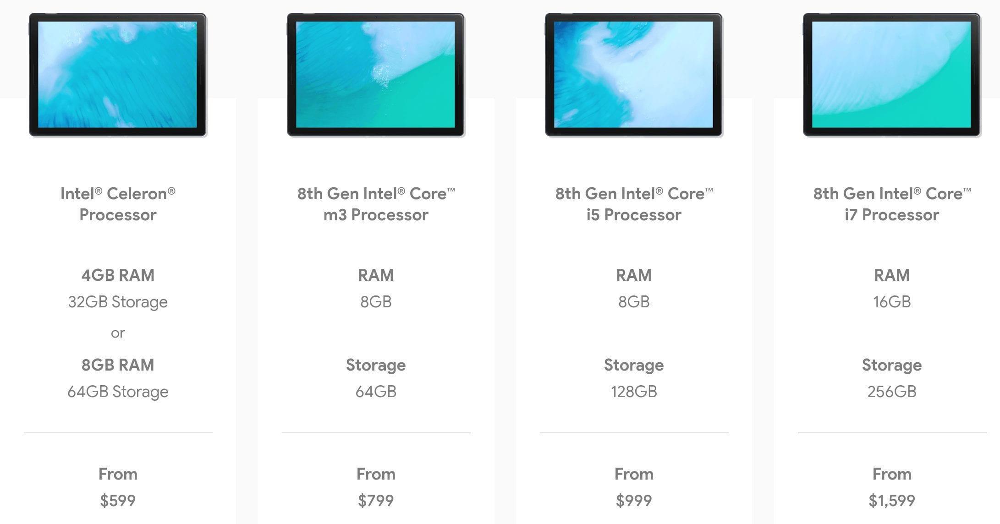

More than a week after the [Google Pixel Slate was announced](https://blog.google/products/pixel-slate/pixel-slate/), I'm still getting numerous questions from readers asking if they should buy it, and if so, which model to get. I'll address the second question in a separate post, so today let's tackle the first one: Should you buy it?

First, there's no "one size fits all" device for anyone, so I won't make big, sweeping generalizations. You need to address your individual requirements because we're all unique. Where and how I use a Chromebook is likely very different than you. However, we can all apply some similar questions during the purchase decision process.

Second, I've been saying for 15 years that mobile technology purchase choices are **all about compromise**. Do you want portability? You may have to give up screen size or battery life, for example, to get a more portable device. Want the best performance? It will likely cost you more in terms of price and portability. These are just some examples of what I mean.

## True tablet or a 2-in-1 Chromebook?

Having said that, it leads into the first question I'd be asking: _Do you really need a true tablet computer?_ I don't mean a 2-in-1 Chromebook that has a tablet mode. I mean an actual slate that can be used on its own without an attached keyboard when desired.

I actually prefer a tablet that can work with an attached or wireless keyboard. Why? Because at least 50% of my device usage is for consuming content such as YouTube TV,  Netflix, and Amazon Prime video. Having a true tablet device is just a more comfortable experience for me -- and again, you may not agree or have this preference -- than a heavier 2-in-1 or a clamshell Chromebook. If you don't fall into this category, I'm not sure why you'd even consider the Pixel Slate, except for one reason that I'll get into shortly.

Of course, there are a few other Chrome OS tablets to consider if you want a slate: the [Acer Chromebook Tab 10](https://www.aboutchromebooks.com/tag/acer-chromebook-tab-10/) if you don't mind a smaller screen and less performance. Or the HP Chromebook X2.

Yes, the HP does have a keyboard but you can use the slate _without_ the keyboard by removing the display. That gives you two less expensive options in the $330 to $600 range, with the HP providing roughly the equivalent performance of a base Pixelbook for less.

## How much performance do you need?

Maybe performance is super high on your list of requirements. In this case, the Core i5 and Core i7 configurations of the Pixel Slate should be considered. These have newer Intel processors than the current Pixelbook, which should eke out some, but not massive, performance gains over last year's Google Chromebook.

You'll pay more of course, and not just because of the performance boost: You're paying for portability and design, as well as having an additional cost for the keyboard. That's a $160 to $200 premium depending on if you [buy the Brydge G-Type](https://www.brydge.com/pages/gtype-keyboard-for-google-pixel-slate) or the [Google Pixel Slate keyboard](https://store.google.com/us/product/pixel_slate_keyboard).

\[caption id="attachment\_2018" align="aligncenter" width="800"\] Brydge G-Type keyboard for Pixel Slate\[/caption\]

The Pixel Slate isn't your _only_ option for performance though. By sacrificing the tablet form factor, you can get comparable, if not better performance from other new devices.

The Acer Chromebook 13 and Chromebook Spin 13, for example, have a range of configurations that use Intel's U-Series Core processors vs the more power efficient Y-Series expected in the Pixel Slate. When the [Acer Spin 13 Chromebook](https://www.aboutchromebooks.com/news/acer-chromebook-spin-13-price-specifications/) goes on sale shortly, you can get a 2-in-1 device with a quad-core Intel Core i5-8250U paired with 16GB of memory and 128GB of storage at $999.

The same price gets you [a Pixel Slate with dual-core Core i5-8200Y](https://www.aboutchromebooks.com/news/pixel-slate-nocturne-intel-configurations-celeron-m3-i5-i7/) and the same 128GB of storage but only 8GB of RAM. Again, there's some compromise.

Keep in mind that the [Lenovo Yoga Chromebook C630 starts at $599](https://www.aboutchromebooks.com/news/4k-lenovo-yoga-chromebook-c630-specs-price-release-date-599/) and also uses an Intel Core i5-8250U processor with 8GB of RAM but caps the local storage at 64GB and has a 1080p display. There will be options with 4K resolution screens, which I expect to add around $200 for that upgrade.

\[caption id="attachment\_1578" align="aligncenter" width="2000"\] Lenovo Yoga Chromebook C630\[/caption\]

So you can get solid performance for less if you're willing to compromise on display resolution and less portability since the Yoga Chromebook C630 weighs 4.2 pounds. That's much heavier than the Pixel Slate, which only weighs 1.6 pounds by itself or 2.7 pounds with the Google keyboard.

Don't forget that the [Pixel Slate will come in at least five configurations](https://store.google.com/product/pixel_slate_specs), so if a tablet is on your wishlist and you don't need screaming fast performance, you've got options. The Celeron model will cost $599 or $699 depending on how much memory or local storage you need.

And if an Intel Core m3 with 8GB of memory is enough horsepower for the way you use a Chromebook today, you can get that in a Pixel Slate for $799; just remember that a keyboard will cost you extra.

**_Click the link below to continue to page 2_**

## There are other factors but these are where to start

Let's be honest: _At their core, every Chromebook essentially does the same thing_. They all provide a simple, speedy and secure way to use the web. Some older Chromebooks and any new ones that arrived in 2017 through the present also run Android apps. And roughly 20 different models currently support [Linux apps thanks to Project Crostini](https://www.aboutchromebooks.com/tag/project-crostini). So right there, you have some choices to make on what apps and features you'd like.

When it comes to the Pixel Slate, the real key is how badly do you want or need a tablet. If you don't, then I'm not sure it's the device for you.

Perhaps you're wowed by that 3000 x 2000 display -- I was -- and it's a must-have. OK, you're back in the Pixel Slate camp then. Otherwise, you just don't need a slate because that's essentially the main draw here and you'll be paying a premium for it.

And while the top-end Pixel Slate is likely to be one of the best performing Chrome OS devices this year, you'll pay a hefty premium to get that Core i7, 16GB of memory and 256GB of storage.

Unless you're a heavy-duty developer with a big budget and you either want a tablet or don't mind using a separate keyboard, or if you simply want the highest possible performance from a portable Chrome OS device, $1,599 is a lot to spend when you can get a great Chromebook experience for roughly one-third to one-half of the cost.

Again the [HP Chromebook X2](https://store.hp.com/us/en/pdp/hp-chromebook-x2-12-f015nr) fits the bill here as do many other devices in the $500 to $700 range: The [Dell Inspiron Chromebook 14 arrives this weekend for $599](https://www.aboutchromebooks.com/news/dell-inspiron-chromebook-14-early-release-date-best-buy/) with a newer Core i3 and 128GB of storage; it should run well enough for most people, even with its 4GB of memory.

\[caption id="attachment\_1527" align="aligncenter" width="3740"\] Dell Inspiron Chromebook 14\[/caption\]

Are there other factors in the decision making process for a new Chromebook purchase? Sure: Battery life, touch vs non-touch displays or screen resolution, weight, size and more or all part of the decision, as is cost.

But if you're wondering if the Pixel Slate is for you, my advice is to focus on the need for a true tablet -- based on how and where you'll use the device -- as well as performance. All things being equal, these two factors are key before even considering your other preferences and requirements.
