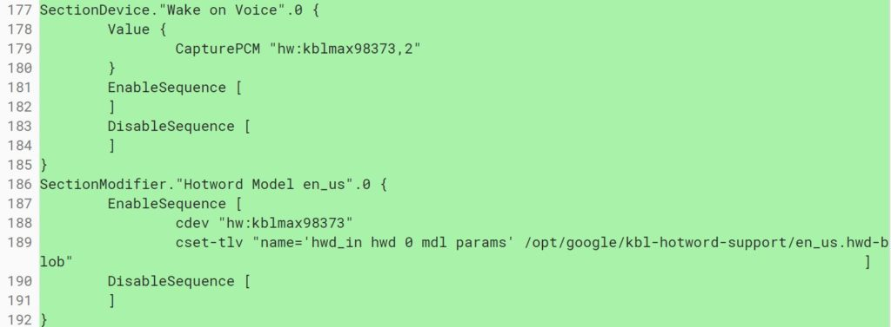
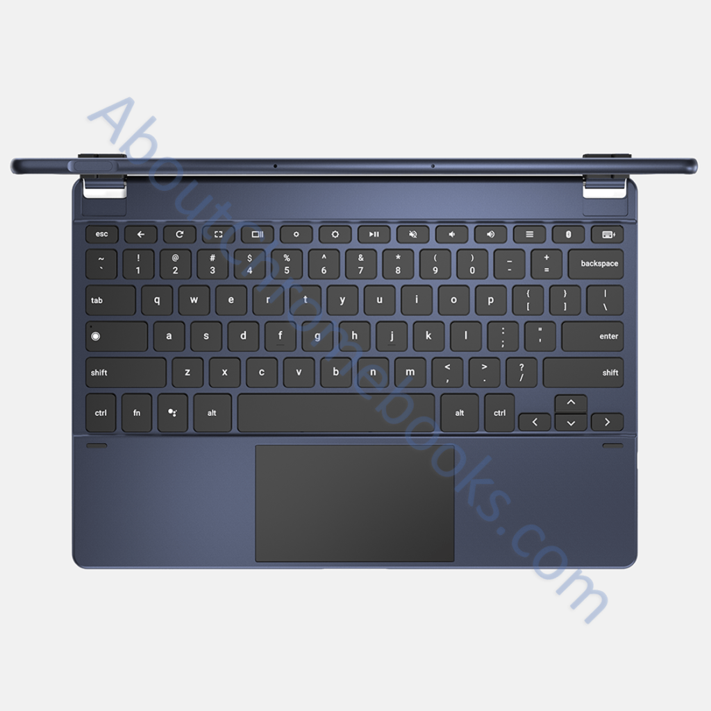

So much has [already leaked about the Pixel Slate](https://www.aboutchromebooks.com/news/google-pixel-slate-images-keyboard-cover-specifications-nocturne/), you'd think there wasn't any more information left before [Tuesday's #MadeByGoogle event that you can watch right here](https://twitter.com/i/events/1046820267849179137). You'd be wrong though. In the past few days, [Google added a Wake on Voice feature to Nocturne](https://chromium-review.googlesource.com/c/chromiumos/overlays/board-overlays/+/1258674), which is expected to have the Pixel Slate brand name.

This feature isn't the only special one related to audio tech: The [Pixel Slate is expected to have Acoustic Echo Cancellation or AEC](https://www.aboutchromebooks.com/news/atlas-and-nocturne-chromebooks-may-natively-support-acoustic-echo-cancellation/). Indeed, the first look at Google's Chrome OS tablet shows multiple microphones for this.

The Wake on Voice function is unique when compared to Apple's iPad Pro, as is the fact that any Chrome OS tablet has a full desktop browser. I'm not sure I'll use it much -- I intend to purchase a Pixel Slate with a configuration similar to my Pixelbook, and there will [be at least four to choose from](https://www.aboutchromebooks.com/news/pixel-slate-nocturne-intel-configurations-celeron-m3-i5-i7/), depending on the price -- because I don't mind tapping a power button.

But when you have your hands full, Wake on Voice can be useful. It's fairly common for a tablet to be used for content consumption and I often have food and my phone in hand when sitting down in front of the Pixelbook in tablet mode to watch television content. In those particular instances, waking up a device by voice is an ideal use case.
