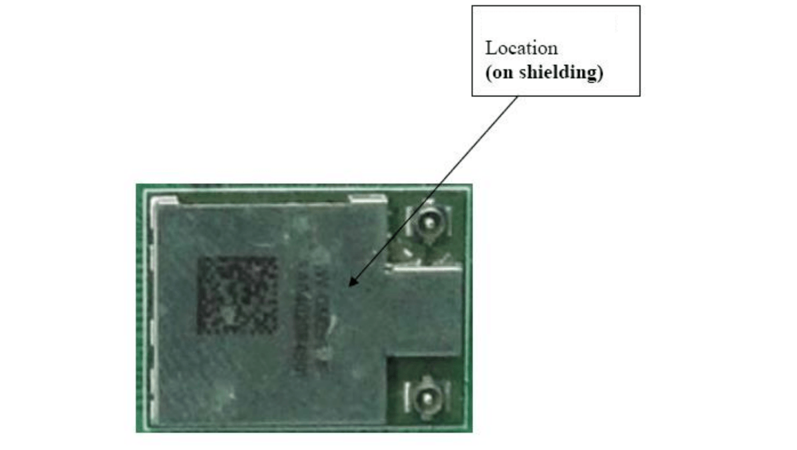
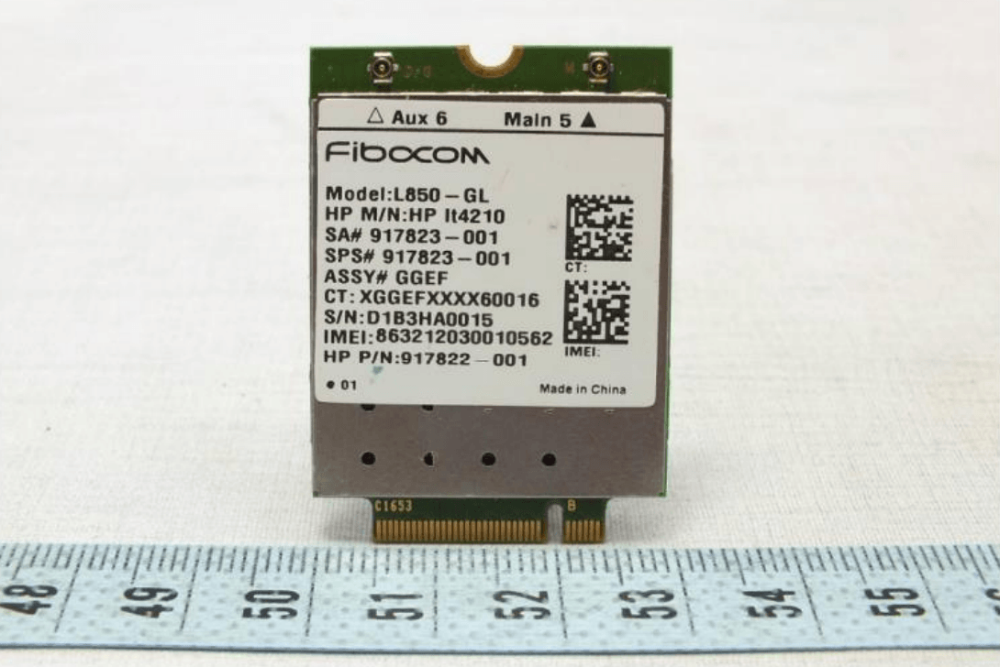
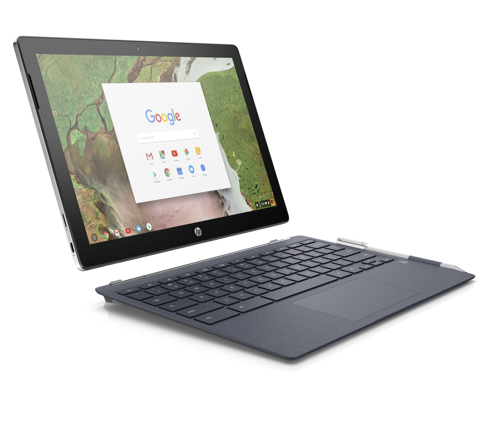

During my daily scan of the FCC database today, I stumbled on to an two interesting application requests. The devices themselves are an LTE module and a Wi-Fi / Bluetooth chip. That's not necessarily interesting because these chips are pretty commonplace. Instead, what **_is_**  interesting is that the applicant is Google.

First let's the get the basics out of the way on the actual modules the FCC has looked at; note that these modules were previously tested by the FCC but are now going to be reclassified with new FCC IDs under Google's name.

One is [a wireless LAN module from AzureWave](https://apps.fcc.gov/oetcf/eas/reports/ViewExhibitReport.cfm?mode=Exhibits&RequestTimeout=500&calledFromFrame=N&application_id=OH%2F7fxwdid0Yhi0Op6OcSQ%3D%3D&fcc_id=A4R-WT4).

It supports 802.11ac 2x2 Wi-Fi and Bluetooth 4.0 (LE). This wireless module is currently [paired with a MediaTek processor in the Acer Chromebook R13](https://us.hardware.info/product/373378/acer-chromebook-r13-cb5-312t-k7sp/specifications), for example.

Next is [an LTE module built by Fibocom](https://apps.fcc.gov/oetcf/eas/reports/ViewExhibitReport.cfm?mode=Exhibits&RequestTimeout=500&calledFromFrame=N&application_id=y%2BnxtIbBFwOab1IryQPbzQ%3D%3D&fcc_id=A4R-WT3); it's the L850-GL that can support the following bands: 4G FDD: Band 1,2,3 4 5,7,8,11,12,13,17,18,19,20,21,26,2829,30,66 - 4G TDD: Band 38,39,40,41 - 3G: Band 1,2,4,5,8.

With support for Cat 9 LTE, It's not the fastest module around but can transfer downloads upt 450 Mbps and uploads at 50 Mbps. It's built on Intel's XMM 7360 LTE modem.

Again, the modules themselves aren't the important aspect here. The fact that Google is essentially taking ownership of the FCC IDs for them is. That very likely means both of these will be used in Google hardware, not hardware from a Google partner. So I don't expect this information to be relevant to [Samsung's LTE-enabled Chromebook](https://www.aboutchromebooks.com/news/samsung-chromebook-pro-v2-lte-core-m3/), for example.

We also know that Google is adding [eSIM technology into Chrome OS,](https://www.aboutchromebooks.com/news/meet-project-hermes-esims-and-likely-project-fi-on-chromebooks/) which could be used for the [Cheza Chromebook](https://www.aboutchromebooks.com/news/why-cheza-snapdragon-845-chromebook-tablet-20-hours-battery-life/) powered by Qualcomm's Snapdragon 845. That device would very likely use Qualcomm's own LTE technology for always-on connectivity, since it's integrated into the Snapdragon SOC.

So my best guess for a Google-branded device to use these chips would be the Pixelbook successor, which I've been calling the [Pixelbook 2](https://www.aboutchromebooks.com/news/pixelbook-2-atlas-detachable-4k-chromebook-availability-2018/). Note that my gut also says we could see two new Google-branded Chromebooks this fall: one in a traditional laptop configuration with fully folding display and one with a detachable display like the [HP Chromebook X2](https://www.aboutchromebooks.com/news/hp-chromebook-x2-arrives-as-the-first-detachable-chromebook-tablet/).

Although much of Chrome OS supports offline use, the addition of an LTE connection does add tremendous value to a Chromebook. Yes, there's an added monthly cost, but the convenience of having such a connection when away from Wi-Fi is a productivity boon. I realized that after buying the original 2013 Chromebook Pixel with the LTE option.

Keep in mind that although its a fact that Google has the FCC IDs for these modules, it's strictly my educated guess that we seem them used in the new Pixelbook. There _**are**_ other possibilities such as pairing the Wi-Fi/Bluetooth chip with another ARM processor -- like in the Acer Chromebook R13 -- for a new ARM-based device. That could even be a tablet for all I know but then again, we haven't seen much evidence for any new tablet devices to this point.

Having said that though, I'm leaning towards the inclusion of LTE, or at least an LTE option, for a new Google Pixelbook device in the coming months. Does the potential for that sound exciting to you or would rather just rely on Wi-Fi and tethering a phone as needed?
