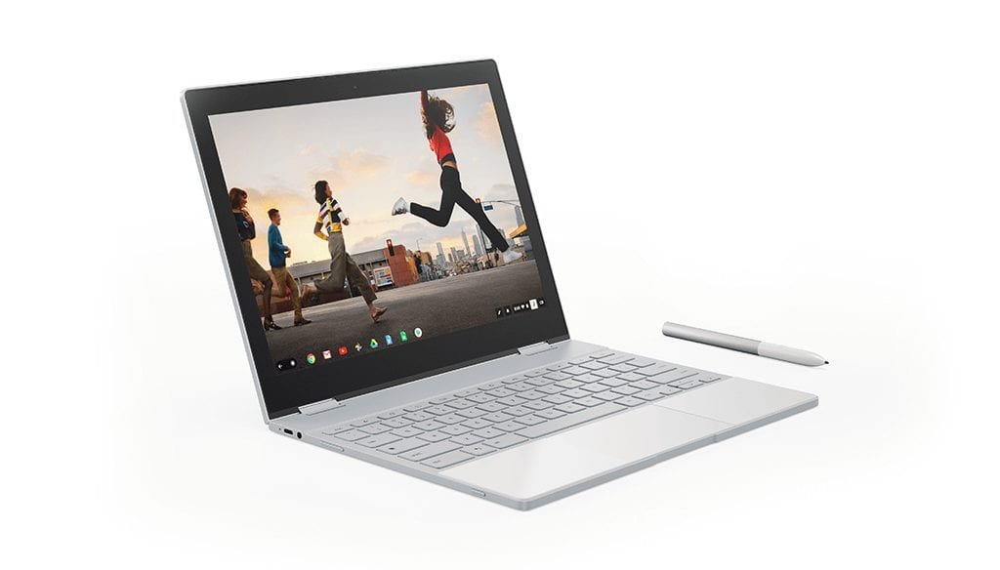

Got a Pixelbook on your wishlist? If you're OK with a certified, refurbished Chromebook, [Best Buy has all three models available with savings ranging from $299 to $549](https://www.bestbuy.com/site/searchpage.jsp?st=refurbished+pixelbook&_dyncharset=UTF-8&id=pcat17071&type=page&sc=Global&cp=1&nrp=&sp=&qp=&list=n&af=true&iht=y&usc=All+Categories&ks=960&keys=keys). You won't find these in retail stores, so you'll have to order online if you're interested.

Here's the rundown on the models and pricing currently available:

- $699.99 - Core i5 with 8GB of RAM and 128 GB of storage
- $849.99 - Core i5 with 8GB of RAM and 256 GB of storage
- $1,099.99 - Core i7 with 16 GB of RAM and 512 GB of storage

All models share the same 12.3-inch touchscreen with 2400 x 1600 resolution, folding keyboard for 2-in-1 mode, Pixelbook Pen support, 802.11ac Wi-Fi, Bluetooth 4.2, 720p webcam, a pair of USB-C ports, headphone jack, backlit keyboard, expected 10 hour battery life and a 15 minute fast charge that adds up to 2 hours of run time.

[Google is currently selling these at full price on its Store with the costs at $999, $1,199, and $1,599](https://store.google.com/config/google_pixelbook) respectively, so this is a significant savings from those prices.

There are some things to keep in mind, however. The Google Pixelbook line uses seventh-generation Intel processors, and while they're still very capable, there are newer Chromebooks with more recent CPUs. And while Google says all Pixelbooks use SSD for storage, [only the highest price model uses a fast NVMe drive](https://www.aboutchromebooks.com/news/pixelbook-emmc-or-ssd-storage/); the other two store data on slower eMMC memory.

And of course, these are refurbished devices. Here's how Best Buy describes such products:

> Occasionally, technology misbehaves right out of the box. Other products work as expected, but need some sprucing up (such as a new screen, battery or casing). Refurbished products are repaired and restored to a like-new state (may have minor scratches), either by one of Best Buy's in-house repair centers, the manufacturer or a third-party refurbishment company. The products are verified to work properly and include all essential parts and accessories (original or comparable substitutes).

For these prices, there are several other very good, new Chromebook choices that have different features - such as larger displays, more current processors or more ports - such as the [Lenovo Yoga Chromebook C630](https://www.aboutchromebooks.com/news/lenovo-yoga-chromebook-c630-price-availability-4k/), [Acer Chromebook Spin 13](https://www.aboutchromebooks.com/reviews/acer-chromebook-spin-13-review-vs-pixelbook/) and [HP Chromebook X360](https://www.aboutchromebooks.com/news/hp-chromebook-x360-release-date-price-specs/), for example. So the real draw here is simply wanting Google-designed and branded hardware at a discounted price.

Make no mistake, the Pixelbook is a great Chromebook. I've owned every model of Google's own Chromebooks and have been happy with all of them. And the automatic update expiration date for the Pixelbook is June 2024, so you'll get another five years of Chrome OS updates. Still, it's entirely possible that [we see a newer Pixelbook model debut this fall](https://www.aboutchromebooks.com/news/pixelbook-2-benchmarks-8th-gen-intel-gpu-specifications-release-date/), so keep that in mind before making the purchase decision.
