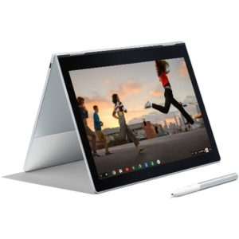

Well this might make the question of buying an [HP Chromebook X2 or a Pixelbook](https://www.aboutchromebooks.com/opinion/pixelbook-or-hp-chromeook-x2-detachable-chrome-tablet/) a little tougher: A handful of retailers, including Google themselves, have [reduced the price of the base Pixelbook from $999 to $749](https://store.google.com/product/google_pixelbook). Best Buy is one of those [offering the deal](https://www.bestbuy.com/site/google-pixelbook-12-3-touchscreen-chromebook-intel-core-i5-8gb-memory-128gb-solid-state-drive-silver/6131501.p?skuId=6131501) and they're also taking $250 off the two higher Pixelbook configurations as well, [according to Android Police](https://www.androidpolice.com/2018/06/02/deal-alert-google-pixelbook-749-250-off-several-retailers/).

Google says the price reduction in their store is good through the of the day on June 17, so for now $749 gets you the same model I purchased: A seventh-gen Core i5, 8 GB of RAM, and 128 GB of flash storage with the 3:2 aspect ratio display at 2400 x 1600 resolution.

Over at Best Buy, the next step up [doubles your local storage to 256 GB and costs $949](https://www.bestbuy.com/site/google-pixelbook-12-3-touch-screen-chromebook-intel-core-i5-8gb-memory-256gb-solid-state-drive-silver/6131502.p?skuId=6131502), which is $50 less than the original price of the base Pixelbook. Best Buy is also selling the Core i7 model with 16 GB of RAM and 512 GB of local storage [for $1399](https://www.bestbuy.com/site/google-pixelbook-12-3-touchscreen-chromebook-intel-core-i7-16gb-memory-512gb-solid-state-drive-silver/6131432.p?skuId=6131432). Other retailers selling the base model with a $250 discount include [B&H Photo](https://www.bhphotovideo.com/c/product/1364588-REG/google_12_3_pixelbook_multi_touch_2_in_1.html), [ABT](https://www.abt.com/product/115601/Google-i5-128GB-Pixelbook-GA00122US.html), and [Walmart](https://www.walmart.com/ip/Google-Pixelbook-12-3-2-in-1-Touchscreen-Display-Intel-Core-i5-Processor-8GB-128GB-MC-Storage-GA00122-US/439277849?wmlspartner=wlpa&selectedSellerId=0&adid=22222222227122525212&wl0=&wl1=g&wl2=c&wl3=234382409008&wl4=pla-385284548159&wl5=9009737&wl6=&wl7=&wl8=&wl9=pla&wl10=8175035&wl11=online&wl12=439277849&wl13=&veh=sem) (yes, Walmart!).

After seeing the [first hands-on video of the HP Chromebook X2](https://www.aboutchromebooks.com/news/hp-chromebook-x2-now-at-some-best-buys-plus-an-early-hands-on-video-look/) yesterday, I was tempted to run out and buy one myself. While I was thinking it over, I was [using my Pixelbook with Linux apps](https://www.aboutchromebooks.com/news/first-look-running-full-linux-apps-on-a-chromebook-with-project-crostini/) and decided to hold off: I'd rather have the latest developer features and it appears that Google's own flagship Chromebook is the one to have for those at the moment.

If you're like me then this deal is almost too good to pass up _unless_ you want to play the waiting game and see what other [high-end Chromebooks](https://www.aboutchromebooks.com/news/more-evidence-suggests-atlas-is-a-4k-detachable-chromebook-tablet/) will appear in the coming months or you simply have to have a detachable Chromebook like the X2 now.
